---  
title: "World Rugby U20 Trophy 2024 Status"  
date: 2024-07-10 6:00:00 -0500  
categories: model review projection  
layout: article  
aside:  
    toc: true  
---
# Current Team Rankings

# Standings

## Projected Total Table

| Club                         |   Total Matches |   Wins |   Point Differential |   Losing Bonus Points |   Try Bonus Points |   Competition Points |
|:-----------------------------|----------------:|-------:|---------------------:|----------------------:|-------------------:|---------------------:|
| United States of America U20 |               1 |    1   |             45.2922  |                   0   |                0.9 |                  4.8 |
| Japan U20                    |               1 |    0.6 |              6.90587 |                   0.1 |                0.3 |                  3   |
| Netherlands U20              |               1 |    0.6 |              4.3786  |                   0.1 |                0.6 |                  3   |
| Samoa U20                    |               1 |    0.5 |              2.91453 |                   0.1 |                0.1 |                  2.4 |
| Hong Kong U20                |               1 |    0.5 |             -2.91453 |                   0.1 |                0.1 |                  2.1 |
| Uruguay U20                  |               1 |    0.4 |             -4.3786  |                   0.1 |                0.2 |                  2.1 |
| Scotland U20                 |               1 |    0.4 |             -6.90587 |                   0.1 |                0.1 |                  1.7 |
| Kenya U20                    |               1 |    0   |            -45.2922  |                   0   |                0.2 |                  0.2 |

# Future Predictions

## Week 1

### Scotland U20 V Japan U20 on 2024/07/12

Average Margin: Japan U20 by 6.9

Average Scoreline: 38-31

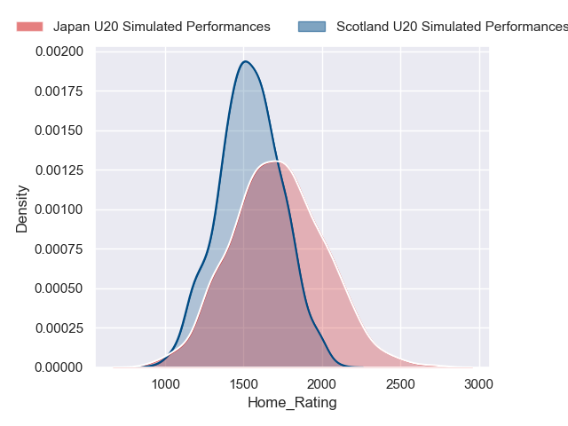
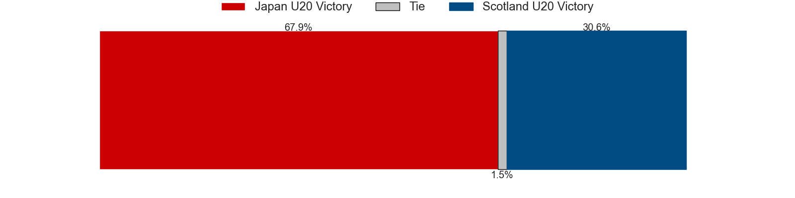
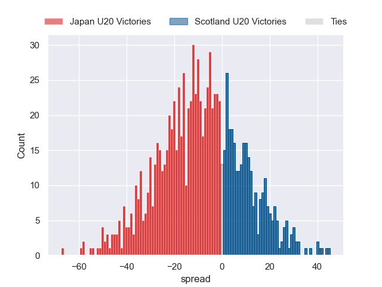

### Samoa U20 V Hong Kong U20 on 2024/07/12

Average Margin: Samoa U20 by 2.9

Average Scoreline: 30-28

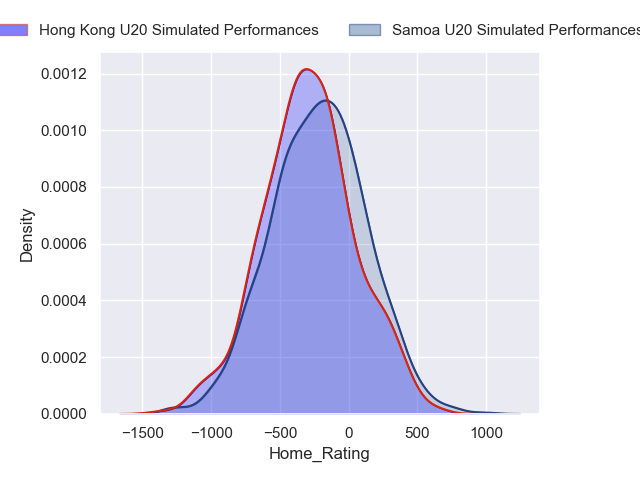
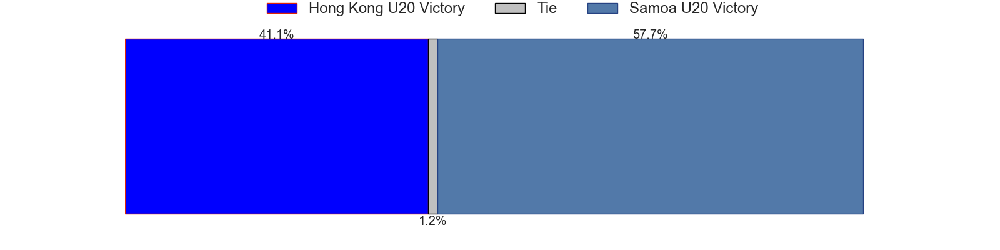
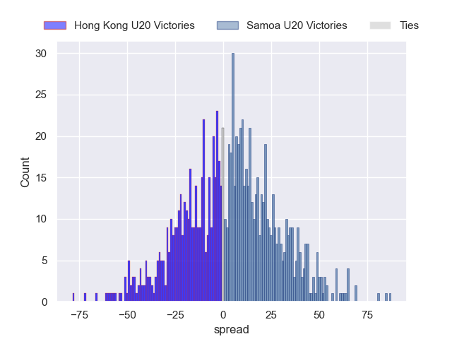

### Uruguay U20 V Netherlands U20 on 2024/07/12

Average Margin: Netherlands U20 by 4.4

Average Scoreline: 30-25

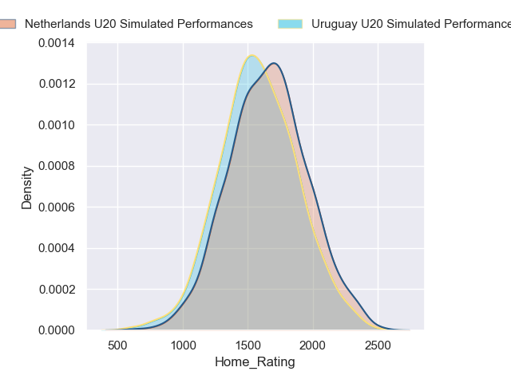
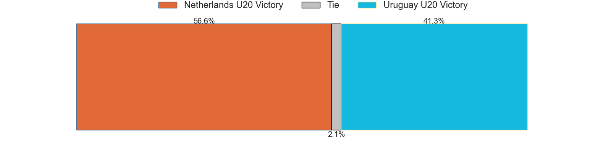
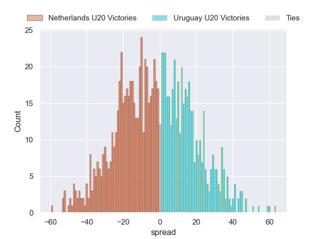

### Kenya U20 V United States of America U20 on 2024/07/12

Average Margin: United States of America U20 by 45.3

Average Scoreline: 55-10

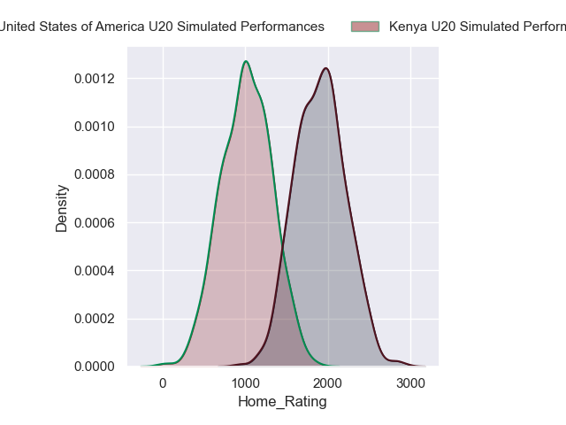
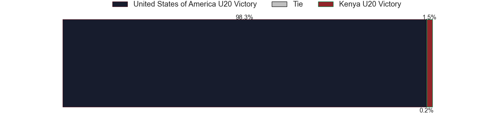
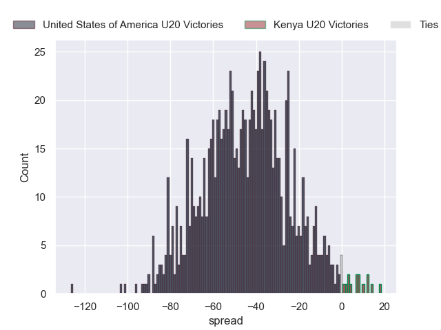

