---  
title: "pacificnationscup 2024 Status"  
date: 2024-08-09 6:00:00 -0500  
categories: model review projection  
layout: article  
aside:  
    toc: true  
---
# Current Team Rankings

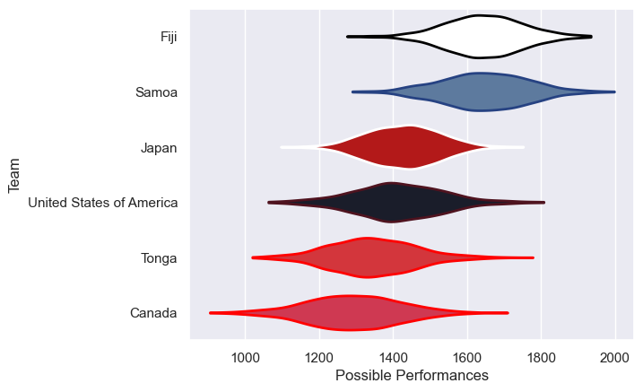
# Standings

## Projected Total Table

| Club                     |   Total Matches |   Wins |   Point Differential |   Losing Bonus Points |   Try Bonus Points |   Competition Points |
|:-------------------------|----------------:|-------:|---------------------:|----------------------:|-------------------:|---------------------:|
| Fiji                     |               2 |    1.7 |             16.5506  |                   0.3 |                1   |                  7.9 |
| United States of America |               2 |    1.3 |              8.79097 |                   0.4 |                0.9 |                  6.5 |
| Samoa                    |               2 |    1.3 |             12.8597  |                   0.3 |                1   |                  6.4 |
| Japan                    |               2 |    1.2 |              4.15569 |                   0.6 |                0.9 |                  6.2 |
| Canada                   |               2 |    0.5 |            -12.9467  |                   0.6 |                0.1 |                  2.7 |
| Tonga                    |               2 |    0.1 |            -29.4104  |                   0.3 |                0.4 |                  0.9 |

# Future Predictions

## Week 1

### Fiji V Samoa on 2024/08/23

Average Margin: Fiji by 4.5

Average Scoreline: 28-23

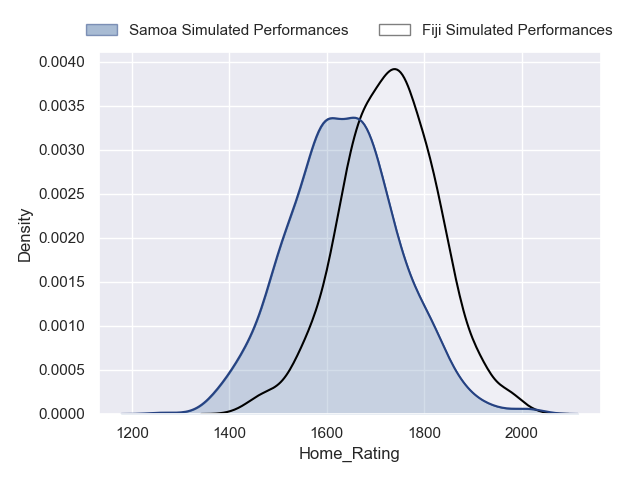
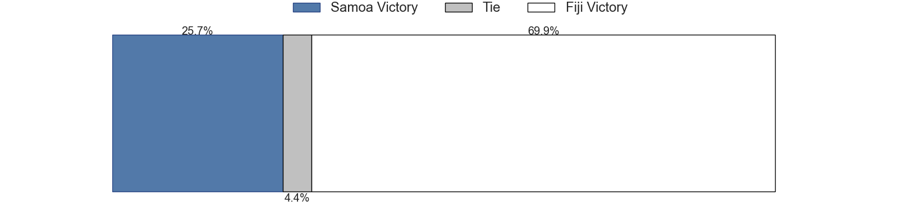
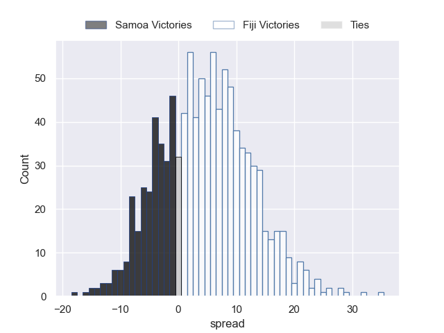

## Week 2

### Canada V Japan on 2024/08/26

Average Margin: Japan by 2.4

Average Scoreline: 28-25

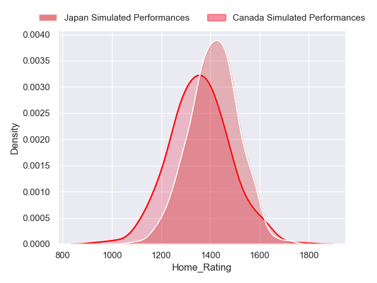

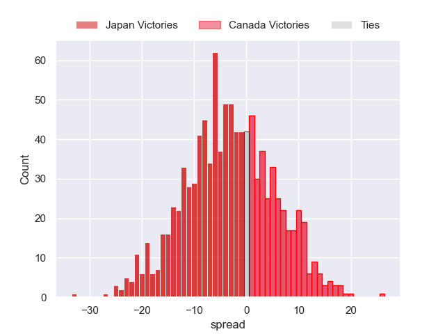

### Samoa V Tonga on 2024/08/30

Average Margin: Samoa by 17.4

Average Scoreline: 34-17

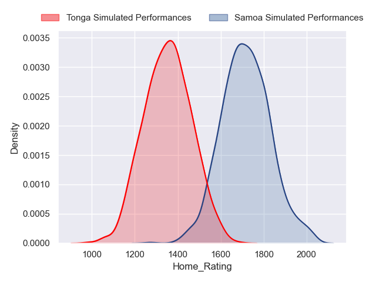
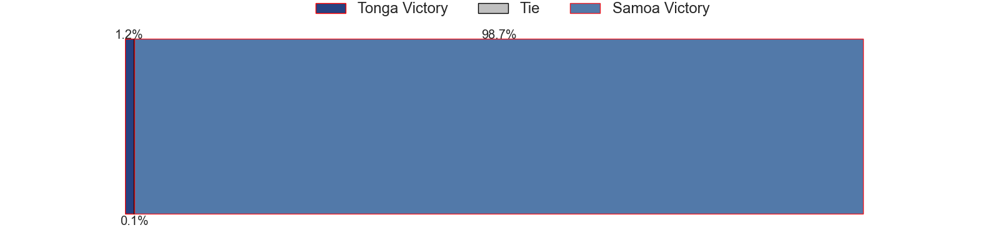
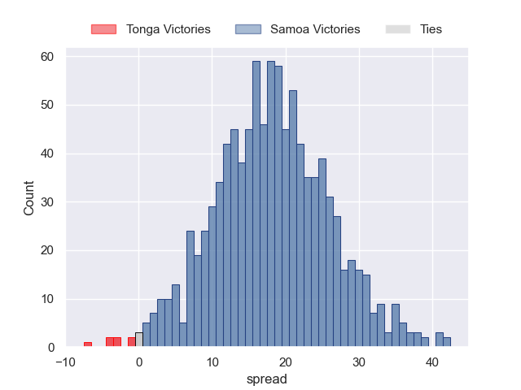

### United States of America V Canada on 2024/09/01

Average Margin: United States of America by 10.5

Average Scoreline: 30-20

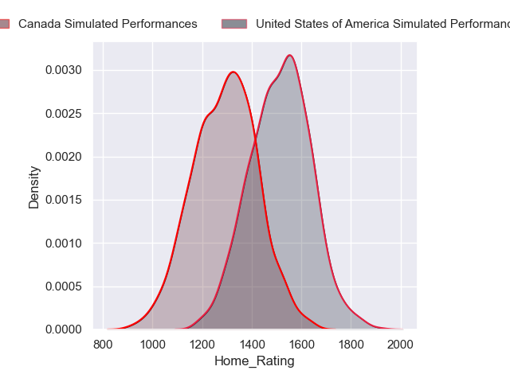
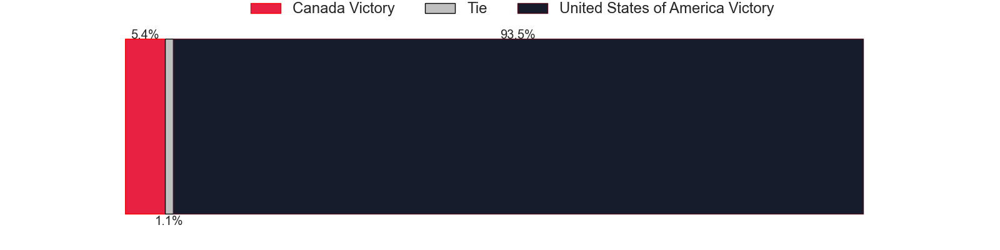
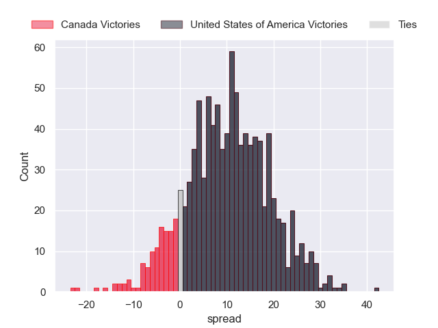

## Week 3

### Tonga V Fiji on 2024/09/06

Average Margin: Fiji by 12.0

Average Scoreline: 25-13

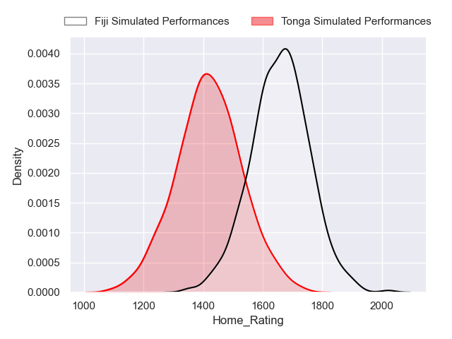
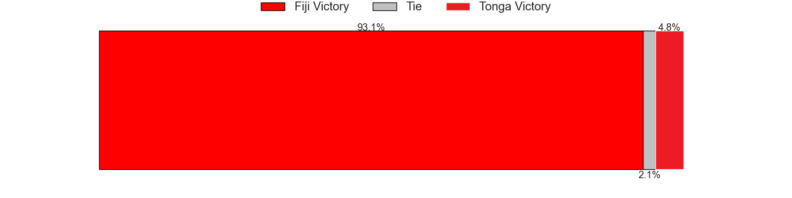
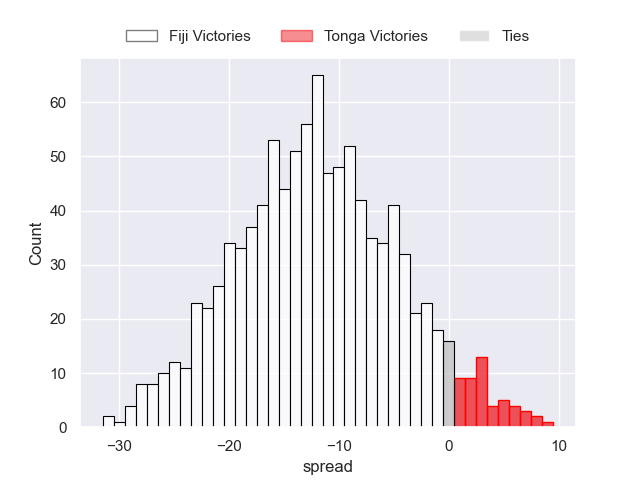

### Japan V United States of America on 2024/09/07

Average Margin: Japan by 1.7

Average Scoreline: 28-26

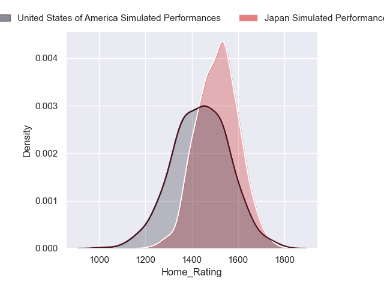
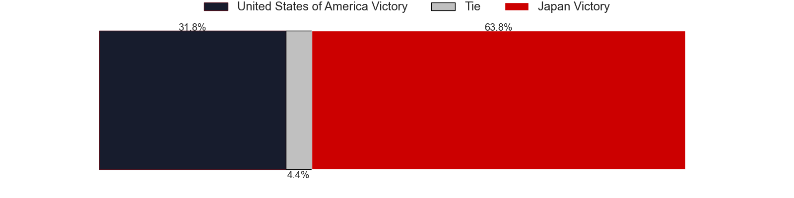
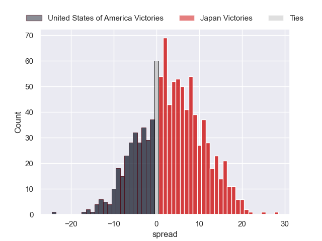

