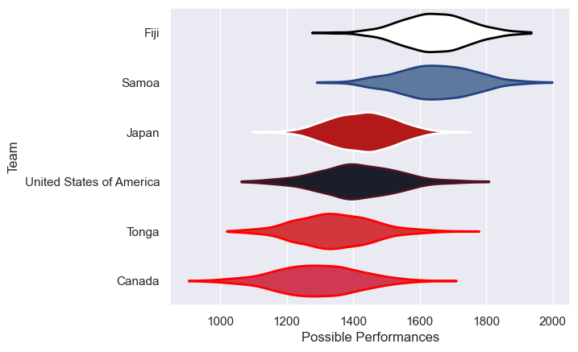
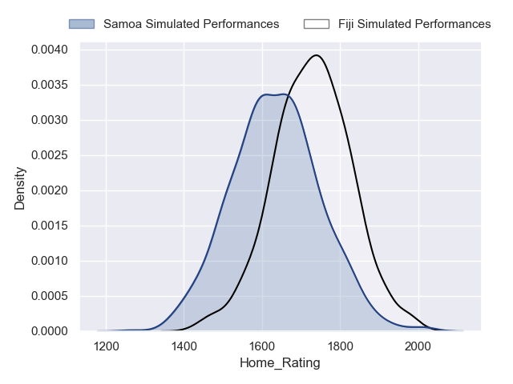
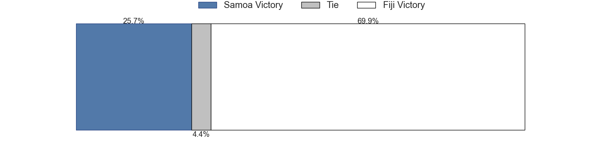
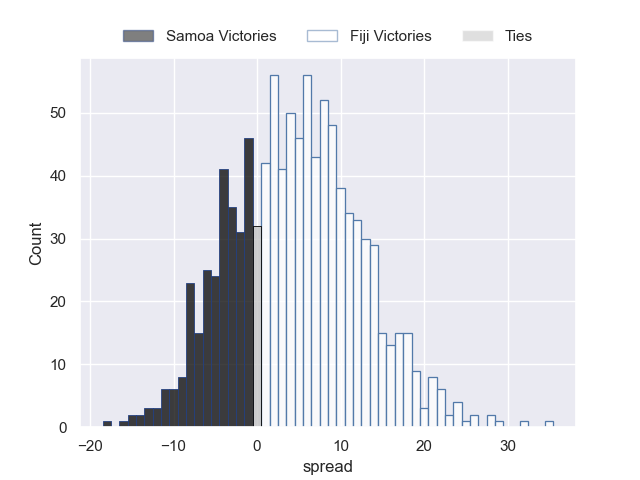
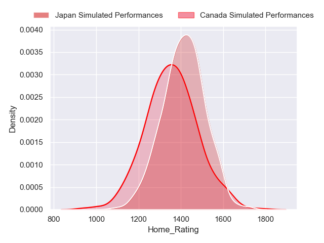
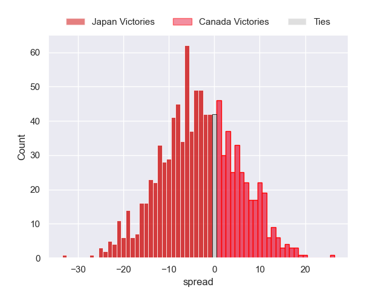

---  
title: "pacificnationscup 2024 Status"  
date: 2024-08-02 6:00:00 -0500  
categories: model review projection  
layout: article  
aside:  
    toc: true  
---
# Current Team Rankings

# Standings

## Projected Total Table

| Club                     |   Total Matches |   Wins |   Point Differential |   Losing Bonus Points |   Try Bonus Points |   Competition Points |
|:-------------------------|----------------:|-------:|---------------------:|----------------------:|-------------------:|---------------------:|
| Fiji                     |               2 |    1.6 |             14.5281  |                   0.3 |                1   |                  7.7 |
| Samoa                    |               2 |    1.3 |             15.0072  |                   0.4 |                1   |                  6.7 |
| Japan                    |               2 |    1.3 |              6.87723 |                   0.5 |                1   |                  6.7 |
| United States of America |               2 |    1.2 |              5.47599 |                   0.5 |                0.7 |                  5.9 |
| Canada                   |               2 |    0.5 |            -12.3532  |                   0.6 |                0.1 |                  2.7 |
| Tonga                    |               2 |    0.1 |            -29.5354  |                   0.3 |                0.3 |                  0.9 |

# Future Predictions

## Week 1

### Fiji V Samoa on 2024/08/23

Average Margin: Fiji by 3.2

Average Scoreline: 23-20

## Week 2

### Canada V Japan on 2024/08/26

Average Margin: Japan by 3.3

Average Scoreline: 29-26

### Samoa V Tonga on 2024/08/30

Average Margin: Samoa by 18.2

Average Scoreline: 39-21

### United States of America V Canada on 2024/09/01

Average Margin: United States of America by 9.1

Average Scoreline: 38-29

## Week 3

### Tonga V Fiji on 2024/09/06

Average Margin: Fiji by 11.4

Average Scoreline: 40-29

### Japan V United States of America on 2024/09/07

Average Margin: Japan by 3.6

Average Scoreline: 33-30

