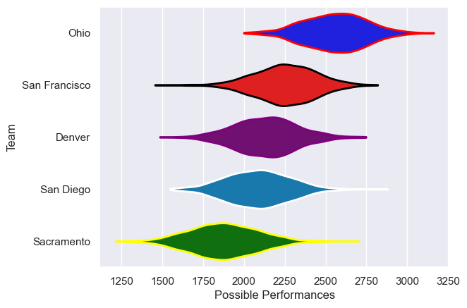

---  
title: "prorugby 2016"  
date: 2025-07-29 6:00:00 -0500  
categories: model review projection  
layout: article  
aside:  
    toc: true  
---
# Current Team Rankings

# Standings

## Current Standings

| Club          |   Played |   Wins |   Point Differential |   Losing Bonus Points |   Try Bonus Points |   Competition Points |
|:--------------|---------:|-------:|---------------------:|----------------------:|-------------------:|---------------------:|
| Denver        |       12 |     10 |                  130 |                     1 |                  7 |                   48 |
| Ohio          |       12 |      9 |                  203 |                     2 |                  9 |                   47 |
| San Diego     |       12 |      4 |                  -78 |                     3 |                  6 |                   25 |
| San Francisco |       12 |      4 |                 -115 |                     2 |                  6 |                   24 |
| Sacramento    |       12 |      3 |                 -140 |                     1 |                  5 |                   18 |

# Completed Match Review

| Model | Percent Correct Predictions | Spread Error |
| ------ | ------ | ------ |
| Club Level | 66.7% | 17.6 |
| Player Level: Lineup | nan% | nan |
| Player Level: Minutes | nan% | nan |

