---  
title: "worldcupunder20 2024 Status"  
date: 2024-07-11 6:00:00 -0500  
categories: model review projection  
layout: article  
aside:  
    toc: true  
---
# Current Team Rankings

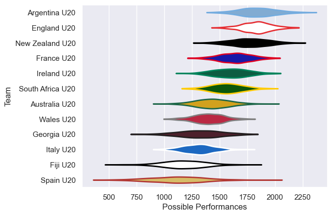
# Standings

## Current Standings

| Club             |   Played |   Wins |   Point Differential |   Losing Bonus Points |   Try Bonus Points |   Competition Points |
|:-----------------|---------:|-------:|---------------------:|----------------------:|-------------------:|---------------------:|
| New Zealand U20  |        3 |      3 |                   40 |                     0 |                  3 |                   15 |
| England U20      |        3 |      3 |                   61 |                     0 |                  2 |                   14 |
| France U20       |        3 |      2 |                   54 |                     1 |                  2 |                   11 |
| Ireland U20      |        3 |      2 |                   46 |                     0 |                nan |                   11 |
| Argentina U20    |        3 |      2 |                   40 |                     0 |                  2 |                   10 |
| Australia U20    |        3 |      1 |                   19 |                     1 |                nan |                    8 |
| Wales U20        |        3 |      1 |                   -4 |                     1 |                  2 |                    7 |
| South Africa U20 |        3 |      1 |                   26 |                     1 |                  1 |                    6 |
| Georgia U20      |        3 |      1 |                  -19 |                     1 |                  1 |                    6 |
| Italy U20        |        3 |      1 |                  -46 |                     0 |                  0 |                    4 |
| Spain U20        |        3 |      0 |                  -90 |                     0 |                  0 |                    0 |
| Fiji U20         |        3 |      0 |                 -127 |                     0 |                  0 |                    0 |

## Projected Remaining Table

| Club             |   Matches Remaining |   Wins |   Point Differential |   Losing Bonus Points |   Try Bonus Points |   Competition Points |
|:-----------------|--------------------:|-------:|---------------------:|----------------------:|-------------------:|---------------------:|
| New Zealand U20  |                   4 |    2.4 |             11.7109  |                   0.9 |                1.2 |                 11.5 |
| France U20       |                   4 |    1.6 |            -11.7109  |                   0.9 |                0.7 |                  8.2 |
| Argentina U20    |                   1 |    0.9 |             18.1793  |                   0   |                0.4 |                  4.3 |
| England U20      |                   1 |    0.9 |             14.5178  |                   0.1 |                0.5 |                  4.2 |
| Italy U20        |                   1 |    0.8 |             11.9728  |                   0.1 |                0.5 |                  3.7 |
| Georgia U20      |                   1 |    0.8 |             10.6277  |                   0.1 |                0.4 |                  3.7 |
| Australia U20    |                   1 |    0.7 |              5.29732 |                   0.2 |                0.4 |                  3.4 |
| Wales U20        |                   1 |    0.3 |             -5.29732 |                   0.3 |                0.3 |                  1.8 |
| Fiji U20         |                   1 |    0.2 |            -10.6277  |                   0.2 |                0.3 |                  1.3 |
| Spain U20        |                   1 |    0.2 |            -11.9728  |                   0.2 |                0.2 |                  1.2 |
| Ireland U20      |                   1 |    0.1 |            -14.5178  |                   0.2 |                0.1 |                  0.6 |
| South Africa U20 |                   1 |    0.1 |            -18.1793  |                   0.1 |                0.1 |                  0.5 |

## Projected Total Table

| Club             |   Total Matches |   Wins |   Point Differential |   Losing Bonus Points |   Try Bonus Points |   Competition Points |
|:-----------------|----------------:|-------:|---------------------:|----------------------:|-------------------:|---------------------:|
| New Zealand U20  |               7 |    5.4 |             51.7109  |                   0.9 |                4.2 |                 26.5 |
| France U20       |               7 |    3.6 |             42.2891  |                   1.9 |                2.7 |                 19.2 |
| England U20      |               4 |    3.9 |             75.5178  |                   0.1 |                2.5 |                 18.2 |
| Argentina U20    |               4 |    2.9 |             58.1793  |                   0   |                2.4 |                 14.3 |
| Ireland U20      |               4 |    2.1 |             31.4822  |                   0.2 |                0.1 |                 11.6 |
| Australia U20    |               4 |    1.7 |             24.2973  |                   1.2 |                0.4 |                 11.4 |
| Georgia U20      |               4 |    1.8 |             -8.37227 |                   1.1 |                1.4 |                  9.7 |
| Wales U20        |               4 |    1.3 |             -9.29732 |                   1.3 |                2.3 |                  8.8 |
| Italy U20        |               4 |    1.8 |            -34.0272  |                   0.1 |                0.5 |                  7.7 |
| South Africa U20 |               4 |    1.1 |              7.8207  |                   1.1 |                1.1 |                  6.5 |
| Fiji U20         |               4 |    0.2 |           -137.628   |                   0.2 |                0.3 |                  1.3 |
| Spain U20        |               4 |    0.2 |           -101.973   |                   0.2 |                0.2 |                  1.2 |

# Completed Match Review

| Model | Percent Correct Predictions | Spread Error |
| ------ | ------ | ------ |
| Club Level | 72.2% | 14.5 |
| Player Level: Lineup | 66.7% | 18.8 |
| Player Level: Minutes | 66.7% | 18.8 |

# Future Predictions

## Week 4

### England U20 V Ireland U20 on 2024/07/14

Average Margin: England U20 by 14.5

Average Scoreline: 39-25

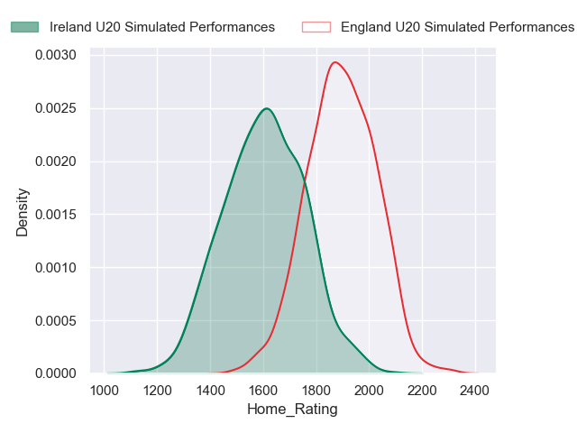
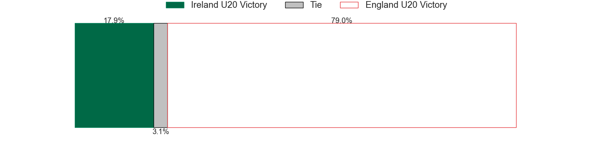
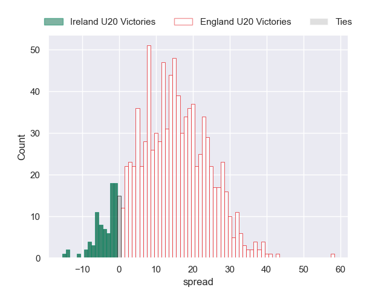

### France U20 V New Zealand U20 on 2024/07/14

Average Margin: New Zealand U20 by 2.9

Average Scoreline: 33-30

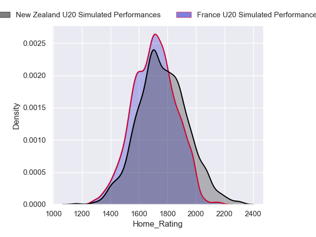

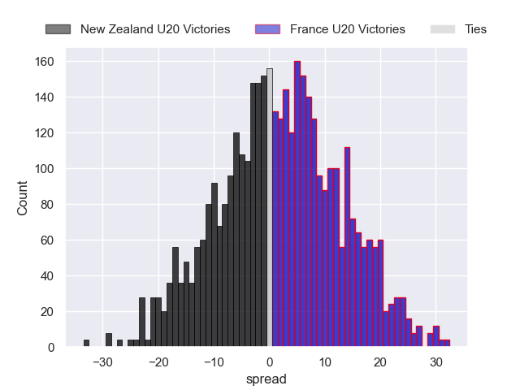

### France U20 V New Zealand U20 on 2024/07/14

Average Margin: New Zealand U20 by 2.9

Average Scoreline: 33-30

### France U20 V New Zealand U20 on 2024/07/14

Average Margin: New Zealand U20 by 2.9

Average Scoreline: 33-30

### France U20 V New Zealand U20 on 2024/07/14

Average Margin: New Zealand U20 by 2.9

Average Scoreline: 33-30

### Argentina U20 V South Africa U20 on 2024/07/14

Average Margin: Argentina U20 by 18.2

Average Scoreline: 45-27

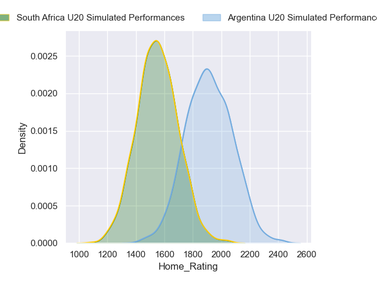
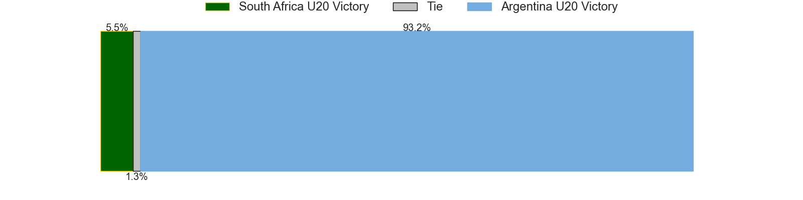
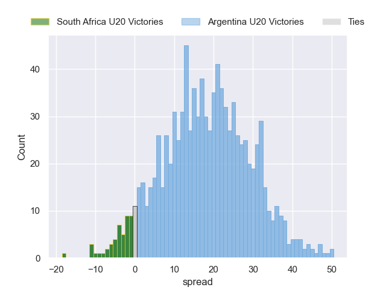

### Italy U20 V Spain U20 on 2024/07/14

Average Margin: Italy U20 by 12.0

Average Scoreline: 29-17

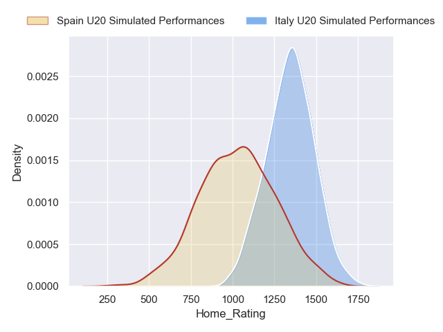
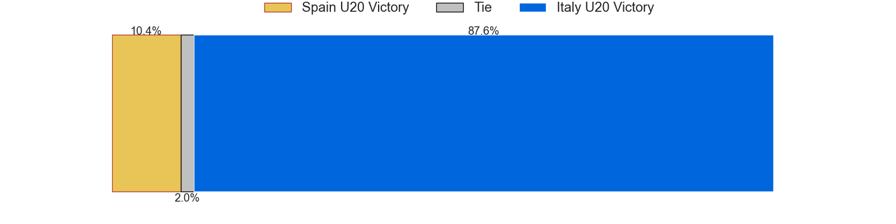
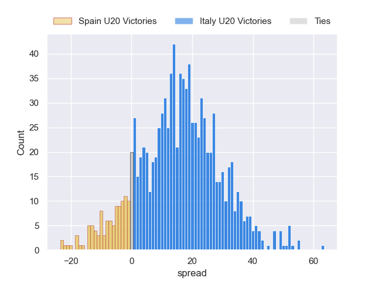

### Georgia U20 V Fiji U20 on 2024/07/14

Average Margin: Georgia U20 by 10.6

Average Scoreline: 39-28

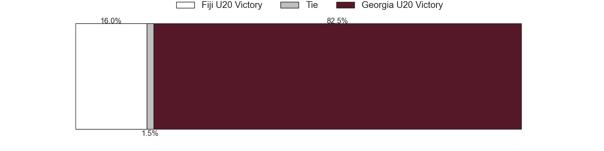

### Australia U20 V Wales U20 on 2024/07/14

Average Margin: Australia U20 by 5.3

Average Scoreline: 42-36

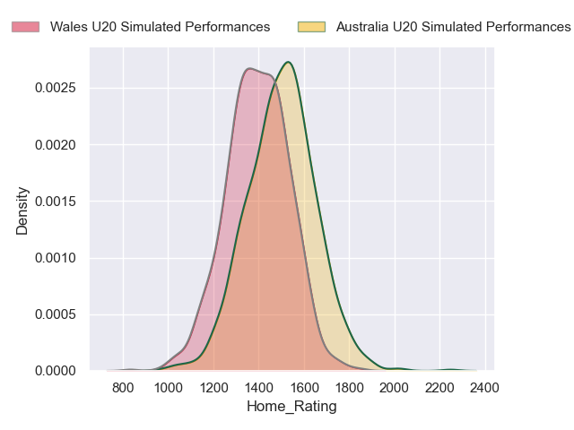

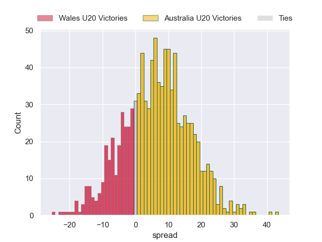

