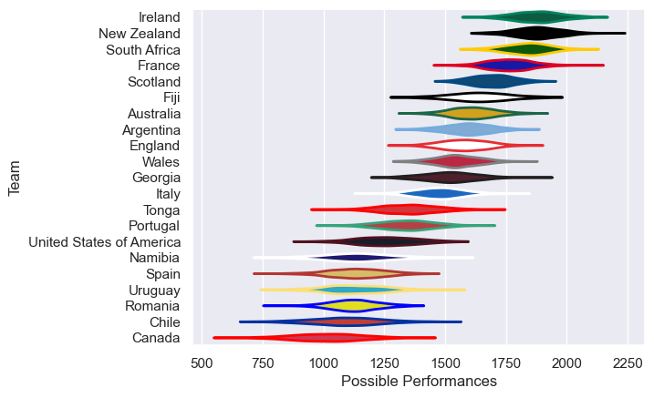
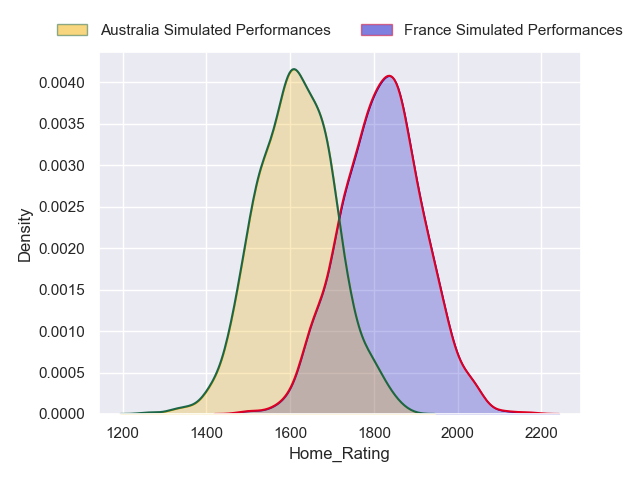
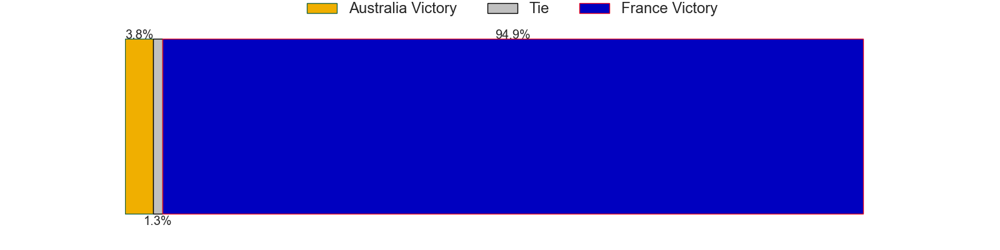
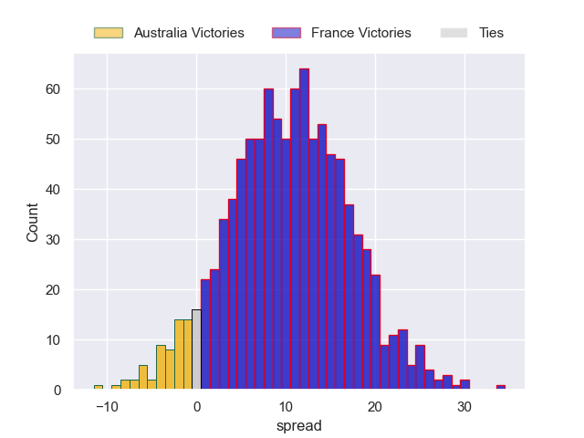

---  
title: "worldcupwarmupmatch 2023 Status"  
date: 2023-08-27 6:00:00 -0500  
categories: model review projection  
layout: article  
aside:  
    toc: true  
---
# Current Team Rankings

# Standings

## Current Standings

| Club                     |   Played |   Wins |   Point Differential |   Losing Bonus Points |   Try Bonus Points |   Competition Points |
|:-------------------------|---------:|-------:|---------------------:|----------------------:|-------------------:|---------------------:|
| Scotland                 |        4 |      3 |                   40 |                     1 |                  2 |                   15 |
| South Africa             |        3 |      3 |                   75 |                     0 |                  2 |                   14 |
| Ireland                  |        3 |      3 |                   39 |                     0 |                  2 |                   14 |
| Tonga                    |        2 |      2 |                   49 |                     0 |                  2 |                   10 |
| Italy                    |        4 |      2 |                   43 |                     0 |                  2 |                   10 |
| Uruguay                  |        2 |      2 |                    9 |                     0 |                  2 |                   10 |
| France                   |        3 |      2 |                   16 |                     1 |                  0 |                    9 |
| Georgia                  |        3 |      2 |                   38 |                     0 |                nan |                    8 |
| Argentina                |        2 |      1 |                   48 |                     0 |                  1 |                    5 |
| Portugal                 |        1 |      1 |                   26 |                     0 |                  1 |                    5 |
| Wales                    |        3 |      1 |                  -27 |                     1 |                  0 |                    5 |
| United States of America |        3 |      1 |                  -27 |                     0 |                  1 |                    5 |
| Namibia                  |        2 |      1 |                   -6 |                     0 |                nan |                    4 |
| Fiji                     |        2 |      1 |                   -9 |                     0 |                  0 |                    4 |
| New Zealand              |        2 |      1 |                  -25 |                     0 |                  0 |                    4 |
| England                  |        4 |      1 |                  -36 |                     0 |                  0 |                    4 |
| Chile                    |        2 |      0 |                   -3 |                     2 |                nan |                    2 |
| Australia                |        1 |      0 |                   -3 |                     1 |                  0 |                    1 |
| Samoa                    |        1 |      0 |                   -4 |                     1 |                  0 |                    1 |
| Japan                    |        1 |      0 |                  -21 |                     0 |                  0 |                    0 |
| Canada                   |        2 |      0 |                  -49 |                     0 |                  0 |                    0 |
| Spain                    |        1 |      0 |                  -59 |                     0 |                  0 |                    0 |
| Romania                  |        3 |      0 |                 -114 |                     0 |                nan |                    0 |

## Projected Remaining Table

| Club      |   Matches Remaining |   Wins |   Point Differential |   Losing Bonus Points |   Try Bonus Points |   Competition Points |
|:----------|--------------------:|-------:|---------------------:|----------------------:|-------------------:|---------------------:|
| France    |                   1 |      1 |                 10.5 |                   0   |                0.9 |                  4.8 |
| Australia |                   1 |      0 |                -10.5 |                   0.2 |                0   |                  0.4 |

## Projected Total Table

| Club                     |   Total Matches |   Wins |   Point Differential |   Losing Bonus Points |   Try Bonus Points |   Competition Points |
|:-------------------------|----------------:|-------:|---------------------:|----------------------:|-------------------:|---------------------:|
| Scotland                 |               4 |      3 |                 40   |                   1   |                2   |                 15   |
| South Africa             |               3 |      3 |                 75   |                   0   |                2   |                 14   |
| Ireland                  |               3 |      3 |                 39   |                   0   |                2   |                 14   |
| France                   |               4 |      3 |                 26.5 |                   1   |                0.9 |                 13.8 |
| Tonga                    |               2 |      2 |                 49   |                   0   |                2   |                 10   |
| Italy                    |               4 |      2 |                 43   |                   0   |                2   |                 10   |
| Uruguay                  |               2 |      2 |                  9   |                   0   |                2   |                 10   |
| Georgia                  |               3 |      2 |                 38   |                   0   |                0   |                  8   |
| Argentina                |               2 |      1 |                 48   |                   0   |                1   |                  5   |
| Portugal                 |               1 |      1 |                 26   |                   0   |                1   |                  5   |
| United States of America |               3 |      1 |                -27   |                   0   |                1   |                  5   |
| Wales                    |               3 |      1 |                -27   |                   1   |                0   |                  5   |
| Namibia                  |               2 |      1 |                 -6   |                   0   |                0   |                  4   |
| Fiji                     |               2 |      1 |                 -9   |                   0   |                0   |                  4   |
| New Zealand              |               2 |      1 |                -25   |                   0   |                0   |                  4   |
| England                  |               4 |      1 |                -36   |                   0   |                0   |                  4   |
| Chile                    |               2 |      0 |                 -3   |                   2   |                0   |                  2   |
| Australia                |               2 |      0 |                -13.5 |                   1.2 |                0   |                  1.4 |
| Samoa                    |               1 |      0 |                 -4   |                   1   |                0   |                  1   |
| Japan                    |               1 |      0 |                -21   |                   0   |                0   |                  0   |
| Canada                   |               2 |      0 |                -49   |                   0   |                0   |                  0   |
| Spain                    |               1 |      0 |                -59   |                   0   |                0   |                  0   |
| Romania                  |               3 |      0 |               -114   |                   0   |                0   |                  0   |

# Completed Match Review

| Model | Percent Correct Predictions | Spread Error |
| ------ | ------ | ------ |
| Club Level | 77.8% | 13.7 |
| Player Level: Lineup | 82.1% | 14.5 |
| Player Level: Minutes | 92.6% | 14.3 |

# Future Predictions

## Week 5

### France V Australia on 2023/08/27

Average Margin: France by 10.9

