---  
title: "worldcupwarmupmatch 2023 Status"  
date: 2023-08-07 6:00:00 -0500  
categories: model review projection  
layout: article  
aside:  
    toc: true  
---
# Current Team Rankings

# Standings

## Current Standings

| Club                     |   Played |   Wins |   Point Differential |   Losing Bonus Points |   Try Bonus Points |   Competition Points |
|:-------------------------|---------:|-------:|---------------------:|----------------------:|-------------------:|---------------------:|
| Uruguay                  |        2 |      2 |                    9 |                     0 |                  2 |                   10 |
| Scotland                 |        2 |      2 |                   16 |                     0 |                  0 |                    8 |
| Ireland                  |        1 |      1 |                   16 |                     0 |                  1 |                    5 |
| United States of America |        1 |      1 |                   14 |                     0 |                  1 |                    5 |
| Wales                    |        1 |      1 |                   11 |                     0 |                  0 |                    4 |
| South Africa             |        1 |      1 |                   11 |                     0 |                  0 |                    4 |
| New Zealand              |        1 |      1 |                    3 |                     0 |                  0 |                    4 |
| Chile                    |        1 |      0 |                   -1 |                     1 |                  0 |                    1 |
| Australia                |        1 |      0 |                   -3 |                     1 |                  0 |                    1 |
| France                   |        1 |      0 |                   -4 |                     1 |                  0 |                    1 |
| Namibia                  |        1 |      0 |                   -8 |                     0 |                  0 |                    0 |
| Argentina                |        1 |      0 |                  -11 |                     0 |                  0 |                    0 |
| England                  |        1 |      0 |                  -11 |                     0 |                  0 |                    0 |
| Romania                  |        1 |      0 |                  -14 |                     0 |                  0 |                    0 |
| Italy                    |        2 |      0 |                  -28 |                     0 |                  0 |                    0 |

## Projected Remaining Table

| Club                     |   Matches Remaining |   Wins |   Point Differential |   Losing Bonus Points |   Try Bonus Points |   Competition Points |
|:-------------------------|--------------------:|-------:|---------------------:|----------------------:|-------------------:|---------------------:|
| France                   |                   3 |    2.8 |                 29.3 |                   0.2 |                2.7 |                 13.9 |
| Georgia                  |                   3 |    2   |                 20.8 |                   0.3 |                1.9 |                 10.1 |
| Ireland                  |                   2 |    2   |                 39.3 |                   0   |                2   |                 10   |
| Italy                    |                   2 |    1.8 |                 24.6 |                   0.2 |                1.8 |                  9.1 |
| England                  |                   3 |    1.3 |                -10.7 |                   0.5 |                1.3 |                  7.1 |
| South Africa             |                   2 |    1.1 |                  2.8 |                   0.4 |                1   |                  5.8 |
| Scotland                 |                   2 |    1.1 |                  4   |                   0.4 |                1   |                  5.7 |
| Argentina                |                   1 |    1   |                 18.8 |                   0   |                1   |                  5   |
| New Zealand              |                   1 |    0.8 |                  6.1 |                   0.1 |                0.8 |                  4.3 |
| Portugal                 |                   1 |    0.6 |                  3.2 |                   0.2 |                0.6 |                  3.4 |
| Chile                    |                   1 |    0.6 |                  3   |                   0.2 |                0.6 |                  3.3 |
| Fiji                     |                   2 |    0.6 |                -10.2 |                   0.6 |                0.5 |                  3.3 |
| United States of America |                   2 |    0.4 |                -15.5 |                   0.5 |                0.4 |                  2.6 |
| Namibia                  |                   1 |    0.4 |                 -3   |                   0.3 |                0.4 |                  2.2 |
| Wales                    |                   2 |    0.3 |                -14.2 |                   0.7 |                0.3 |                  2.1 |
| Japan                    |                   1 |    0.2 |                 -6.1 |                   0.4 |                0.2 |                  1.3 |
| Australia                |                   1 |    0   |                -11.5 |                   0.2 |                0   |                  0.4 |
| Spain                    |                   1 |    0   |                -18.8 |                   0   |                0   |                  0.1 |
| Romania                  |                   2 |    0   |                -38.9 |                   0.1 |                0   |                  0.1 |
| Samoa                    |                   1 |    0   |                -22.4 |                   0   |                0   |                  0   |

## Projected Total Table

| Club                     |   Total Matches |   Wins |   Point Differential |   Losing Bonus Points |   Try Bonus Points |   Competition Points |
|:-------------------------|----------------:|-------:|---------------------:|----------------------:|-------------------:|---------------------:|
| Ireland                  |               3 |    3   |                 55.3 |                   0   |                3   |                 15   |
| France                   |               4 |    2.8 |                 25.3 |                   1.2 |                2.7 |                 14.9 |
| Scotland                 |               4 |    3.1 |                 20   |                   0.4 |                1   |                 13.7 |
| Georgia                  |               3 |    2   |                 20.8 |                   0.3 |                1.9 |                 10.1 |
| Uruguay                  |               2 |    2   |                  9   |                   0   |                2   |                 10   |
| South Africa             |               3 |    2.1 |                 13.8 |                   0.4 |                1   |                  9.8 |
| Italy                    |               4 |    1.8 |                 -3.4 |                   0.2 |                1.8 |                  9.1 |
| New Zealand              |               2 |    1.8 |                  9.1 |                   0.1 |                0.8 |                  8.3 |
| United States of America |               3 |    1.4 |                 -1.5 |                   0.5 |                1.4 |                  7.6 |
| England                  |               4 |    1.3 |                -21.7 |                   0.5 |                1.3 |                  7.1 |
| Wales                    |               3 |    1.3 |                 -3.2 |                   0.7 |                0.3 |                  6.1 |
| Argentina                |               2 |    1   |                  7.8 |                   0   |                1   |                  5   |
| Chile                    |               2 |    0.6 |                  2   |                   1.2 |                0.6 |                  4.3 |
| Portugal                 |               1 |    0.6 |                  3.2 |                   0.2 |                0.6 |                  3.4 |
| Fiji                     |               2 |    0.6 |                -10.2 |                   0.6 |                0.5 |                  3.3 |
| Namibia                  |               2 |    0.4 |                -11   |                   0.3 |                0.4 |                  2.2 |
| Australia                |               2 |    0   |                -14.5 |                   1.2 |                0   |                  1.4 |
| Japan                    |               1 |    0.2 |                 -6.1 |                   0.4 |                0.2 |                  1.3 |
| Spain                    |               1 |    0   |                -18.8 |                   0   |                0   |                  0.1 |
| Romania                  |               3 |    0   |                -52.9 |                   0.1 |                0   |                  0.1 |
| Samoa                    |               1 |    0   |                -22.4 |                   0   |                0   |                  0   |

# Completed Match Review

| Model | Percent Correct Predictions | Spread Error |
| ------ | ------ | ------ |
| Club Level | 66.7% | 9.2 |
| Player Level: Lineup | 55.6% | 22.2 |
| Player Level: Minutes | 55.6% | 21.8 |

# Future Predictions

## Week 3

### England V Wales on 2023/08/12

Average Margin: England by 5.3

### Georgia V Romania on 2023/08/12

Average Margin: Georgia by 20.8

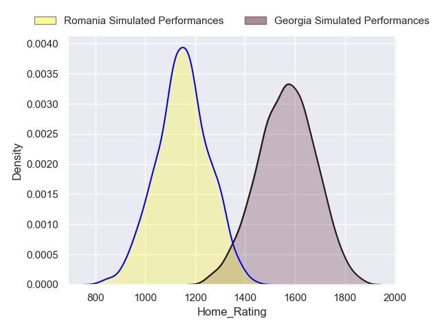
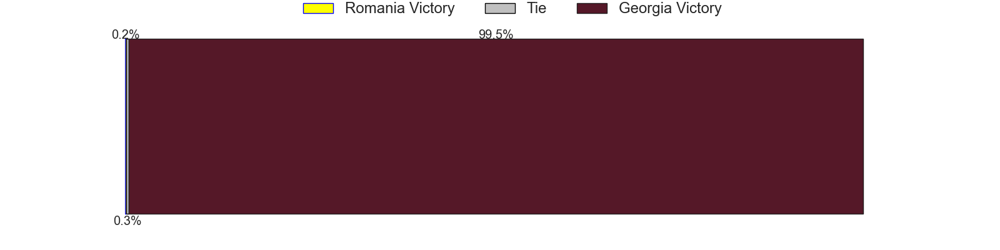
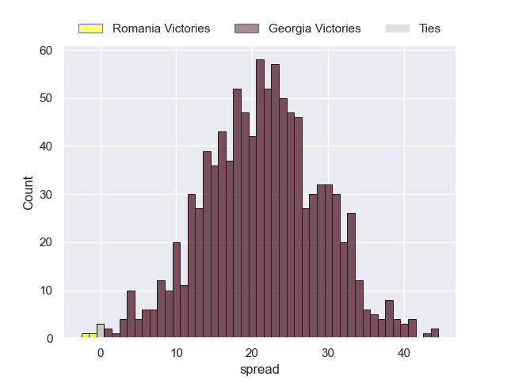

### Portugal V United States of America on 2023/08/12

Average Margin: Portugal by 3.3

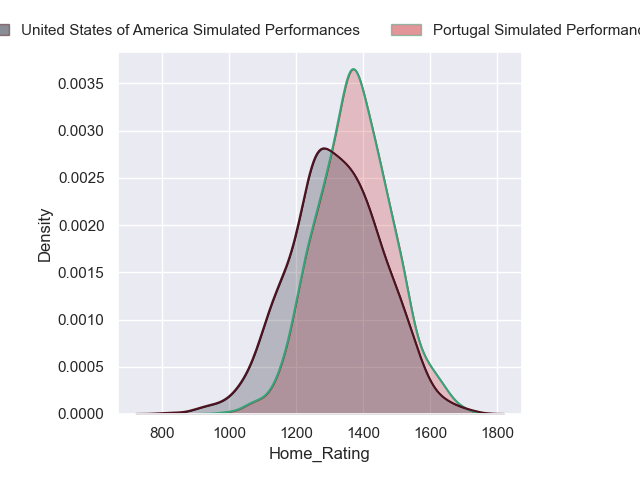
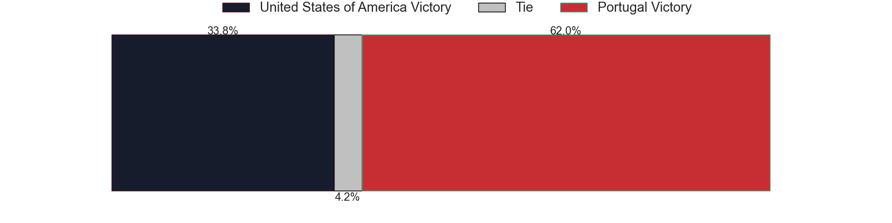
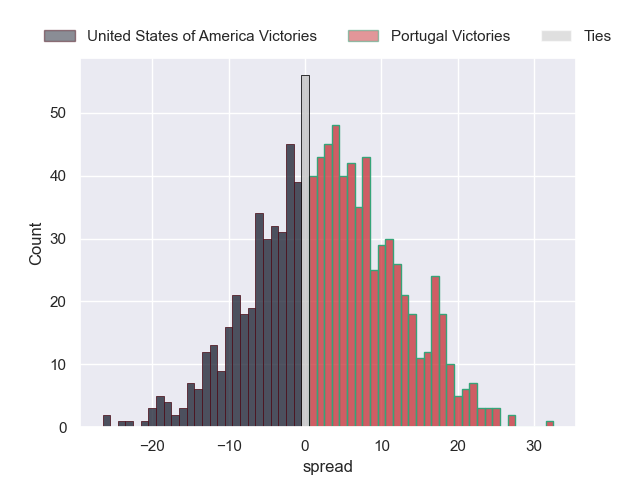

### France V Scotland on 2023/08/12

Average Margin: France by 8.0

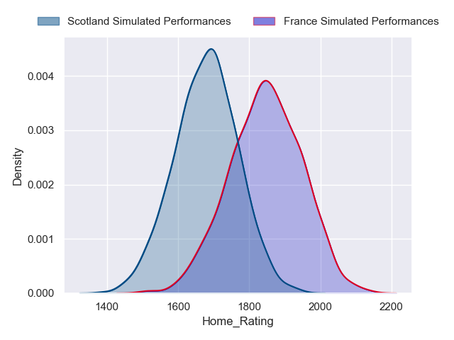
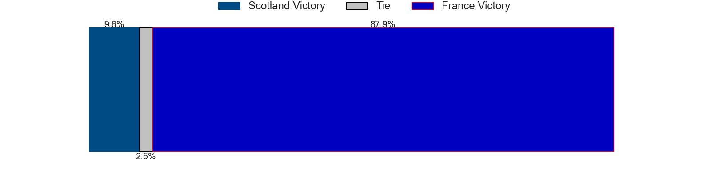
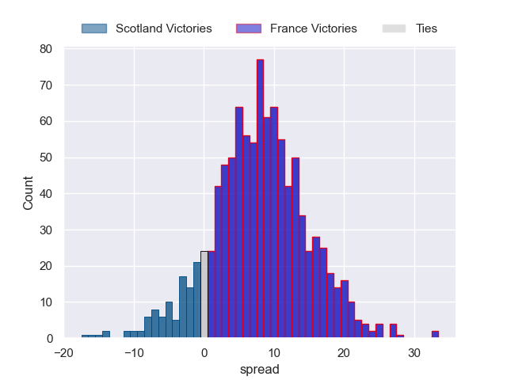

### Chile V Namibia on 2023/08/12

Average Margin: Chile by 3.1

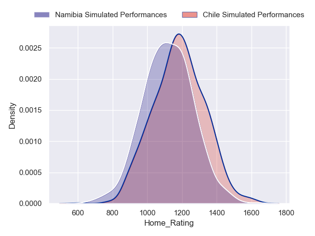
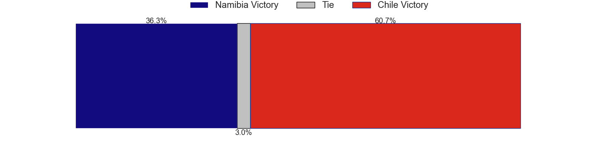
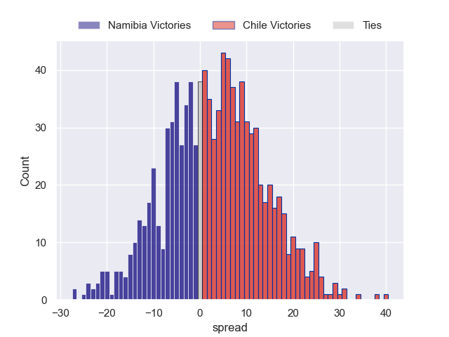

## Week 4

### Georgia V United States of America on 2023/08/19

Average Margin: Georgia by 12.6

### Wales V South Africa on 2023/08/19

Average Margin: South Africa by 9.3

### France V Fiji on 2023/08/19

Average Margin: France by 9.9

### Ireland V England on 2023/08/19

Average Margin: Ireland by 16.9

### Italy V Romania on 2023/08/19

Average Margin: Italy by 18.6

## Week 5

### New Zealand V South Africa on 2023/08/25

Average Margin: New Zealand by 6.4

### Ireland V Samoa on 2023/08/26

Average Margin: Ireland by 22.9

### Spain V Argentina on 2023/08/26

Average Margin: Argentina by 19.3

### Scotland V Georgia on 2023/08/26

Average Margin: Scotland by 12.1

### Italy V Japan on 2023/08/26

Average Margin: Italy by 6.4

### England V Fiji on 2023/08/26

Average Margin: England by 0.6

### France V Australia on 2023/08/27

Average Margin: France by 11.9

