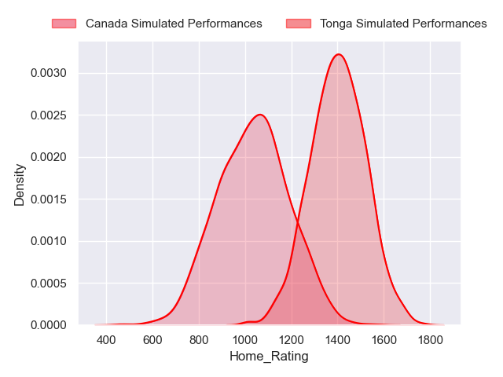
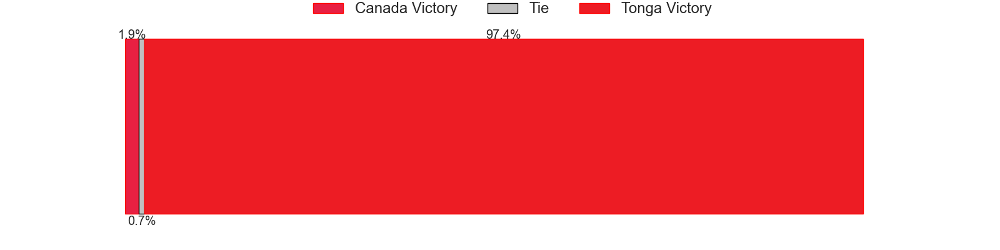
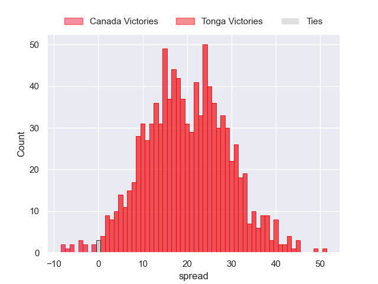

---  
title: "worldcupwarmupmatch 2023 Status"  
date: 2023-08-13 6:00:00 -0500  
categories: model review projection  
layout: article  
aside:  
    toc: true  
---
# Current Team Rankings

# Standings

## Current Standings

| Club                     |   Played |   Wins |   Point Differential |   Losing Bonus Points |   Try Bonus Points |   Competition Points |
|:-------------------------|---------:|-------:|---------------------:|----------------------:|-------------------:|---------------------:|
| Uruguay                  |        2 |      2 |                    9 |                     0 |                  2 |                   10 |
| Scotland                 |        2 |      2 |                   16 |                     0 |                  0 |                    8 |
| Portugal                 |        1 |      1 |                   26 |                     0 |                  1 |                    5 |
| Tonga                    |        1 |      1 |                   25 |                     0 |                  1 |                    5 |
| Ireland                  |        1 |      1 |                   16 |                     0 |                  1 |                    5 |
| Namibia                  |        2 |      1 |                   -6 |                     0 |                  1 |                    5 |
| United States of America |        2 |      1 |                  -12 |                     0 |                  1 |                    5 |
| Wales                    |        1 |      1 |                   11 |                     0 |                  0 |                    4 |
| South Africa             |        1 |      1 |                   11 |                     0 |                  0 |                    4 |
| New Zealand              |        1 |      1 |                    3 |                     0 |                  0 |                    4 |
| Chile                    |        2 |      0 |                   -3 |                     2 |                  1 |                    3 |
| Australia                |        1 |      0 |                   -3 |                     1 |                  0 |                    1 |
| France                   |        1 |      0 |                   -4 |                     1 |                  0 |                    1 |
| Argentina                |        1 |      0 |                  -11 |                     0 |                  0 |                    0 |
| England                  |        1 |      0 |                  -11 |                     0 |                  0 |                    0 |
| Romania                  |        1 |      0 |                  -14 |                     0 |                  0 |                    0 |
| Canada                   |        1 |      0 |                  -25 |                     0 |                  0 |                    0 |
| Italy                    |        2 |      0 |                  -28 |                     0 |                  0 |                    0 |

## Projected Remaining Table

| Club                     |   Matches Remaining |   Wins |   Point Differential |   Losing Bonus Points |   Try Bonus Points |   Competition Points |
|:-------------------------|--------------------:|-------:|---------------------:|----------------------:|-------------------:|---------------------:|
| Ireland                  |                   2 |    2   |                 39.1 |                   0   |                2   |                 10   |
| France                   |                   2 |    1.9 |                 20.6 |                   0.1 |                1.8 |                  9.4 |
| Italy                    |                   2 |    1.8 |                 24.6 |                   0.2 |                1.7 |                  9   |
| South Africa             |                   2 |    1.1 |                  2.3 |                   0.5 |                1   |                  5.7 |
| Georgia                  |                   2 |    1   |                  3.8 |                   0.2 |                1   |                  5.3 |
| Argentina                |                   1 |    1   |                 18.9 |                   0   |                1   |                  5   |
| Tonga                    |                   1 |    1   |                 17.8 |                   0   |                1   |                  4.9 |
| Scotland                 |                   1 |    1   |                 11.7 |                   0   |                0.9 |                  4.8 |
| New Zealand              |                   1 |    0.8 |                  6.1 |                   0.1 |                0.8 |                  4.3 |
| Fiji                     |                   2 |    0.6 |                -10.3 |                   0.6 |                0.5 |                  3.3 |
| England                  |                   2 |    0.6 |                -15.4 |                   0.4 |                0.5 |                  3.2 |
| Japan                    |                   1 |    0.2 |                 -6   |                   0.3 |                0.2 |                  1.4 |
| Wales                    |                   1 |    0.1 |                 -8.4 |                   0.3 |                0.1 |                  0.8 |
| Australia                |                   1 |    0   |                -11.1 |                   0.2 |                0   |                  0.3 |
| United States of America |                   1 |    0   |                -15.6 |                   0.1 |                0   |                  0.3 |
| Canada                   |                   1 |    0   |                -17.8 |                   0.1 |                0   |                  0.2 |
| Romania                  |                   1 |    0   |                -18.3 |                   0   |                0   |                  0.1 |
| Spain                    |                   1 |    0   |                -18.9 |                   0   |                0   |                  0.1 |
| Samoa                    |                   1 |    0   |                -22.1 |                   0   |                0   |                  0   |

## Projected Total Table

| Club                     |   Total Matches |   Wins |   Point Differential |   Losing Bonus Points |   Try Bonus Points |   Competition Points |
|:-------------------------|----------------:|-------:|---------------------:|----------------------:|-------------------:|---------------------:|
| Ireland                  |               3 |    3   |                 55.1 |                   0   |                3   |                 15   |
| Scotland                 |               3 |    3   |                 27.7 |                   0   |                0.9 |                 12.8 |
| France                   |               3 |    1.9 |                 16.6 |                   1.1 |                1.8 |                 10.4 |
| Uruguay                  |               2 |    2   |                  9   |                   0   |                2   |                 10   |
| Tonga                    |               2 |    2   |                 42.8 |                   0   |                2   |                  9.9 |
| South Africa             |               3 |    2.1 |                 13.3 |                   0.5 |                1   |                  9.7 |
| Italy                    |               4 |    1.8 |                 -3.4 |                   0.2 |                1.7 |                  9   |
| New Zealand              |               2 |    1.8 |                  9.1 |                   0.1 |                0.8 |                  8.3 |
| Georgia                  |               2 |    1   |                  3.8 |                   0.2 |                1   |                  5.3 |
| United States of America |               3 |    1   |                -27.6 |                   0.1 |                1   |                  5.3 |
| Portugal                 |               1 |    1   |                 26   |                   0   |                1   |                  5   |
| Argentina                |               2 |    1   |                  7.9 |                   0   |                1   |                  5   |
| Namibia                  |               2 |    1   |                 -6   |                   0   |                1   |                  5   |
| Wales                    |               2 |    1.1 |                  2.6 |                   0.3 |                0.1 |                  4.8 |
| Fiji                     |               2 |    0.6 |                -10.3 |                   0.6 |                0.5 |                  3.3 |
| England                  |               3 |    0.6 |                -26.4 |                   0.4 |                0.5 |                  3.2 |
| Chile                    |               2 |    0   |                 -3   |                   2   |                1   |                  3   |
| Japan                    |               1 |    0.2 |                 -6   |                   0.3 |                0.2 |                  1.4 |
| Australia                |               2 |    0   |                -14.1 |                   1.2 |                0   |                  1.3 |
| Canada                   |               2 |    0   |                -42.8 |                   0.1 |                0   |                  0.2 |
| Spain                    |               1 |    0   |                -18.9 |                   0   |                0   |                  0.1 |
| Romania                  |               2 |    0   |                -32.3 |                   0   |                0   |                  0.1 |
| Samoa                    |               1 |    0   |                -22.1 |                   0   |                0   |                  0   |

# Completed Match Review

| Model | Percent Correct Predictions | Spread Error |
| ------ | ------ | ------ |
| Club Level | 66.7% | 9.1 |
| Player Level: Lineup | 60.0% | 16.1 |
| Player Level: Minutes | 75.0% | 15.8 |

# Future Predictions

## Week 3

### Tonga V Canada on 2023/08/15

Average Margin: Tonga by 18.3

### France V Fiji on 2023/08/19

Average Margin: France by 9.5

### Italy V Romania on 2023/08/19

Average Margin: Italy by 18.8

### Wales V South Africa on 2023/08/19

Average Margin: South Africa by 8.8

### Georgia V United States of America on 2023/08/19

Average Margin: Georgia by 16.0

### Ireland V England on 2023/08/19

Average Margin: Ireland by 17.0

## Week 4

### New Zealand V South Africa on 2023/08/25

Average Margin: New Zealand by 6.4

### England V Fiji on 2023/08/26

Average Margin: England by 1.2

### Italy V Japan on 2023/08/26

Average Margin: Italy by 6.2

### Scotland V Georgia on 2023/08/26

Average Margin: Scotland by 12.1

### Spain V Argentina on 2023/08/26

Average Margin: Argentina by 19.4

### Ireland V Samoa on 2023/08/26

Average Margin: Ireland by 22.6

### France V Australia on 2023/08/27

Average Margin: France by 11.6

