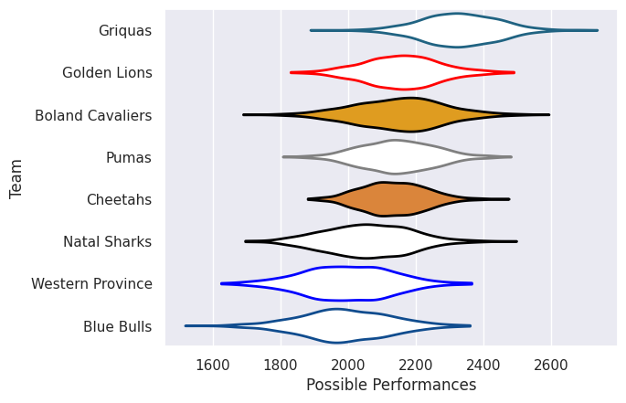

## Team Rankings

## Standings
### Current Standings

| Club             |   Played |   Wins |   Point Differential |   Losing Bonus Points |   Try Bonus Points |   Competition Points |
|:-----------------|---------:|-------:|---------------------:|----------------------:|-------------------:|---------------------:|
| Griquas          |        9 |      8 |                  175 |                     1 |                  6 |                   39 |
| Cheetahs         |        8 |      5 |                   16 |                     2 |                  5 |                   27 |
| Pumas            |        9 |      5 |                    2 |                     2 |                  4 |                   26 |
| Golden Lions     |        8 |      3 |                    7 |                     1 |                  4 |                   19 |
| Natal Sharks     |        7 |      3 |                  -24 |                     0 |                  4 |                   18 |
| Boland Cavaliers |        7 |      3 |                    9 |                     2 |                  2 |                   16 |
| Western Province |        7 |      3 |                  -51 |                     1 |                  2 |                   15 |
| Blue Bulls       |        7 |      0 |                 -134 |                     1 |                  3 |                    4 |

## Completed Match Review

| Model | Percent Correct Predictions | Spread Error |
| ------ | ------ | ------ |
| Club Level | 61.3% | 13.9 |
| Player Level: Lineup | nan% | nan |
| Player Level: Minutes | nan% | nan |

