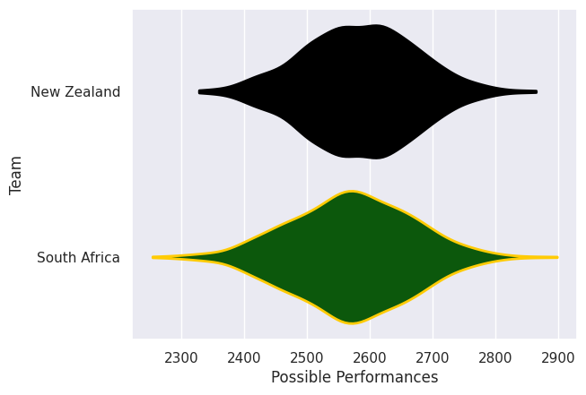

## Team Rankings

## Standings
### Current Standings

| Club         |   Played |   Wins |   Point Differential |   Losing Bonus Points |   Try Bonus Points |   Competition Points |
|:-------------|---------:|-------:|---------------------:|----------------------:|-------------------:|---------------------:|
| South Africa |        4 |      3 |                   10 |                     0 |                  2 |                   14 |
| New Zealand  |        4 |      1 |                  -10 |                     2 |                  4 |                   10 |

## Completed Match Review

| Model | Percent Correct Predictions | Spread Error |
| ------ | ------ | ------ |
| Club Level | 75.0% | 10.9 |
| Player Level: Lineup | nan% | nan |
| Player Level: Minutes | nan% | nan |

