## Team Rankings

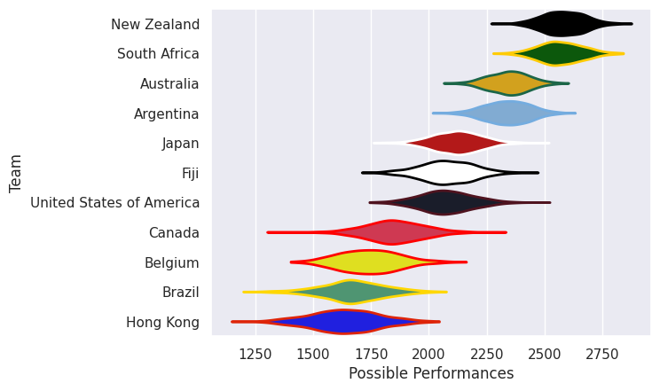
## Completed Match Review

| Model | Percent Correct Predictions | Spread Error |
| ------ | ------ | ------ |
| Club Level | 78.9% | 8.7 |
| Player Level: Lineup | nan% | nan |
| Player Level: Minutes | nan% | nan |

## Future Predictions
### Week 5
#### Australia V South Africa on 2026/09/27

Average Margin: South Africa by 8.3

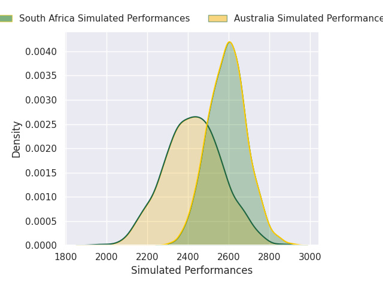
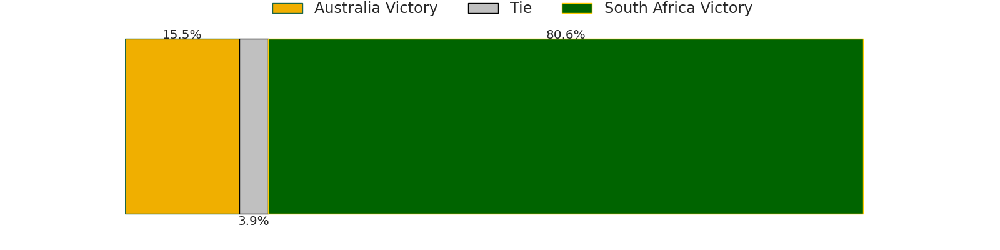
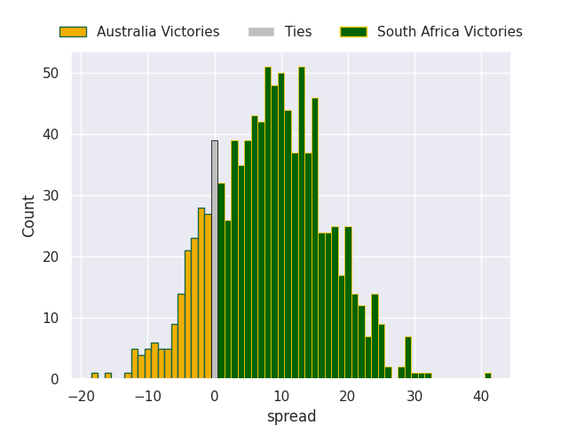

### Week 6
#### New Zealand V Australia on 2026/10/10

Average Margin: New Zealand by 14.9

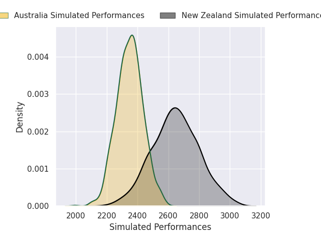
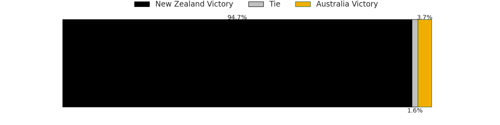
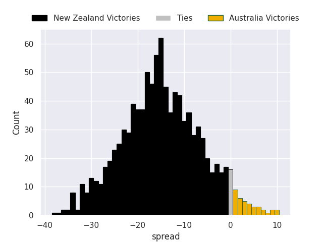

### Week 7
#### Australia V New Zealand on 2026/10/17

Average Margin: New Zealand by 6.7

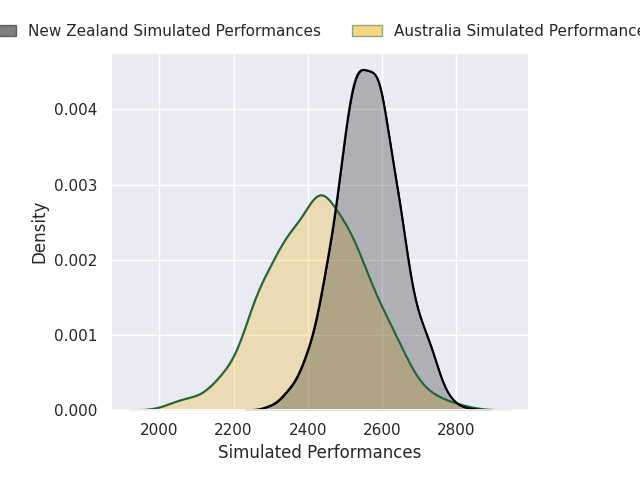
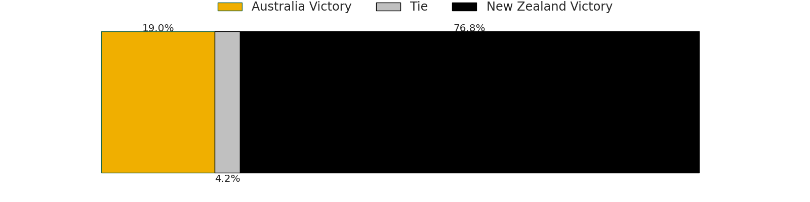
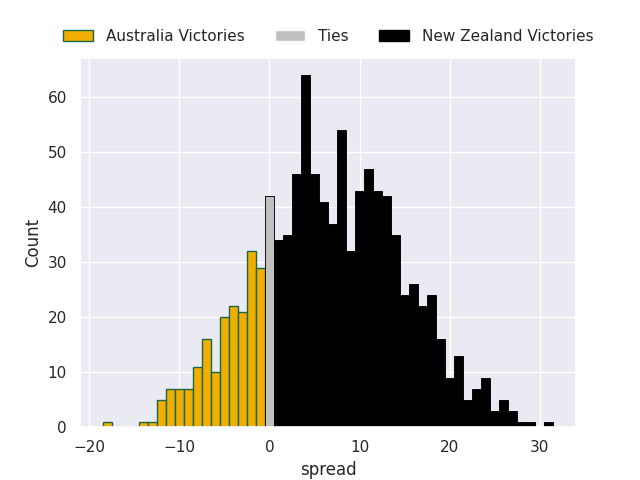

### Week 8
#### Japan V Fiji on 2026/10/24

Average Margin: Japan by 11.2

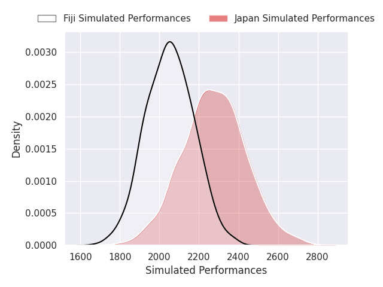
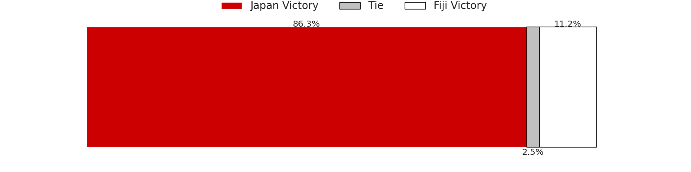
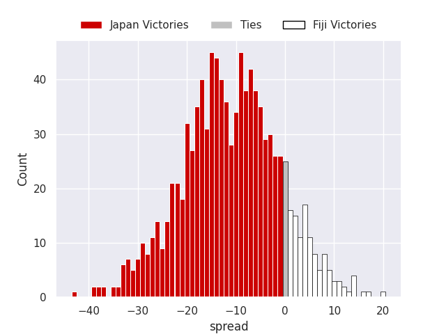

### Week 9
#### Belgium V Hong Kong on 2026/10/31

Average Margin: Belgium by 10.2

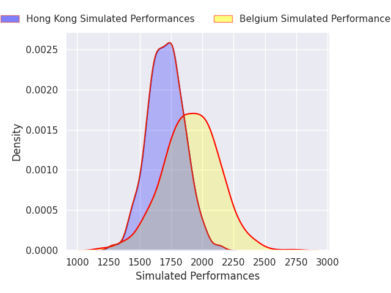
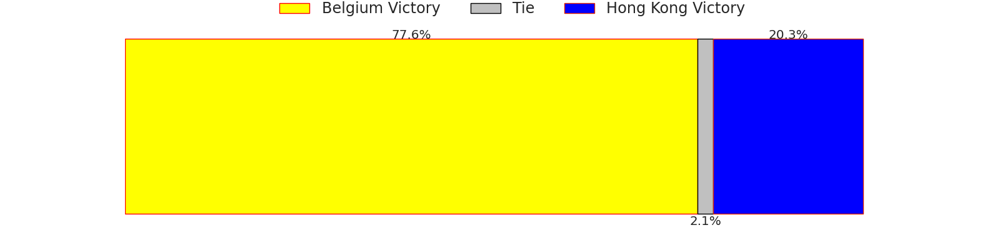
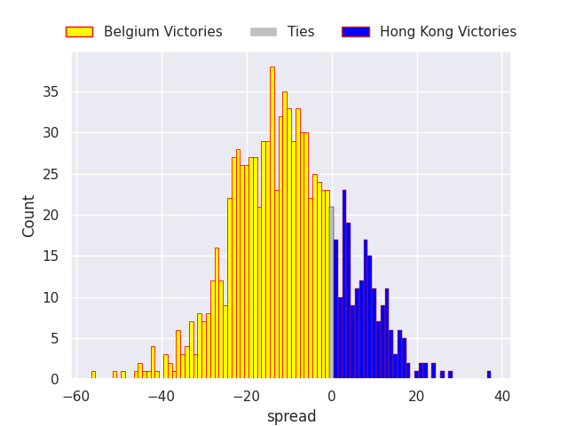

### Week 10
#### Paraguay V Brazil on 2026/11/13

Average Margin: Paraguay by 19.2

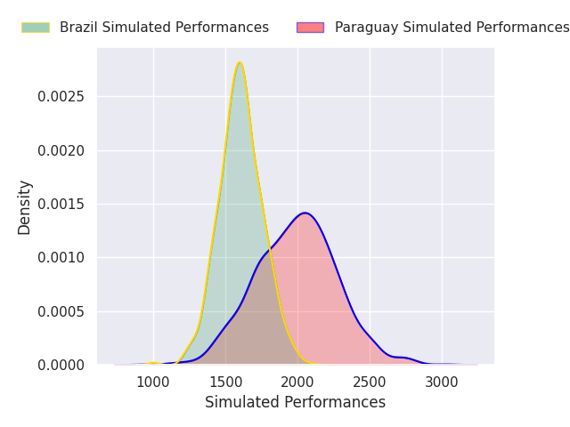
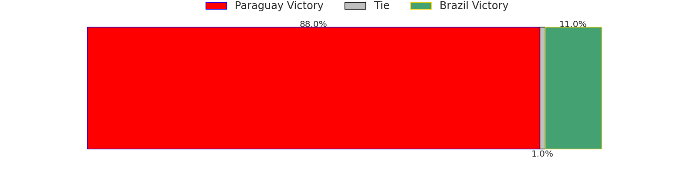
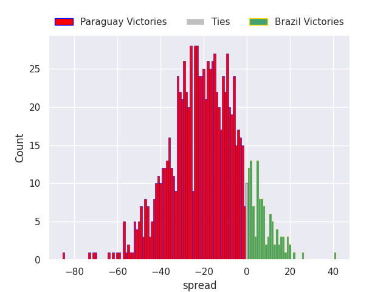

