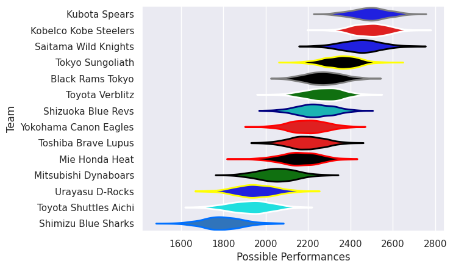

## Team Rankings

## Standings
### Current Standings

| Club                  |   Played |   Wins |   Point Differential |   Losing Bonus Points |   Try Bonus Points |   Competition Points |
|:----------------------|---------:|-------:|---------------------:|----------------------:|-------------------:|---------------------:|
| Kobelco Kobe Steelers |       20 |     18 |                  349 |                     1 |                  4 |                   77 |
| Saitama Wild Knights  |       20 |     17 |                  333 |                     2 |                  6 |                   76 |
| Kubota Spears         |       21 |     16 |                  368 |                     3 |                  5 |                   72 |
| Tokyo Sungoliath      |       20 |     10 |                   58 |                     7 |                  4 |                   51 |
| Black Rams Tokyo      |       19 |      9 |                  -54 |                     2 |                  2 |                   40 |
| Toshiba Brave Lupus   |       19 |      8 |                 -173 |                     3 |                  5 |                   40 |
| Shizuoka Blue Revs    |       18 |      7 |                  -38 |                     4 |                  3 |                   35 |
| Mie Honda Heat        |       18 |      7 |                 -136 |                     4 |                  3 |                   35 |
| Toyota Verblitz       |       18 |      7 |                  -44 |                     2 |                  3 |                   33 |
| Urayasu D-Rocks       |       20 |      7 |                 -230 |                     0 |                  2 |                   30 |
| Yokohama Canon Eagles |       18 |      6 |                 -143 |                     4 |                  1 |                   29 |
| Mitsubishi Dynaboars  |       19 |      5 |                 -184 |                     4 |                  2 |                   26 |
| Toyota Shuttles Aichi |        2 |      0 |                  -46 |                     0 |                    |                    0 |
| Shimizu Blue Sharks   |        2 |      0 |                  -60 |                     0 |                    |                    0 |

### Projected Remaining Table

| Club                 |   To Play |   Projected Wins |   Projected Differential |   Projected Losing Bonus Points | Projected Try Bonus Points   |   Projected Competition Points |
|:---------------------|----------:|-----------------:|-------------------------:|--------------------------------:|:-----------------------------|-------------------------------:|
| Tokyo Sungoliath     |         1 |            0.933 |                   15.035 |                           0.048 |                              |                          3.798 |
| Mitsubishi Dynaboars |         1 |            0.058 |                  -15.035 |                           0.138 |                              |                          0.388 |

### Projected Total Table

| Club                  |   Played |   Wins |   Point Differential |   Losing Bonus Points |   Try Bonus Points |   Competition Points |
|:----------------------|---------:|-------:|---------------------:|----------------------:|-------------------:|---------------------:|
| Kobelco Kobe Steelers |       20 | 18     |              349     |                 1     |                  4 |               77     |
| Saitama Wild Knights  |       20 | 17     |              333     |                 2     |                  6 |               76     |
| Kubota Spears         |       21 | 16     |              368     |                 3     |                  5 |               72     |
| Tokyo Sungoliath      |       21 | 10.933 |               73.035 |                 7.048 |                  4 |               54.798 |
| Black Rams Tokyo      |       19 |  9     |              -54     |                 2     |                  2 |               40     |
| Toshiba Brave Lupus   |       19 |  8     |             -173     |                 3     |                  5 |               40     |
| Shizuoka Blue Revs    |       18 |  7     |              -38     |                 4     |                  3 |               35     |
| Mie Honda Heat        |       18 |  7     |             -136     |                 4     |                  3 |               35     |
| Toyota Verblitz       |       18 |  7     |              -44     |                 2     |                  3 |               33     |
| Urayasu D-Rocks       |       20 |  7     |             -230     |                 0     |                  2 |               30     |
| Yokohama Canon Eagles |       18 |  6     |             -143     |                 4     |                  1 |               29     |
| Mitsubishi Dynaboars  |       20 |  5.058 |             -199.035 |                 4.138 |                  2 |               26.388 |
| Toyota Shuttles Aichi |        2 |  0     |              -46     |                 0     |                    |                0     |
| Shimizu Blue Sharks   |        2 |  0     |              -60     |                 0     |                    |                0     |

## Completed Match Review

| Model | Percent Correct Predictions | Spread Error |
| ------ | ------ | ------ |
| Club Level | 71.2% | 14.1 |
| Player Level: Lineup | nan% | nan |
| Player Level: Minutes | nan% | nan |

## Future Predictions
### Week 22
#### Tokyo Sungoliath V Mitsubishi Dynaboars on 2026/02/07

Average Margin: Tokyo Sungoliath by 15.0

