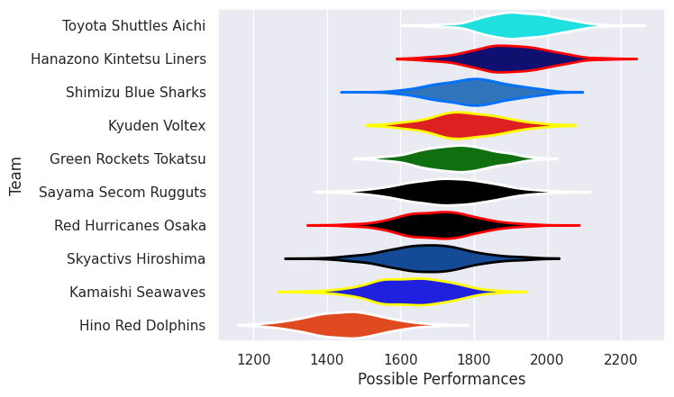

## Team Rankings

## Standings
### Current Standings

| Club                     |   Played |   Wins |   Point Differential |   Losing Bonus Points |   Try Bonus Points |   Competition Points |
|:-------------------------|---------:|-------:|---------------------:|----------------------:|-------------------:|---------------------:|
| Toyota Shuttles Aichi    |       13 |     10 |                  319 |                     1 |                  3 |                   44 |
| Shimizu Blue Sharks      |       12 |     10 |                   50 |                     1 |                  2 |                   43 |
| Hanazono Kintetsu Liners |       11 |      8 |                  133 |                     1 |                  3 |                   36 |
| Kyuden Voltex            |       12 |      7 |                  -26 |                     1 |                    |                   29 |
| Green Rockets Tokatsu    |       12 |      6 |                   29 |                     2 |                  1 |                   27 |
| Red Hurricanes Osaka     |       11 |      3 |                 -141 |                     4 |                    |                   16 |
| Kamaishi Seawaves        |       11 |      3 |                 -102 |                     1 |                    |                   13 |
| Hino Red Dolphins        |       15 |      2 |                 -284 |                     3 |                  1 |                   12 |
| Skyactivs Hiroshima      |        2 |      1 |                   24 |                     1 |                    |                    5 |
| Sayama Secom Rugguts     |        1 |      0 |                   -2 |                     1 |                    |                    1 |

### Projected Remaining Table

| Club                     |   To Play |   Projected Wins |   Projected Differential |   Projected Losing Bonus Points | Projected Try Bonus Points   |   Projected Competition Points |
|:-------------------------|----------:|-----------------:|-------------------------:|--------------------------------:|:-----------------------------|-------------------------------:|
| Hanazono Kintetsu Liners |         1 |            0.825 |                   10.238 |                           0.115 |                              |                          3.447 |
| Green Rockets Tokatsu    |         1 |            0.733 |                    7.134 |                           0.166 |                              |                          3.172 |
| Sayama Secom Rugguts     |         1 |            0.709 |                    7.459 |                           0.145 |                              |                          3.033 |
| Kyuden Voltex            |         1 |            0.598 |                    3.355 |                           0.223 |                              |                          2.689 |
| Kamaishi Seawaves        |         2 |            0.495 |                  -14.593 |                           0.441 |                              |                          2.547 |
| Red Hurricanes Osaka     |         1 |            0.365 |                   -3.355 |                           0.249 |                              |                          1.783 |
| Shimizu Blue Sharks      |         1 |            0.159 |                  -10.238 |                           0.223 |                              |                          0.891 |

### Projected Total Table

| Club                     |   Played |   Wins |   Point Differential |   Losing Bonus Points |   Try Bonus Points |   Competition Points |
|:-------------------------|---------:|-------:|---------------------:|----------------------:|-------------------:|---------------------:|
| Toyota Shuttles Aichi    |       13 | 10     |              319     |                 1     |                  3 |               44     |
| Shimizu Blue Sharks      |       13 | 10.159 |               39.762 |                 1.223 |                  2 |               43.891 |
| Hanazono Kintetsu Liners |       12 |  8.825 |              143.238 |                 1.115 |                  3 |               39.447 |
| Kyuden Voltex            |       13 |  7.598 |              -22.645 |                 1.223 |                    |               31.689 |
| Green Rockets Tokatsu    |       13 |  6.733 |               36.134 |                 2.166 |                  1 |               30.172 |
| Red Hurricanes Osaka     |       12 |  3.365 |             -144.355 |                 4.249 |                    |               17.783 |
| Kamaishi Seawaves        |       13 |  3.495 |             -116.593 |                 1.441 |                    |               15.547 |
| Hino Red Dolphins        |       15 |  2     |             -284     |                 3     |                  1 |               12     |
| Skyactivs Hiroshima      |        2 |  1     |               24     |                 1     |                    |                5     |
| Sayama Secom Rugguts     |        2 |  0.709 |                5.459 |                 1.145 |                    |                4.033 |

## Completed Match Review

| Model | Percent Correct Predictions | Spread Error |
| ------ | ------ | ------ |
| Club Level | 64.8% | 14.5 |
| Player Level: Lineup | nan% | nan |
| Player Level: Minutes | nan% | nan |

## Future Predictions
### Week 16
#### Shimizu Blue Sharks V Hanazono Kintetsu Liners on 2026/02/07

Average Margin: Hanazono Kintetsu Liners by 10.2

#### Green Rockets Tokatsu V Kamaishi Seawaves on 2026/02/08

Average Margin: Green Rockets Tokatsu by 7.1

#### Kyuden Voltex V Red Hurricanes Osaka on 2026/02/08

Average Margin: Kyuden Voltex by 3.4

### Week 17
#### Sayama Secom Rugguts V Kamaishi Seawaves on 2026/05/31

Average Margin: Sayama Secom Rugguts by 7.5

