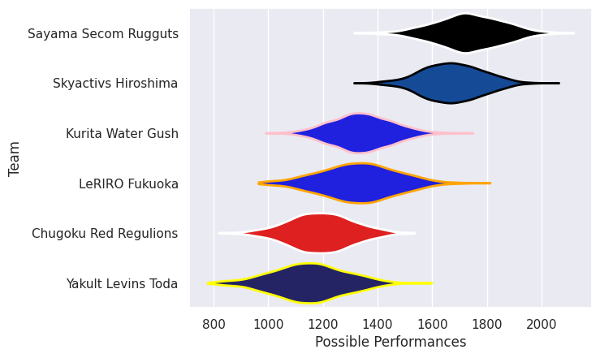

## Team Rankings

## Standings
### Current Standings

| Club                  |   Played |   Wins |   Point Differential |   Losing Bonus Points |   Try Bonus Points |   Competition Points |
|:----------------------|---------:|-------:|---------------------:|----------------------:|-------------------:|---------------------:|
| Skyactivs Hiroshima   |       14 |     13 |                  295 |                     0 |                  1 |                   53 |
| Sayama Secom Rugguts  |       13 |     10 |                  388 |                     1 |                  1 |                   44 |
| Kurita Water Gush     |       13 |      5 |                 -100 |                     4 |                    |                   24 |
| LeRIRO Fukuoka        |       13 |      5 |                 -117 |                     0 |                    |                   24 |
| Yakult Levins Toda    |       15 |      3 |                 -273 |                     4 |                    |                   16 |
| Chugoku Red Regulions |       12 |      2 |                 -193 |                     2 |                  1 |                   13 |

### Projected Remaining Table

| Club                  |   To Play |   Projected Wins |   Projected Differential |   Projected Losing Bonus Points | Projected Try Bonus Points   |   Projected Competition Points |
|:----------------------|----------:|-----------------:|-------------------------:|--------------------------------:|:-----------------------------|-------------------------------:|
| Sayama Secom Rugguts  |         1 |            0.921 |                   19.435 |                           0.046 |                              |                          3.752 |
| LeRIRO Fukuoka        |         1 |            0.559 |                    2.871 |                           0.163 |                              |                          2.457 |
| Chugoku Red Regulions |         1 |            0.412 |                   -2.871 |                           0.176 |                              |                          1.882 |
| Kurita Water Gush     |         1 |            0.068 |                  -19.435 |                           0.111 |                              |                          0.405 |

### Projected Total Table

| Club                  |   Played |   Wins |   Point Differential |   Losing Bonus Points |   Try Bonus Points |   Competition Points |
|:----------------------|---------:|-------:|---------------------:|----------------------:|-------------------:|---------------------:|
| Skyactivs Hiroshima   |       14 | 13     |              295     |                 0     |                  1 |               53     |
| Sayama Secom Rugguts  |       14 | 10.921 |              407.435 |                 1.046 |                  1 |               47.752 |
| LeRIRO Fukuoka        |       14 |  5.559 |             -114.129 |                 0.163 |                    |               26.457 |
| Kurita Water Gush     |       14 |  5.068 |             -119.435 |                 4.111 |                    |               24.405 |
| Yakult Levins Toda    |       15 |  3     |             -273     |                 4     |                    |               16     |
| Chugoku Red Regulions |       13 |  2.412 |             -195.871 |                 2.176 |                  1 |               14.882 |

## Completed Match Review

| Model | Percent Correct Predictions | Spread Error |
| ------ | ------ | ------ |
| Club Level | 76.2% | 14.9 |
| Player Level: Lineup | nan% | nan |
| Player Level: Minutes | nan% | nan |

## Future Predictions
### Week 16
#### LeRIRO Fukuoka V Chugoku Red Regulions on 2026/02/08

Average Margin: LeRIRO Fukuoka by 2.9

### Week 17
#### Sayama Secom Rugguts V Kurita Water Gush on 2026/02/15

Average Margin: Sayama Secom Rugguts by 19.4

