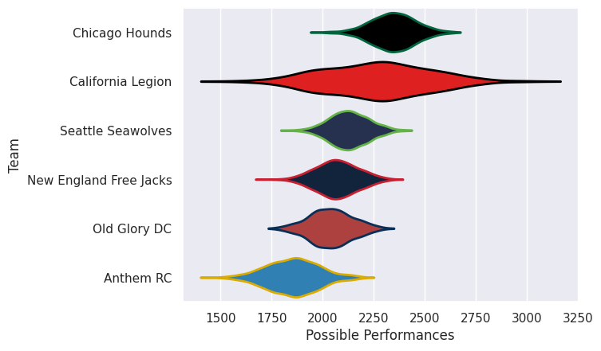

## Team Rankings

## Standings
### Current Standings

| Club                   |   Played |   Wins |   Point Differential |   Losing Bonus Points | Try Bonus Points   |   Competition Points |
|:-----------------------|---------:|-------:|---------------------:|----------------------:|:-------------------|---------------------:|
| Chicago Hounds         |       13 |     12 |                  240 |                     0 |                    |                   48 |
| California Legion      |       12 |      6 |                   46 |                     1 |                    |                   25 |
| Seattle Seawolves      |       11 |      6 |                   -8 |                     0 |                    |                   24 |
| Old Glory DC           |       11 |      4 |                  -95 |                     2 |                    |                   18 |
| New England Free Jacks |        9 |      3 |                  -51 |                     2 |                    |                   14 |
| Anthem RC              |       10 |      2 |                 -132 |                     0 |                    |                    8 |

### Projected Remaining Table

| Club              |   To Play |   Projected Wins |   Projected Differential |   Projected Losing Bonus Points | Projected Try Bonus Points   |   Projected Competition Points |
|:------------------|----------:|-----------------:|-------------------------:|--------------------------------:|:-----------------------------|-------------------------------:|
| California Legion |         1 |            0.694 |                   12.396 |                           0.084 |                              |                          2.882 |
| Seattle Seawolves |         1 |            0.295 |                  -12.396 |                           0.108 |                              |                          1.31  |

### Projected Total Table

| Club                   |   Played |   Wins |   Point Differential |   Losing Bonus Points | Try Bonus Points   |   Competition Points |
|:-----------------------|---------:|-------:|---------------------:|----------------------:|:-------------------|---------------------:|
| Chicago Hounds         |       13 | 12     |              240     |                 0     |                    |               48     |
| California Legion      |       13 |  6.694 |               58.396 |                 1.084 |                    |               27.882 |
| Seattle Seawolves      |       12 |  6.295 |              -20.396 |                 0.108 |                    |               25.31  |
| Old Glory DC           |       11 |  4     |              -95     |                 2     |                    |               18     |
| New England Free Jacks |        9 |  3     |              -51     |                 2     |                    |               14     |
| Anthem RC              |       10 |  2     |             -132     |                 0     |                    |                8     |

## Completed Match Review

| Model | Percent Correct Predictions | Spread Error |
| ------ | ------ | ------ |
| Club Level | 64.7% | 20.3 |
| Player Level: Lineup | nan% | nan |
| Player Level: Minutes | nan% | nan |

## Future Predictions
### Week 14
#### California Legion V Seattle Seawolves on 2026/06/03

Average Margin: California Legion by 12.4

