## Team Rankings

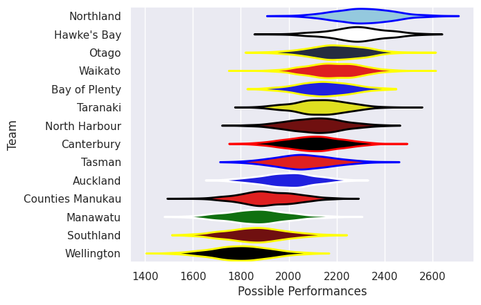
## Standings
### Current Standings

| Club             |   Played |   Wins |   Point Differential |   Losing Bonus Points |   Try Bonus Points |   Competition Points |
|:-----------------|---------:|-------:|---------------------:|----------------------:|-------------------:|---------------------:|
| Northland        |        8 |      6 |                  125 |                     1 |                  7 |                   32 |
| Otago            |        8 |      6 |                  111 |                     1 |                  7 |                   32 |
| Hawke's Bay      |        8 |      6 |                  109 |                     1 |                  6 |                   31 |
| North Harbour    |        8 |      5 |                  104 |                     3 |                  8 |                   31 |
| Canterbury       |        8 |      6 |                   48 |                     0 |                  6 |                   30 |
| Tasman           |        9 |      5 |                   12 |                     1 |                  6 |                   27 |
| Taranaki         |        8 |      4 |                   27 |                     3 |                  5 |                   24 |
| Waikato          |        8 |      4 |                   15 |                     2 |                  6 |                   24 |
| Bay of Plenty    |        9 |      4 |                  -59 |                     1 |                  6 |                   23 |
| Manawatu         |        8 |      4 |                  -56 |                     1 |                  3 |                   20 |
| Auckland         |        8 |      3 |                  -32 |                     2 |                  4 |                   18 |
| Southland        |        8 |      2 |                  -99 |                     1 |                  4 |                   13 |
| Counties Manukau |        8 |      2 |                 -108 |                     0 |                  4 |                   12 |
| Wellington       |        8 |      0 |                 -197 |                     1 |                  5 |                    6 |

### Projected Remaining Table

| Club             |   To Play |   Projected Wins |   Projected Differential |   Projected Losing Bonus Points | Projected Try Bonus Points   |   Projected Competition Points |
|:-----------------|----------:|-----------------:|-------------------------:|--------------------------------:|:-----------------------------|-------------------------------:|
| Northland        |         2 |            1.845 |                   34.916 |                           0.102 |                              |                          7.52  |
| Canterbury       |         2 |            1.608 |                   22.793 |                           0.204 |                              |                          6.72  |
| Hawke's Bay      |         2 |            1.537 |                   16.037 |                           0.266 |                              |                          6.518 |
| Waikato          |         2 |            1.482 |                   15.415 |                           0.287 |                              |                          6.339 |
| Otago            |         2 |            1.317 |                   13.271 |                           0.281 |                              |                          5.661 |
| North Harbour    |         2 |            1.25  |                    8.773 |                           0.423 |                              |                          5.571 |
| Taranaki         |         2 |            1.198 |                   13.684 |                           0.291 |                              |                          5.131 |
| Manawatu         |         2 |            0.676 |                   -7.187 |                           0.514 |                              |                          3.356 |
| Auckland         |         2 |            0.657 |                  -12.835 |                           0.342 |                              |                          3.072 |
| Tasman           |         1 |            0.337 |                   -4.115 |                           0.258 |                              |                          1.678 |
| Bay of Plenty    |         1 |            0.289 |                   -6.034 |                           0.233 |                              |                          1.455 |
| Counties Manukau |         2 |            0.204 |                  -31.094 |                           0.29  |                              |                          1.178 |
| Wellington       |         2 |            0.151 |                  -32.037 |                           0.279 |                              |                          0.943 |
| Southland        |         2 |            0.145 |                  -31.587 |                           0.288 |                              |                          0.916 |

### Projected Total Table

| Club             |   Played |   Wins |   Point Differential |   Losing Bonus Points |   Try Bonus Points |   Competition Points |
|:-----------------|---------:|-------:|---------------------:|----------------------:|-------------------:|---------------------:|
| Northland        |       10 |  7.845 |              159.916 |                 1.102 |                  7 |               39.52  |
| Otago            |       10 |  7.317 |              124.271 |                 1.281 |                  7 |               37.661 |
| Hawke's Bay      |       10 |  7.537 |              125.037 |                 1.266 |                  6 |               37.518 |
| Canterbury       |       10 |  7.608 |               70.793 |                 0.204 |                  6 |               36.72  |
| North Harbour    |       10 |  6.25  |              112.773 |                 3.423 |                  8 |               36.571 |
| Waikato          |       10 |  5.482 |               30.415 |                 2.287 |                  6 |               30.339 |
| Taranaki         |       10 |  5.198 |               40.684 |                 3.291 |                  5 |               29.131 |
| Tasman           |       10 |  5.337 |                7.885 |                 1.258 |                  6 |               28.678 |
| Bay of Plenty    |       10 |  4.289 |              -65.034 |                 1.233 |                  6 |               24.455 |
| Manawatu         |       10 |  4.676 |              -63.187 |                 1.514 |                  3 |               23.356 |
| Auckland         |       10 |  3.657 |              -44.835 |                 2.342 |                  4 |               21.072 |
| Southland        |       10 |  2.145 |             -130.587 |                 1.288 |                  4 |               13.916 |
| Counties Manukau |       10 |  2.204 |             -139.094 |                 0.29  |                  4 |               13.178 |
| Wellington       |       10 |  0.151 |             -229.037 |                 1.279 |                  5 |                6.943 |

## Completed Match Review

| Model | Percent Correct Predictions | Spread Error |
| ------ | ------ | ------ |
| Club Level | 65.7% | 13.7 |
| Player Level: Lineup | nan% | nan |
| Player Level: Minutes | nan% | nan |

## Future Predictions
### Week 10
#### Auckland V Manawatu on 2026/09/25

Average Margin: Auckland by 3.2

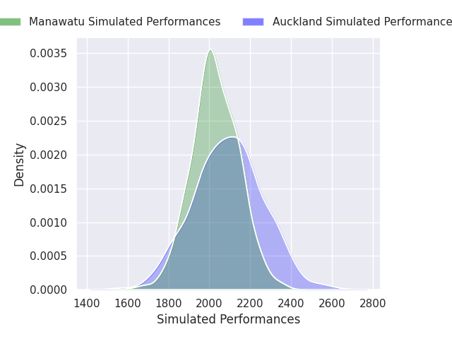

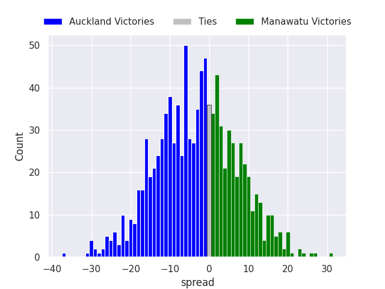

#### North Harbour V Otago on 2026/09/26

Average Margin: North Harbour by 2.7

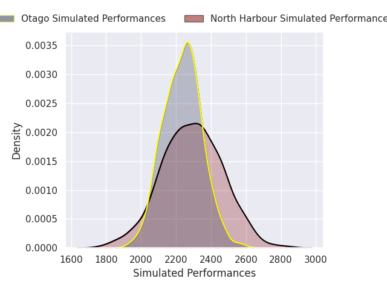

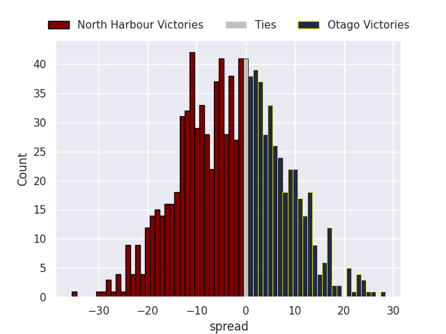

#### Canterbury V Southland on 2026/09/26

Average Margin: Canterbury by 18.8

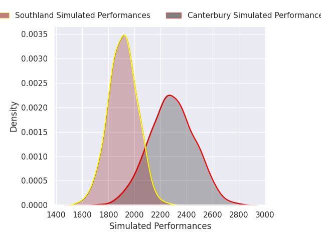
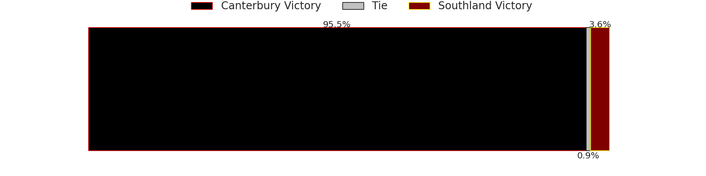
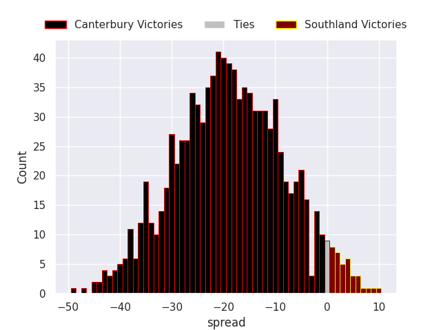

#### Northland V Counties Manukau on 2026/09/26

Average Margin: Northland by 22.1

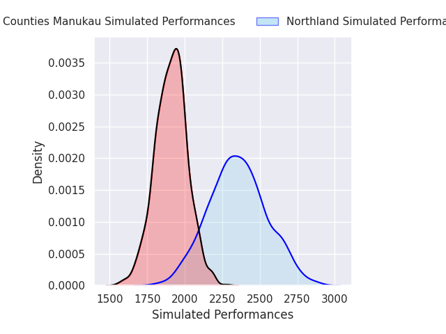
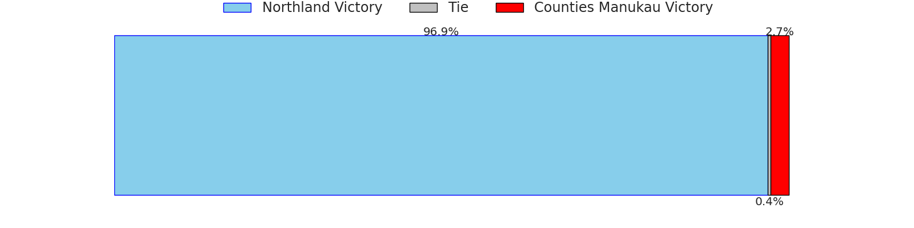
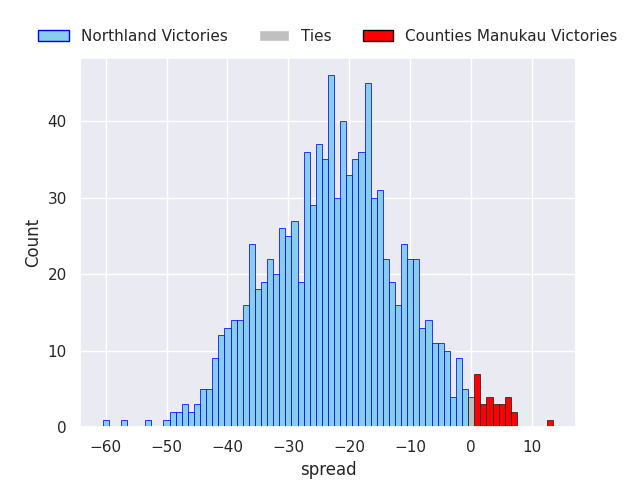

#### Hawke's Bay V Taranaki on 2026/09/27

Average Margin: Hawke's Bay by 7.1

#### Wellington V Waikato on 2026/09/27

Average Margin: Waikato by 11.3

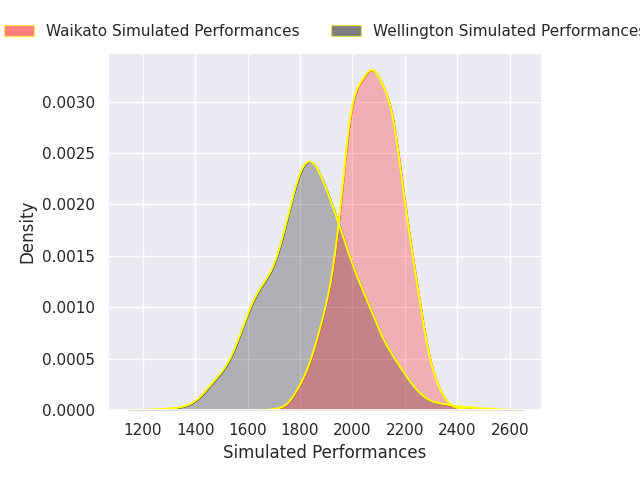
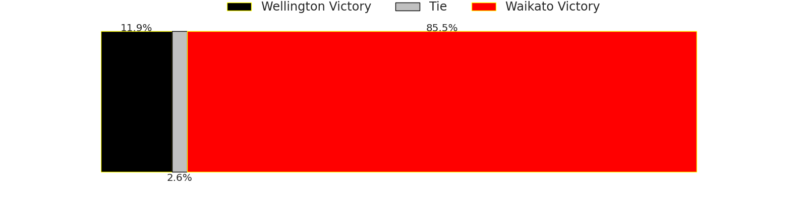
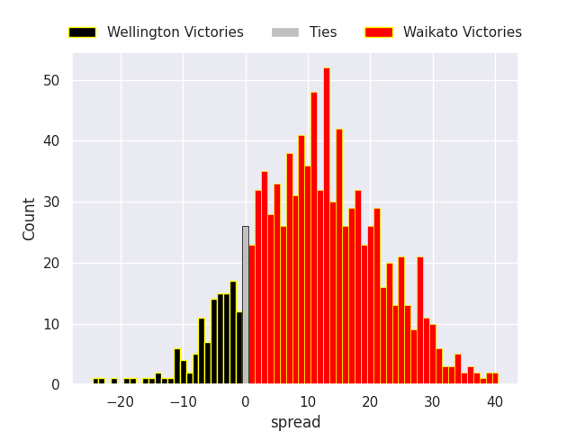

### Week 11
#### Otago V Auckland on 2026/10/01

Average Margin: Otago by 16.0

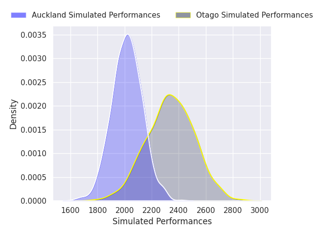

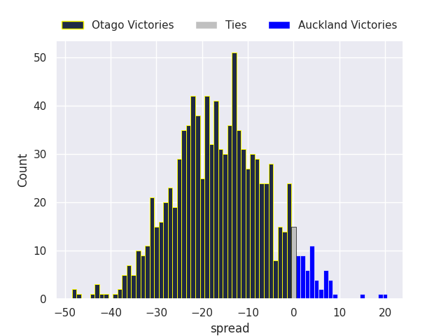

#### Manawatu V Canterbury on 2026/10/02

Average Margin: Canterbury by 4.0

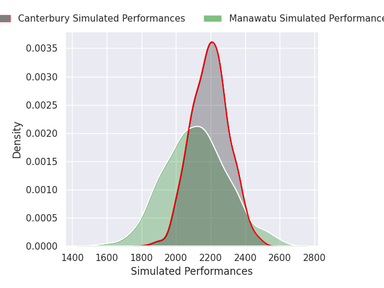
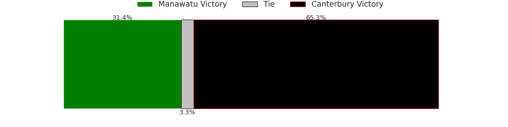
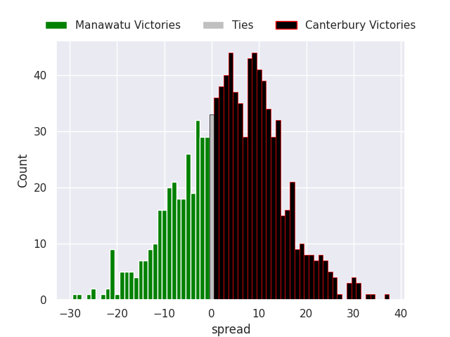

#### Southland V Northland on 2026/10/02

Average Margin: Northland by 12.8

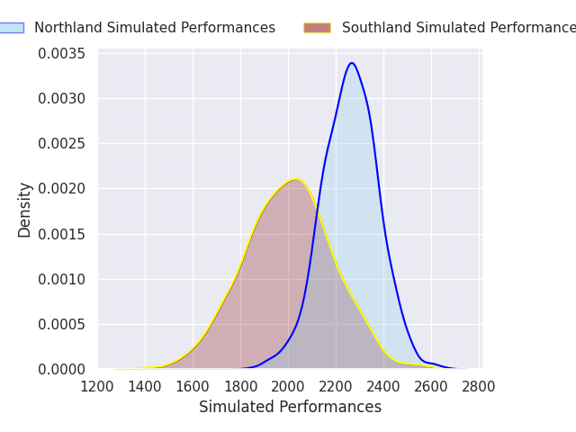
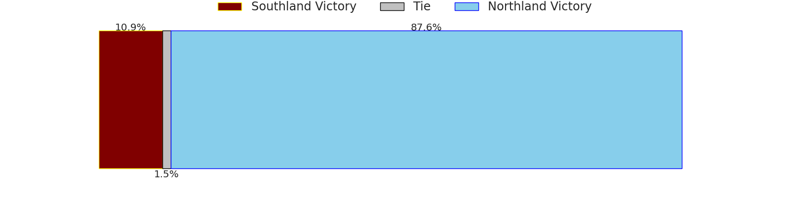
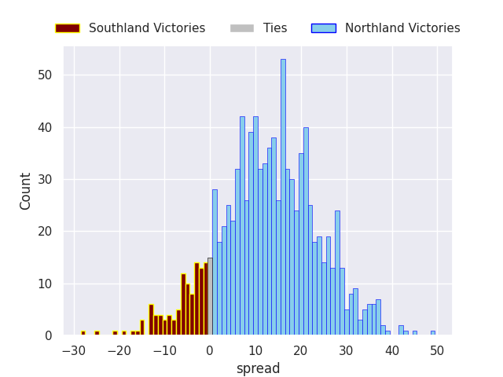

#### Waikato V Tasman on 2026/10/03

Average Margin: Waikato by 4.1

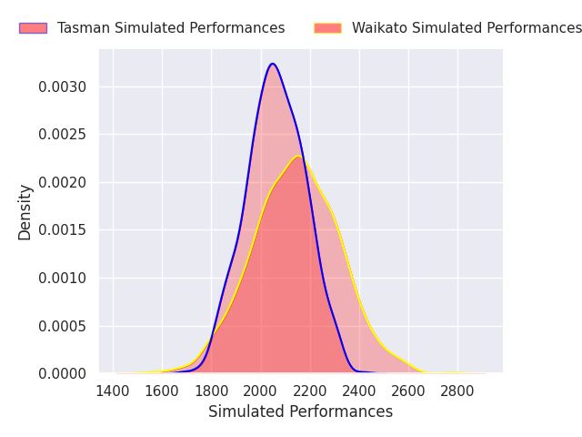

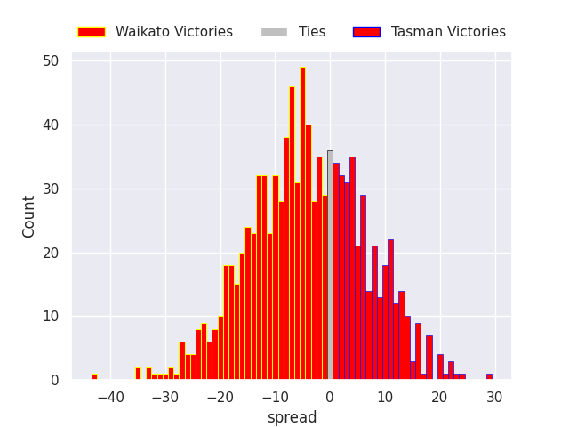

#### Counties Manukau V Hawke's Bay on 2026/10/03

Average Margin: Hawke's Bay by 9.0

#### Taranaki V Wellington on 2026/10/03

Average Margin: Taranaki by 20.7

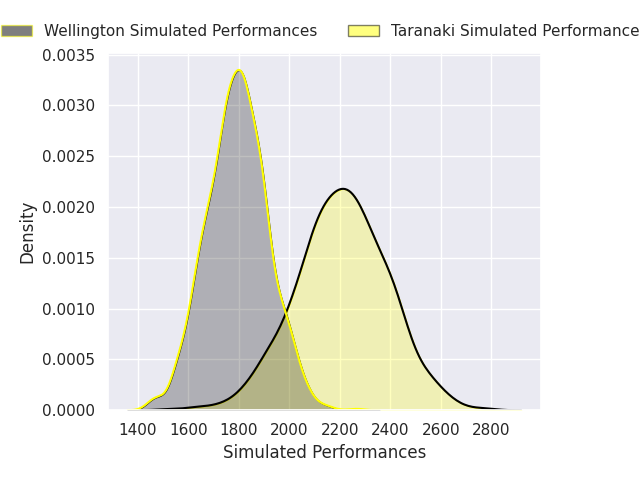
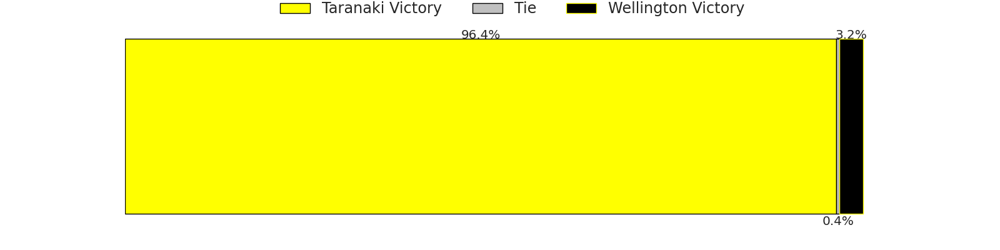
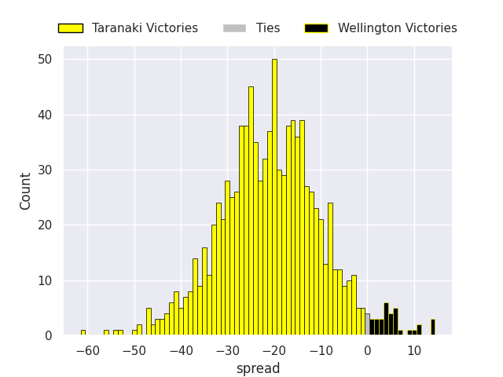

#### Bay of Plenty V North Harbour on 2026/10/04

Average Margin: North Harbour by 6.0

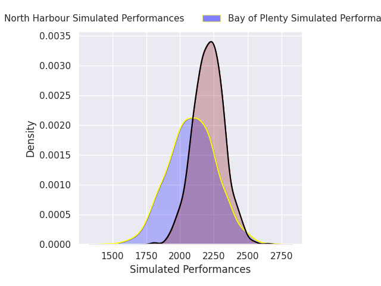
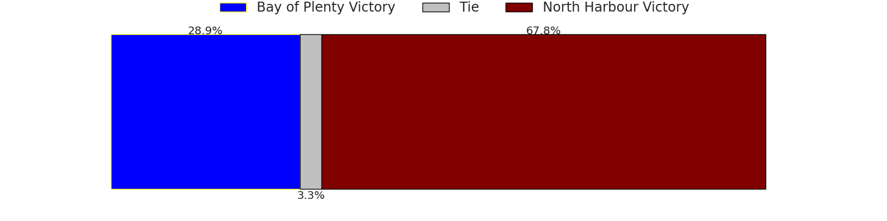
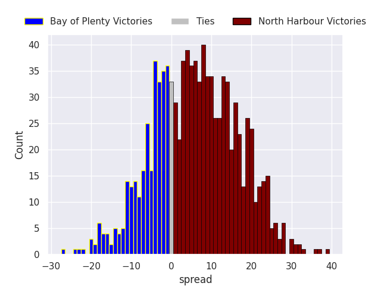

