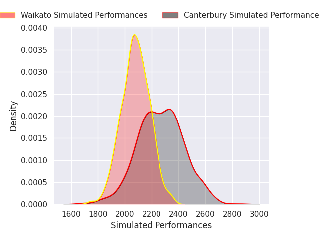
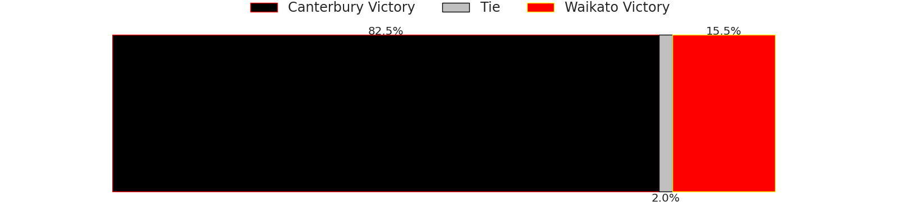
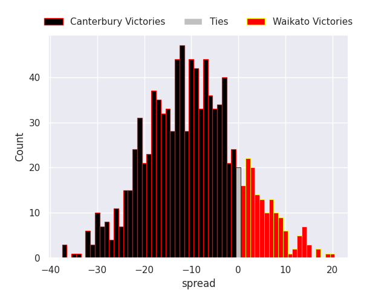

## Team Rankings

## Standings
### Current Standings

| Club             |   Played |   Wins |   Point Differential |   Losing Bonus Points |   Try Bonus Points |   Competition Points |
|:-----------------|---------:|-------:|---------------------:|----------------------:|-------------------:|---------------------:|
| Canterbury       |       14 |     12 |                  146 |                     0 |                 11 |                   59 |
| Northland        |       14 |     10 |                  155 |                     2 |                 10 |                   52 |
| Otago            |       13 |      9 |                  123 |                     1 |                  9 |                   46 |
| Taranaki         |       13 |      8 |                  156 |                     3 |                  9 |                   44 |
| North Harbour    |       12 |      6 |                   62 |                     3 |                 10 |                   37 |
| Tasman           |       12 |      7 |                   41 |                     2 |                  7 |                   37 |
| Hawke's Bay      |       12 |      6 |                   27 |                     3 |                  6 |                   33 |
| Bay of Plenty    |       11 |      6 |                  -25 |                     1 |                  7 |                   32 |
| Waikato          |       12 |      5 |                  -31 |                     2 |                  9 |                   31 |
| Manawatu         |       11 |      5 |                  -70 |                     1 |                  4 |                   25 |
| Counties Manukau |       11 |      5 |                  -95 |                     0 |                  4 |                   24 |
| Auckland         |       11 |      3 |                  -44 |                     5 |                  6 |                   23 |
| Southland        |       11 |      2 |                 -140 |                     1 |                  4 |                   13 |
| Wellington       |       11 |      0 |                 -305 |                     1 |                  6 |                    7 |

### Projected Remaining Table

| Club          |   To Play |   Projected Wins |   Projected Differential |   Projected Losing Bonus Points | Projected Try Bonus Points   |   Projected Competition Points |
|:--------------|----------:|-----------------:|-------------------------:|--------------------------------:|:-----------------------------|-------------------------------:|
| Canterbury    |         1 |            0.843 |                    9.539 |                           0.089 |                              |                          3.491 |
| North Harbour |         1 |            0.578 |                    2.42  |                           0.21  |                              |                          2.588 |
| Taranaki      |         1 |            0.389 |                   -2.42  |                           0.268 |                              |                          1.89  |
| Waikato       |         1 |            0.142 |                   -9.539 |                           0.258 |                              |                          0.856 |

### Projected Total Table

| Club             |   Played |   Wins |   Point Differential |   Losing Bonus Points |   Try Bonus Points |   Competition Points |
|:-----------------|---------:|-------:|---------------------:|----------------------:|-------------------:|---------------------:|
| Canterbury       |       15 | 12.843 |              155.539 |                 0.089 |                 11 |               62.491 |
| Northland        |       14 | 10     |              155     |                 2     |                 10 |               52     |
| Otago            |       13 |  9     |              123     |                 1     |                  9 |               46     |
| Taranaki         |       14 |  8.389 |              153.58  |                 3.268 |                  9 |               45.89  |
| North Harbour    |       13 |  6.578 |               64.42  |                 3.21  |                 10 |               39.588 |
| Tasman           |       12 |  7     |               41     |                 2     |                  7 |               37     |
| Hawke's Bay      |       12 |  6     |               27     |                 3     |                  6 |               33     |
| Bay of Plenty    |       11 |  6     |              -25     |                 1     |                  7 |               32     |
| Waikato          |       13 |  5.142 |              -40.539 |                 2.258 |                  9 |               31.856 |
| Manawatu         |       11 |  5     |              -70     |                 1     |                  4 |               25     |
| Counties Manukau |       11 |  5     |              -95     |                 0     |                  4 |               24     |
| Auckland         |       11 |  3     |              -44     |                 5     |                  6 |               23     |
| Southland        |       11 |  2     |             -140     |                 1     |                  4 |               13     |
| Wellington       |       11 |  0     |             -305     |                 1     |                  6 |                7     |

## Completed Match Review

| Model | Percent Correct Predictions | Spread Error |
| ------ | ------ | ------ |
| Club Level | 66.3% | 14.9 |
| Player Level: Lineup | nan% | nan |
| Player Level: Minutes | nan% | nan |

## Future Predictions
### Week 15
#### North Harbour V Taranaki on 2026/09/01

Average Margin: North Harbour by 2.4

### Week 16
#### Canterbury V Waikato on 2026/10/01

Average Margin: Canterbury by 9.5

