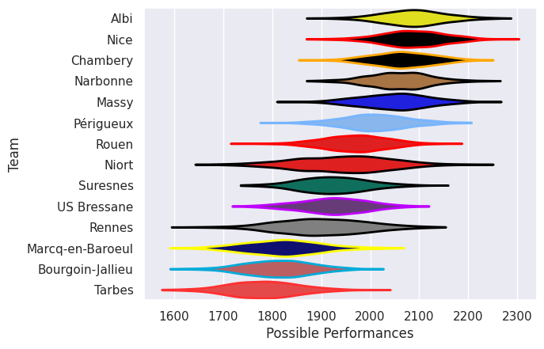

## Team Rankings

## Standings
### Current Standings

| Club             |   Played |   Wins |   Point Differential |   Losing Bonus Points |   Try Bonus Points |   Competition Points |
|:-----------------|---------:|-------:|---------------------:|----------------------:|-------------------:|---------------------:|
| Nice             |       28 |     20 |                  277 |                     5 |                  8 |                   93 |
| Narbonne         |       28 |     18 |                  196 |                     6 |                  4 |                   86 |
| Albi             |       26 |     19 |                  169 |                     3 |                  4 |                   85 |
| Massy            |       26 |     18 |                  123 |                     4 |                  4 |                   80 |
| Chambery         |       25 |     15 |                  148 |                     9 |                  5 |                   74 |
| Périgueux        |       27 |     16 |                   90 |                     6 |                  4 |                   74 |
| US Bressane      |       24 |      9 |                  -78 |                     7 |                  2 |                   51 |
| Niort            |       21 |      9 |                   20 |                     6 |                  6 |                   50 |
| Rouen            |       23 |      9 |                  -20 |                     7 |                  1 |                   46 |
| Bourgoin-Jallieu |       26 |     10 |                 -176 |                     6 |                    |                   46 |
| Suresnes         |       25 |      9 |                  -77 |                     4 |                  1 |                   45 |
| Rennes           |       24 |      8 |                 -166 |                     6 |                  1 |                   41 |
| Marcq-en-Baroeul |       25 |      5 |                 -261 |                     5 |                  2 |                   29 |
| Tarbes           |       18 |      2 |                 -245 |                     7 |                    |                   15 |

### Projected Remaining Table

| Club             |   To Play |   Projected Wins |   Projected Differential |   Projected Losing Bonus Points | Projected Try Bonus Points   |   Projected Competition Points |
|:-----------------|----------:|-----------------:|-------------------------:|--------------------------------:|:-----------------------------|-------------------------------:|
| Niort            |         5 |            2.828 |                   14.997 |                           0.971 |                              |                         12.599 |
| Chambery         |         3 |            2.54  |                   32.634 |                           0.284 |                              |                         10.568 |
| Rouen            |         3 |            2.076 |                   15.445 |                           0.409 |                              |                          8.849 |
| Tarbes           |         8 |            1.225 |                  -82.557 |                           1.675 |                              |                          6.961 |
| Rennes           |         2 |            0.829 |                   -3.229 |                           0.588 |                              |                          4.088 |
| Massy            |         1 |            0.992 |                   18.491 |                           0.005 |                              |                          3.979 |
| Albi             |         1 |            0.88  |                    8.553 |                           0.09  |                              |                          3.652 |
| Narbonne         |         1 |            0.859 |                    7.946 |                           0.106 |                              |                          3.59  |
| Suresnes         |         1 |            0.669 |                    3.648 |                           0.212 |                              |                          2.99  |
| Marcq-en-Baroeul |         1 |            0.428 |                   -0.721 |                           0.345 |                              |                          2.189 |
| US Bressane      |         2 |            0.277 |                  -15.207 |                           0.662 |                              |                          1.882 |

### Projected Total Table

| Club             |   Played |   Wins |   Point Differential |   Losing Bonus Points |   Try Bonus Points |   Competition Points |
|:-----------------|---------:|-------:|---------------------:|----------------------:|-------------------:|---------------------:|
| Nice             |       28 | 20     |              277     |                 5     |                  8 |               93     |
| Narbonne         |       29 | 18.859 |              203.946 |                 6.106 |                  4 |               89.59  |
| Albi             |       27 | 19.88  |              177.553 |                 3.09  |                  4 |               88.652 |
| Chambery         |       28 | 17.54  |              180.634 |                 9.284 |                  5 |               84.568 |
| Massy            |       27 | 18.992 |              141.491 |                 4.005 |                  4 |               83.979 |
| Périgueux        |       27 | 16     |               90     |                 6     |                  4 |               74     |
| Niort            |       26 | 11.828 |               34.997 |                 6.971 |                  6 |               62.599 |
| Rouen            |       26 | 11.076 |               -4.555 |                 7.409 |                  1 |               54.849 |
| US Bressane      |       26 |  9.277 |              -93.207 |                 7.662 |                  2 |               52.882 |
| Suresnes         |       26 |  9.669 |              -73.352 |                 4.212 |                  1 |               47.99  |
| Bourgoin-Jallieu |       26 | 10     |             -176     |                 6     |                    |               46     |
| Rennes           |       26 |  8.829 |             -169.229 |                 6.588 |                  1 |               45.088 |
| Marcq-en-Baroeul |       26 |  5.428 |             -261.721 |                 5.345 |                  2 |               31.189 |
| Tarbes           |       26 |  3.225 |             -327.557 |                 8.675 |                    |               21.961 |

## Completed Match Review

| Model | Percent Correct Predictions | Spread Error |
| ------ | ------ | ------ |
| Club Level | 73.8% | 8.2 |
| Player Level: Lineup | nan% | nan |
| Player Level: Minutes | nan% | nan |

## Future Predictions
### Week 29
#### Rennes V Chambery on 2026/01/31

Average Margin: Chambery by 4.1

### Week 30
#### Tarbes V Marcq-en-Baroeul on 2026/02/13

Average Margin: Tarbes by 0.7

### Week 31
#### Massy V Tarbes on 2026/02/20

Average Margin: Massy by 18.5

### Week 32
#### Tarbes V Narbonne on 2026/02/27

Average Margin: Narbonne by 7.9

### Week 33
#### Niort V Tarbes on 2026/03/07

Average Margin: Niort by 14.8

### Week 34
#### Chambery V Niort on 2026/03/20

Average Margin: Chambery by 9.9

#### Tarbes V Albi on 2026/03/20

Average Margin: Albi by 8.6

### Week 35
#### Chambery V Tarbes on 2026/03/27

Average Margin: Chambery by 18.6

#### Niort V Rouen on 2026/03/28

Average Margin: Niort by 5.8

### Week 36
#### Rouen V US Bressane on 2026/04/03

Average Margin: Rouen by 7.2

### Week 37
#### Tarbes V Rennes on 2026/04/10

Average Margin: Rennes by 0.8

#### Suresnes V Niort on 2026/04/11

Average Margin: Suresnes by 3.6

### Week 38
#### Niort V US Bressane on 2026/04/25

Average Margin: Niort by 8.0

#### Rouen V Tarbes on 2026/04/25

Average Margin: Rouen by 14.1

