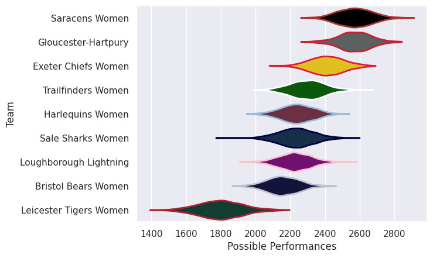

## Team Rankings

## Standings
### Current Standings

| Club                   |   Played |   Wins |   Point Differential |   Losing Bonus Points |   Try Bonus Points |   Competition Points |
|:-----------------------|---------:|-------:|---------------------:|----------------------:|-------------------:|---------------------:|
| Saracens Women         |       18 |     16 |                  537 |                     1 |                    |                   65 |
| Gloucester-Hartpury    |       17 |     14 |                  281 |                     3 |                    |                   59 |
| Exeter Chiefs Women    |       17 |      9 |                  177 |                     1 |                    |                   43 |
| Trailfinders Women     |       18 |      8 |                  -50 |                     3 |                    |                   39 |
| Harlequins Women       |       16 |      6 |                  -20 |                     5 |                  1 |                   32 |
| Sale Sharks Women      |       16 |      6 |                  -69 |                     3 |                    |                   29 |
| Loughborough Lightning |       16 |      5 |                  -51 |                     3 |                    |                   27 |
| Bristol Bears Women    |       16 |      6 |                  -75 |                     1 |                    |                   27 |
| Leicester Tigers Women |       16 |      0 |                 -730 |                     0 |                    |                    0 |

## Completed Match Review

| Model | Percent Correct Predictions | Spread Error |
| ------ | ------ | ------ |
| Club Level | 76.0% | 17.3 |
| Player Level: Lineup | nan% | nan |
| Player Level: Minutes | nan% | nan |

