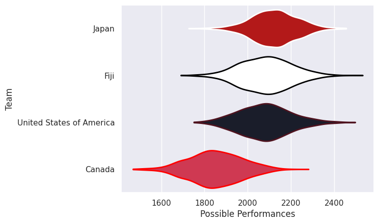

## Team Rankings

## Standings
### Current Standings

| Club                     |   Played |   Wins |   Point Differential |   Losing Bonus Points |   Try Bonus Points |   Competition Points |
|:-------------------------|---------:|-------:|---------------------:|----------------------:|-------------------:|---------------------:|
| Japan                    |        2 |      2 |                   54 |                     0 |                  1 |                    9 |
| Fiji                     |        2 |      1 |                   11 |                     1 |                  1 |                    6 |
| Canada                   |        2 |      1 |                  -13 |                     0 |                  1 |                    5 |
| United States of America |        2 |      0 |                  -52 |                     1 |                    |                    1 |

## Completed Match Review

| Model | Percent Correct Predictions | Spread Error |
| ------ | ------ | ------ |
| Club Level | 50.0% | 14.8 |
| Player Level: Lineup | nan% | nan |
| Player Level: Minutes | nan% | nan |

