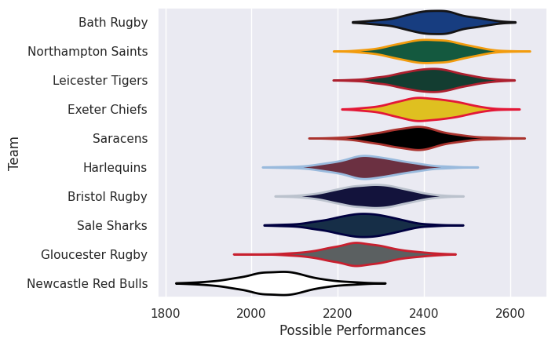

## Team Rankings

## Standings
### Current Standings

| Club                |   Played |   Wins |   Point Differential |   Losing Bonus Points | Try Bonus Points   |   Competition Points |
|:--------------------|---------:|-------:|---------------------:|----------------------:|:-------------------|---------------------:|
| Harlequins          |        2 |      2 |                   39 |                     0 |                    |                    8 |
| Gloucester Rugby    |        2 |      1 |                   14 |                     1 |                    |                    5 |
| Saracens            |        1 |      1 |                   54 |                     0 |                    |                    4 |
| Exeter Chiefs       |        1 |      1 |                   24 |                     0 |                    |                    4 |
| Newcastle Red Bulls |        1 |      1 |                   12 |                     0 |                    |                    4 |
| Sale Sharks         |        2 |      1 |                    5 |                     0 |                    |                    4 |
| Bristol Rugby       |        2 |      1 |                  -21 |                     0 |                    |                    4 |
| Bath Rugby          |        1 |      0 |                  -22 |                     0 |                    |                    0 |
| Leicester Tigers    |        2 |      0 |                  -36 |                     0 |                    |                    0 |
| Northampton Saints  |        2 |      0 |                  -69 |                     0 |                    |                    0 |

## Completed Match Review

| Model | Percent Correct Predictions | Spread Error |
| ------ | ------ | ------ |
| Club Level | 50.0% | 23.0 |
| Player Level: Lineup | nan% | nan |
| Player Level: Minutes | nan% | nan |

