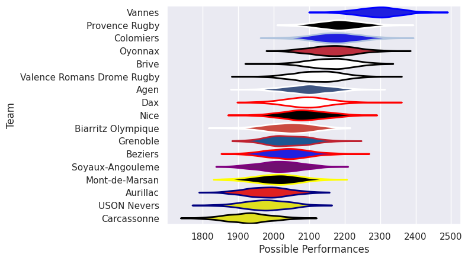

## Team Rankings

## Standings
### Current Standings

| Club                       |   Played |   Wins |   Point Differential |   Losing Bonus Points |   Try Bonus Points |   Competition Points |
|:---------------------------|---------:|-------:|---------------------:|----------------------:|-------------------:|---------------------:|
| Vannes                     |       32 |     26 |                  594 |                     4 |                 12 |                  122 |
| Provence Rugby             |       33 |     21 |                  201 |                     8 |                  9 |                  101 |
| Colomiers                  |       31 |     21 |                  317 |                     4 |                  7 |                   95 |
| Oyonnax                    |       32 |     18 |                  278 |                     9 |                  7 |                   88 |
| Valence Romans Drome Rugby |       31 |     19 |                   18 |                     4 |                  7 |                   87 |
| Brive                      |       31 |     17 |                  246 |                     3 |                  7 |                   80 |
| Agen                       |       30 |     15 |                   46 |                     4 |                  7 |                   71 |
| Dax                        |       30 |     14 |                  -36 |                     8 |                  2 |                   66 |
| Grenoble                   |       30 |     14 |                  -90 |                     6 |                  4 |                   66 |
| Biarritz Olympique         |       30 |     12 |                 -117 |                     4 |                  6 |                   60 |
| USON Nevers                |       30 |     11 |                 -264 |                     5 |                  8 |                   59 |
| Soyaux-Angouleme           |       30 |     13 |                 -194 |                     5 |                  1 |                   58 |
| Beziers                    |       30 |     12 |                 -147 |                     4 |                  5 |                   57 |
| Aurillac                   |       30 |     11 |                 -190 |                     7 |                  5 |                   56 |
| Mont-de-Marsan             |       31 |     11 |                 -254 |                     4 |                  2 |                   52 |
| Carcassonne                |       30 |      7 |                 -413 |                     6 |                  2 |                   38 |
| Nice                       |        1 |      1 |                    5 |                     0 |                    |                    4 |

## Completed Match Review

| Model | Percent Correct Predictions | Spread Error |
| ------ | ------ | ------ |
| Club Level | 74.4% | 13.3 |
| Player Level: Lineup | nan% | nan |
| Player Level: Minutes | nan% | nan |

