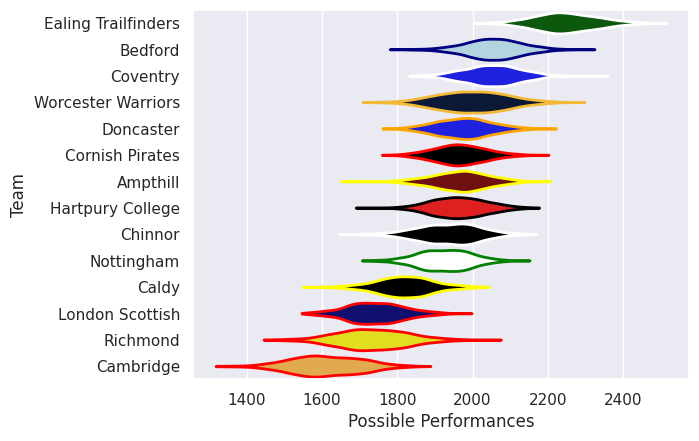

## Team Rankings

## Standings
### Current Standings

| Club                |   Played |   Wins |   Point Differential |   Losing Bonus Points |   Try Bonus Points |   Competition Points |
|:--------------------|---------:|-------:|---------------------:|----------------------:|-------------------:|---------------------:|
| Ealing Trailfinders |       27 |     26 |                  683 |                     1 |                  8 |                  113 |
| Bedford             |       28 |     19 |                  180 |                     3 |                 10 |                   91 |
| Worcester Warriors  |       29 |     18 |                  271 |                     6 |                  7 |                   85 |
| Coventry            |       28 |     17 |                  299 |                     7 |                  8 |                   83 |
| Chinnor             |       27 |     16 |                   56 |                     7 |                  2 |                   73 |
| Hartpury College    |       27 |     15 |                  137 |                     4 |                  4 |                   72 |
| Nottingham          |       26 |     12 |                   -8 |                     8 |                  8 |                   66 |
| Cornish Pirates     |       26 |     13 |                   99 |                     3 |                  6 |                   63 |
| Doncaster           |       26 |     12 |                   74 |                     4 |                  4 |                   62 |
| Ampthill            |       26 |     12 |                  -62 |                     5 |                  4 |                   57 |
| Caldy               |       26 |      9 |                 -240 |                     5 |                  6 |                   47 |
| Richmond            |       27 |      8 |                 -275 |                     4 |                  1 |                   39 |
| London Scottish     |       27 |      6 |                 -471 |                     3 |                  2 |                   29 |
| Cambridge           |       26 |      0 |                 -743 |                     4 |                  4 |                   10 |

## Completed Match Review

| Model | Percent Correct Predictions | Spread Error |
| ------ | ------ | ------ |
| Club Level | 72.3% | 14.0 |
| Player Level: Lineup | nan% | nan |
| Player Level: Minutes | nan% | nan |

