## Team Rankings

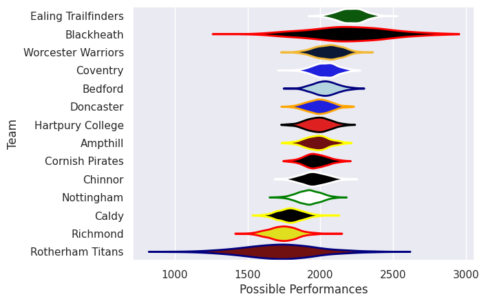
## Standings
### Current Standings

| Club                |   Played |   Wins |   Point Differential |   Losing Bonus Points | Try Bonus Points   |   Competition Points |
|:--------------------|---------:|-------:|---------------------:|----------------------:|:-------------------|---------------------:|
| Worcester Warriors  |        1 |      1 |                   35 |                     0 |                    |                    4 |
| Cornish Pirates     |        1 |      1 |                   26 |                     0 |                    |                    4 |
| Ealing Trailfinders |        1 |      1 |                   17 |                     0 |                    |                    4 |
| Nottingham          |        1 |      1 |                    7 |                     0 |                    |                    4 |
| Rotherham Titans    |        1 |      1 |                    3 |                     0 |                    |                    4 |
| Ampthill            |        1 |      1 |                    2 |                     0 |                    |                    4 |
| Hartpury College    |        1 |      1 |                    2 |                     0 |                    |                    4 |
| Caldy               |        1 |      0 |                   -2 |                     1 |                    |                    1 |
| Richmond            |        1 |      0 |                   -2 |                     1 |                    |                    1 |
| Coventry            |        1 |      0 |                   -3 |                     1 |                    |                    1 |
| Blackheath          |        1 |      0 |                   -7 |                     1 |                    |                    1 |
| Chinnor             |        1 |      0 |                  -17 |                     0 |                    |                    0 |
| Doncaster           |        1 |      0 |                  -26 |                     0 |                    |                    0 |
| Bedford             |        1 |      0 |                  -35 |                     0 |                    |                    0 |

### Projected Remaining Table

| Club                |   To Play |   Projected Wins |   Projected Differential |   Projected Losing Bonus Points | Projected Try Bonus Points   |   Projected Competition Points |
|:--------------------|----------:|-----------------:|-------------------------:|--------------------------------:|:-----------------------------|-------------------------------:|
| Ealing Trailfinders |         1 |            0.999 |                   28.01  |                           0.001 |                              |                          3.997 |
| Blackheath          |         1 |            0.849 |                   27.407 |                           0.055 |                              |                          3.473 |
| Coventry            |         1 |            0.819 |                    7.042 |                           0.12  |                              |                          3.47  |
| Bedford             |         1 |            0.793 |                    6.985 |                           0.142 |                              |                          3.376 |
| Worcester Warriors  |         1 |            0.758 |                   10.46  |                           0.123 |                              |                          3.187 |
| Ampthill            |         1 |            0.722 |                    4.97  |                           0.174 |                              |                          3.13  |
| Doncaster           |         1 |            0.667 |                    3.915 |                           0.213 |                              |                          2.973 |
| Hartpury College    |         1 |            0.287 |                   -3.915 |                           0.345 |                              |                          1.585 |
| Nottingham          |         1 |            0.244 |                   -4.97  |                           0.339 |                              |                          1.383 |
| Rotherham Titans    |         1 |            0.226 |                  -10.46  |                           0.181 |                              |                          1.117 |
| Chinnor             |         1 |            0.176 |                   -6.985 |                           0.325 |                              |                          1.091 |
| Cornish Pirates     |         1 |            0.144 |                   -7.042 |                           0.345 |                              |                          0.995 |
| Caldy               |         1 |            0.14  |                  -27.407 |                           0.078 |                              |                          0.66  |
| Richmond            |         1 |            0.001 |                  -28.01  |                           0.012 |                              |                          0.016 |

### Projected Total Table

| Club                |   Played |   Wins |   Point Differential |   Losing Bonus Points | Try Bonus Points   |   Competition Points |
|:--------------------|---------:|-------:|---------------------:|----------------------:|:-------------------|---------------------:|
| Ealing Trailfinders |        2 |  1.999 |               45.01  |                 0.001 |                    |                7.997 |
| Worcester Warriors  |        2 |  1.758 |               45.46  |                 0.123 |                    |                7.187 |
| Ampthill            |        2 |  1.722 |                6.97  |                 0.174 |                    |                7.13  |
| Hartpury College    |        2 |  1.287 |               -1.915 |                 0.345 |                    |                5.585 |
| Nottingham          |        2 |  1.244 |                2.03  |                 0.339 |                    |                5.383 |
| Rotherham Titans    |        2 |  1.226 |               -7.46  |                 0.181 |                    |                5.117 |
| Cornish Pirates     |        2 |  1.144 |               18.958 |                 0.345 |                    |                4.995 |
| Blackheath          |        2 |  0.849 |               20.407 |                 1.055 |                    |                4.473 |
| Coventry            |        2 |  0.819 |                4.042 |                 1.12  |                    |                4.47  |
| Bedford             |        2 |  0.793 |              -28.015 |                 0.142 |                    |                3.376 |
| Doncaster           |        2 |  0.667 |              -22.085 |                 0.213 |                    |                2.973 |
| Caldy               |        2 |  0.14  |              -29.407 |                 1.078 |                    |                1.66  |
| Chinnor             |        2 |  0.176 |              -23.985 |                 0.325 |                    |                1.091 |
| Richmond            |        2 |  0.001 |              -30.01  |                 1.012 |                    |                1.016 |

## Completed Match Review

| Model | Percent Correct Predictions | Spread Error |
| ------ | ------ | ------ |
| Club Level | 85.7% | 9.5 |
| Player Level: Lineup | nan% | nan |
| Player Level: Minutes | nan% | nan |

## Future Predictions
### Week 2
#### Blackheath V Caldy on 2026/09/25

Average Margin: Blackheath by 27.4

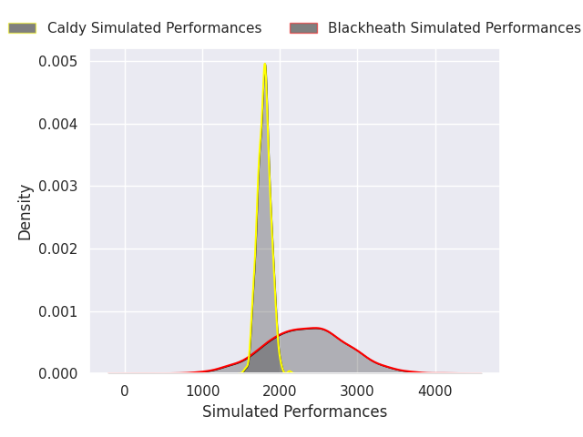

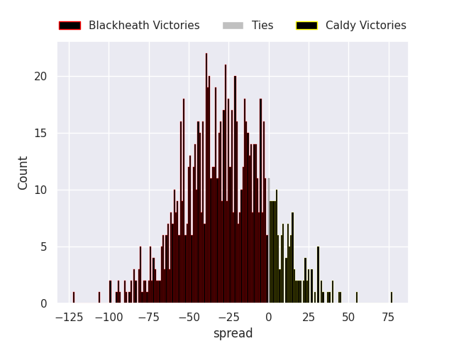

#### Bedford V Chinnor on 2026/09/26

Average Margin: Bedford by 7.0

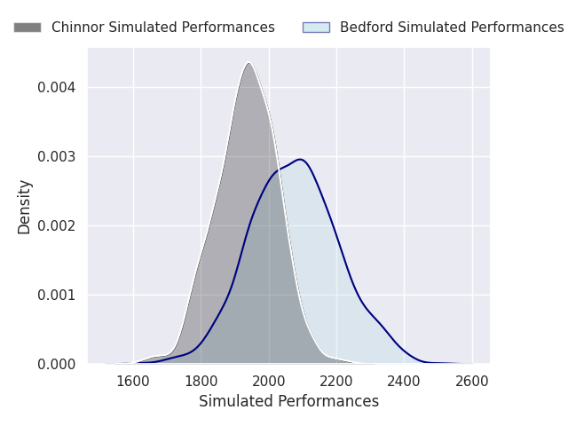

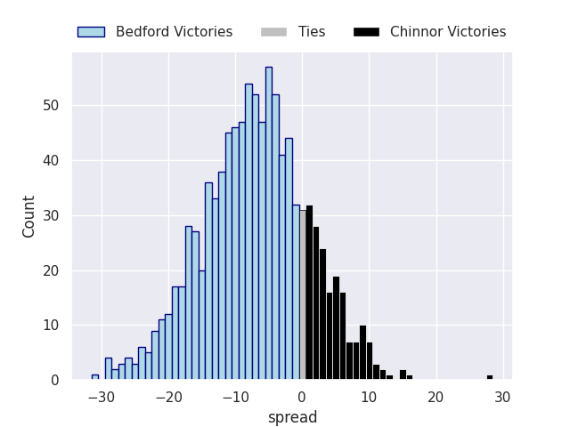

#### Worcester Warriors V Rotherham Titans on 2026/09/26

Average Margin: Worcester Warriors by 10.5

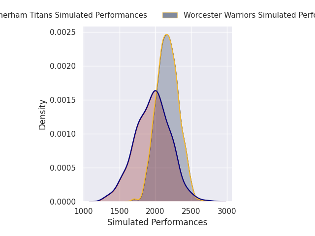

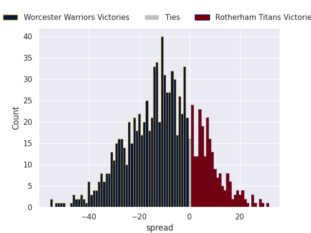

#### Coventry V Cornish Pirates on 2026/09/26

Average Margin: Coventry by 7.0

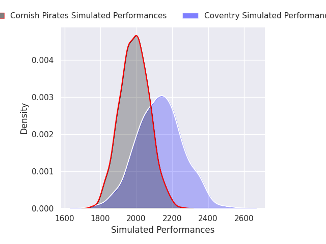

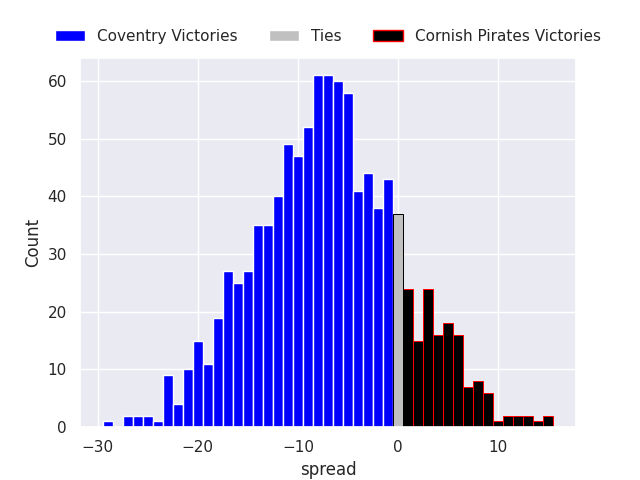

#### Ampthill V Nottingham on 2026/09/26

Average Margin: Ampthill by 5.0

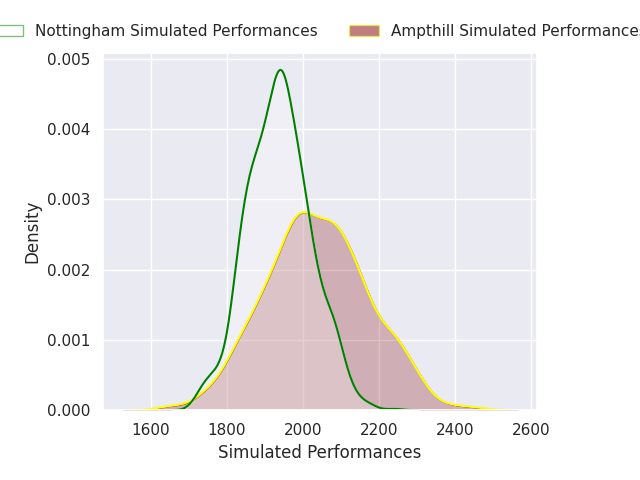

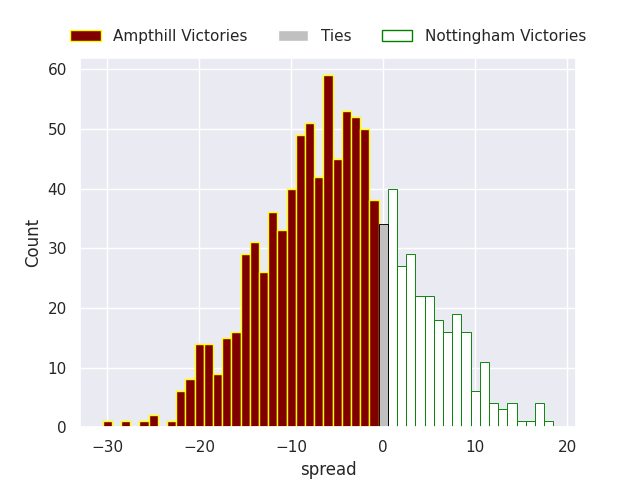

#### Ealing Trailfinders V Richmond on 2026/09/27

Average Margin: Ealing Trailfinders by 28.0

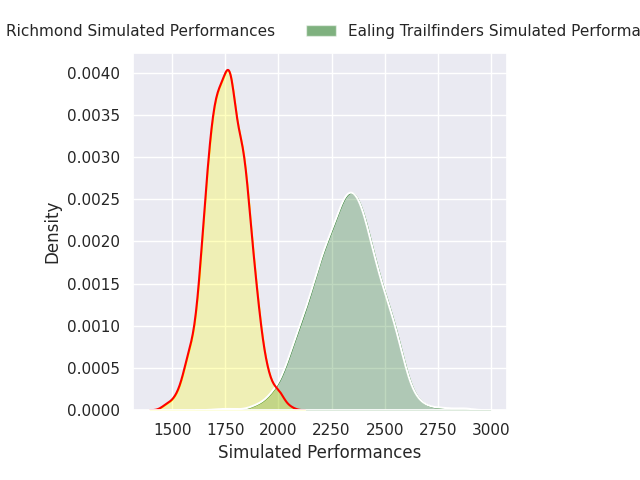

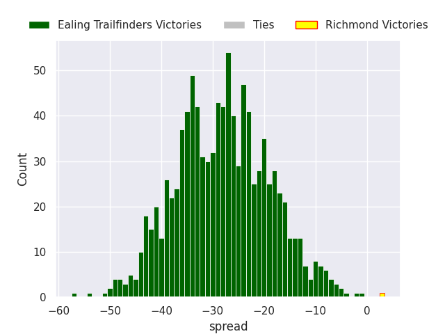

#### Doncaster V Hartpury College RFC on 2026/09/27

Average Margin: Doncaster by 3.9

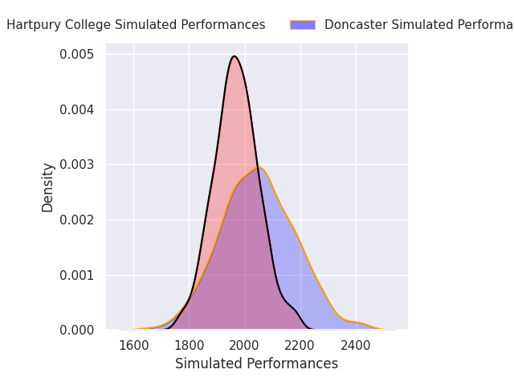

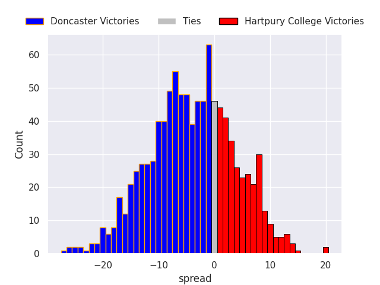

