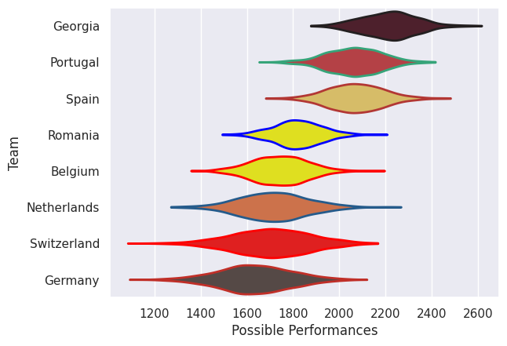

## Team Rankings

## Standings
### Current Standings

| Club        |   Played |   Wins |   Point Differential |   Losing Bonus Points | Try Bonus Points   |   Competition Points |
|:------------|---------:|-------:|---------------------:|----------------------:|:-------------------|---------------------:|
| Portugal    |        5 |      5 |                  144 |                     0 |                    |                   20 |
| Georgia     |        5 |      4 |                  133 |                     1 |                    |                   17 |
| Spain       |        5 |      3 |                   32 |                     0 |                    |                   12 |
| Belgium     |        5 |      3 |                   16 |                     0 |                    |                   12 |
| Switzerland |        5 |      2 |                  -97 |                     0 |                    |                    8 |
| Romania     |        5 |      1 |                  -55 |                     2 |                    |                    6 |
| Netherlands |        5 |      1 |                  -29 |                     1 |                    |                    5 |
| Germany     |        5 |      1 |                 -144 |                     0 |                    |                    4 |

## Completed Match Review

| Model | Percent Correct Predictions | Spread Error |
| ------ | ------ | ------ |
| Club Level | 70.0% | 20.2 |
| Player Level: Lineup | nan% | nan |
| Player Level: Minutes | nan% | nan |

