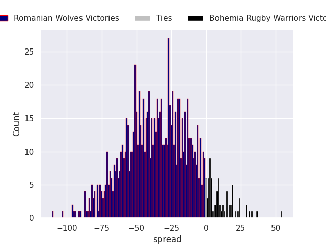
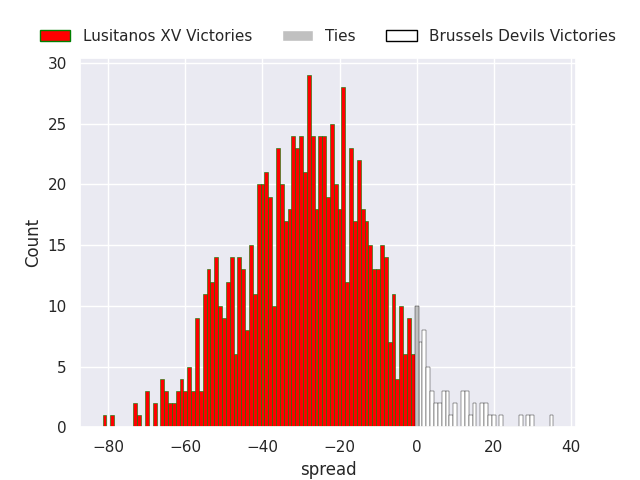
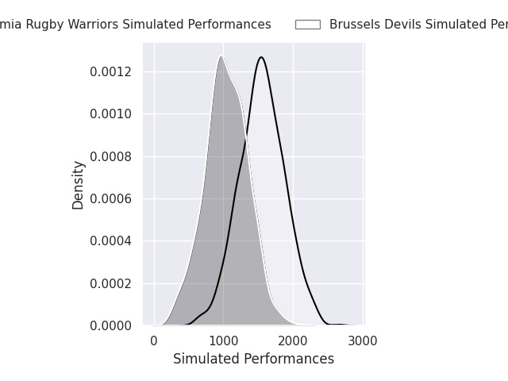
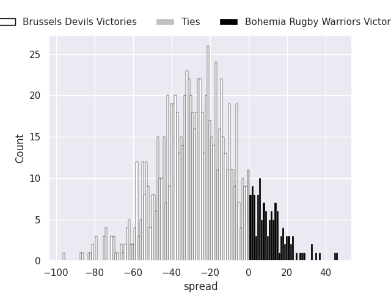
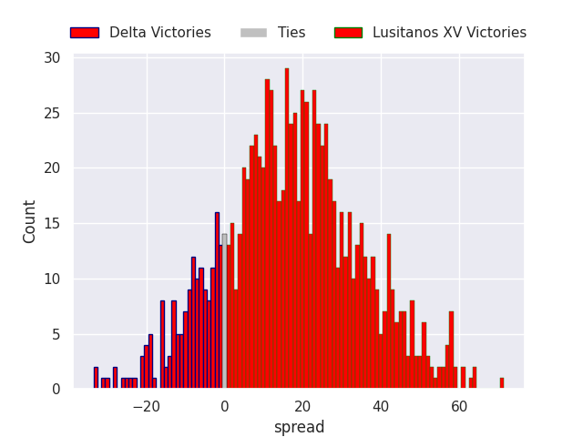

## Team Rankings

## Standings
### Current Standings

| Club                     |   Played |   Wins |   Point Differential |   Losing Bonus Points |   Try Bonus Points |   Competition Points |
|:-------------------------|---------:|-------:|---------------------:|----------------------:|-------------------:|---------------------:|
| Delta                    |        5 |      3 |                   10 |                     1 |                    |                   13 |
| Lusitanos XV             |        4 |      3 |                  158 |                     0 |                    |                   12 |
| Romanian Wolves          |        3 |      2 |                  -59 |                     0 |                  1 |                    9 |
| Castilla y Leon Iberians |        2 |      2 |                   30 |                     0 |                    |                    8 |
| Brussels Devils          |        4 |      0 |                  -62 |                     3 |                  1 |                    4 |
| Bohemia Rugby Warriors   |        2 |      0 |                  -77 |                     0 |                    |                    0 |

### Projected Remaining Table

| Club                   |   To Play |   Projected Wins |   Projected Differential |   Projected Losing Bonus Points | Projected Try Bonus Points   |   Projected Competition Points |
|:-----------------------|----------:|-----------------:|-------------------------:|--------------------------------:|:-----------------------------|-------------------------------:|
| Lusitanos XV           |         2 |            1.755 |                   43.794 |                           0.117 |                              |                          7.177 |
| Brussels Devils        |         2 |            0.928 |                   -2.486 |                           0.109 |                              |                          3.847 |
| Romanian Wolves        |         1 |            0.911 |                   31.442 |                           0.032 |                              |                          3.694 |
| Bohemia Rugby Warriors |         2 |            0.21  |                  -55.598 |                           0.143 |                              |                          1.015 |
| Delta                  |         1 |            0.16  |                  -17.152 |                           0.112 |                              |                          0.78  |

### Projected Total Table

| Club                     |   Played |   Wins |   Point Differential |   Losing Bonus Points |   Try Bonus Points |   Competition Points |
|:-------------------------|---------:|-------:|---------------------:|----------------------:|-------------------:|---------------------:|
| Lusitanos XV             |        6 |  4.755 |              201.794 |                 0.117 |                    |               19.177 |
| Delta                    |        6 |  3.16  |               -7.152 |                 1.112 |                    |               13.78  |
| Romanian Wolves          |        4 |  2.911 |              -27.558 |                 0.032 |                  1 |               12.694 |
| Castilla y Leon Iberians |        2 |  2     |               30     |                 0     |                    |                8     |
| Brussels Devils          |        6 |  0.928 |              -64.486 |                 3.109 |                  1 |                7.847 |
| Bohemia Rugby Warriors   |        4 |  0.21  |             -132.598 |                 0.143 |                    |                1.015 |

## Completed Match Review

| Model | Percent Correct Predictions | Spread Error |
| ------ | ------ | ------ |
| Club Level | 85.7% | 18.8 |
| Player Level: Lineup | nan% | nan |
| Player Level: Minutes | nan% | nan |

## Future Predictions
### Week 6
#### Romanian Wolves V Bohemia Rugby Warriors on 2026/12/05

Average Margin: Romanian Wolves by 31.4

#### Lusitanos XV V Brussels Devils on 2026/12/05

Average Margin: Lusitanos XV by 26.6

### Week 7
#### Brussels Devils V Bohemia Rugby Warriors on 2026/12/12

Average Margin: Brussels Devils by 24.2

#### Delta V Lusitanos XV on 2026/12/13

Average Margin: Lusitanos XV by 17.2

