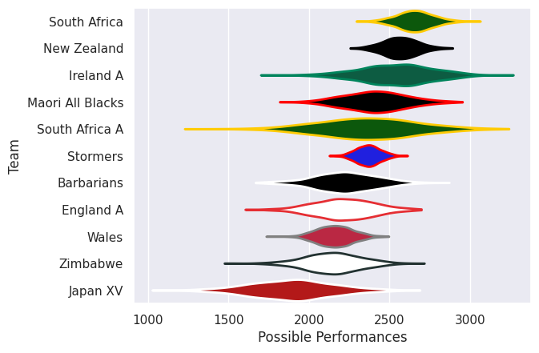

## Team Rankings

## Standings
### Current Standings

| Club             |   Played |   Wins |   Point Differential |   Losing Bonus Points | Try Bonus Points   |   Competition Points |
|:-----------------|---------:|-------:|---------------------:|----------------------:|:-------------------|---------------------:|
| South Africa     |        1 |      1 |                   49 |                     0 |                    |                    4 |
| South Africa A   |        1 |      1 |                   40 |                     0 |                    |                    4 |
| Maori All Blacks |        1 |      1 |                    7 |                     0 |                    |                    4 |
| Wales            |        1 |      1 |                    2 |                     0 |                    |                    4 |
| Japan XV         |        1 |      0 |                   -7 |                     1 |                    |                    1 |
| Barbarians       |        2 |      0 |                  -51 |                     1 |                    |                    1 |
| Zimbabwe         |        1 |      0 |                  -40 |                     0 |                    |                    0 |

### Projected Remaining Table

| Club        |   To Play |   Projected Wins |   Projected Differential |   Projected Losing Bonus Points | Projected Try Bonus Points   |   Projected Competition Points |
|:------------|----------:|-----------------:|-------------------------:|--------------------------------:|:-----------------------------|-------------------------------:|
| Ireland A   |         1 |            0.785 |                   22.255 |                           0.066 |                              |                          3.24  |
| New Zealand |         1 |            0.724 |                    5.47  |                           0.187 |                              |                          3.155 |
| Stormers    |         1 |            0.24  |                   -5.47  |                           0.322 |                              |                          1.354 |
| England A   |         1 |            0.198 |                  -22.255 |                           0.074 |                              |                          0.9   |

### Projected Total Table

| Club             |   Played |   Wins |   Point Differential |   Losing Bonus Points | Try Bonus Points   |   Competition Points |
|:-----------------|---------:|-------:|---------------------:|----------------------:|:-------------------|---------------------:|
| South Africa     |        1 |  1     |               49     |                 0     |                    |                4     |
| South Africa A   |        1 |  1     |               40     |                 0     |                    |                4     |
| Maori All Blacks |        1 |  1     |                7     |                 0     |                    |                4     |
| Wales            |        1 |  1     |                2     |                 0     |                    |                4     |
| Ireland A        |        1 |  0.785 |               22.255 |                 0.066 |                    |                3.24  |
| New Zealand      |        1 |  0.724 |                5.47  |                 0.187 |                    |                3.155 |
| Stormers         |        1 |  0.24  |               -5.47  |                 0.322 |                    |                1.354 |
| Japan XV         |        1 |  0     |               -7     |                 1     |                    |                1     |
| Barbarians       |        2 |  0     |              -51     |                 1     |                    |                1     |
| England A        |        1 |  0.198 |              -22.255 |                 0.074 |                    |                0.9   |
| Zimbabwe         |        1 |  0     |              -40     |                 0     |                    |                0     |

## Completed Match Review

| Model | Percent Correct Predictions | Spread Error |
| ------ | ------ | ------ |
| Club Level | 83.3% | 11.7 |
| Player Level: Lineup | nan% | nan |
| Player Level: Minutes | nan% | nan |

## Future Predictions
### Week 3
#### Ireland A V England A on 2026/02/06

Average Margin: Ireland A by 22.3

### Week 4
#### Stormers V New Zealand on 2026/08/07

Average Margin: New Zealand by 5.5

