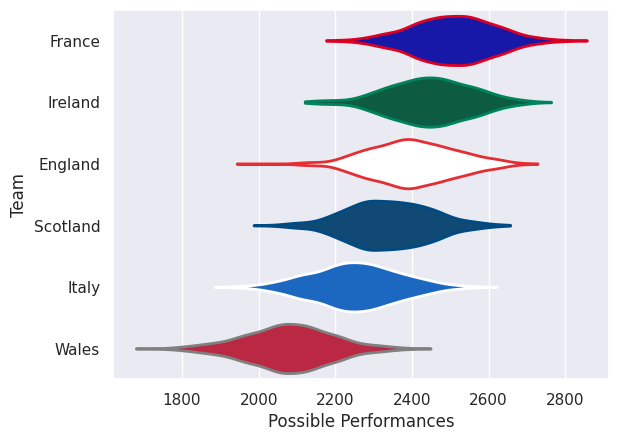

## Team Rankings

## Standings
### Current Standings

| Club     |   Played |   Wins |   Point Differential |   Losing Bonus Points |   Try Bonus Points |   Competition Points |
|:---------|---------:|-------:|---------------------:|----------------------:|-------------------:|---------------------:|
| France   |        5 |      4 |                   81 |                     0 |                  5 |                   21 |
| Ireland  |        5 |      4 |                   38 |                     0 |                  3 |                   19 |
| Scotland |        5 |      3 |                   -1 |                     1 |                  3 |                   16 |
| England  |        5 |      1 |                    2 |                     2 |                  3 |                    9 |
| Italy    |        5 |      2 |                  -38 |                     1 |                    |                    9 |
| Wales    |        5 |      1 |                  -82 |                     1 |                  1 |                    6 |

## Completed Match Review

| Model | Percent Correct Predictions | Spread Error |
| ------ | ------ | ------ |
| Club Level | 66.7% | 13.6 |
| Player Level: Lineup | nan% | nan |
| Player Level: Minutes | nan% | nan |

