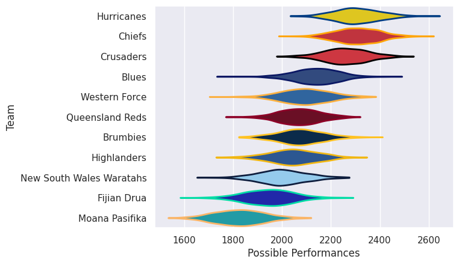

## Team Rankings

## Standings
### Current Standings

| Club                     |   Played |   Wins |   Point Differential |   Losing Bonus Points |   Try Bonus Points |   Competition Points |
|:-------------------------|---------:|-------:|---------------------:|----------------------:|-------------------:|---------------------:|
| Hurricanes               |       17 |     14 |                  409 |                     2 |                 14 |                   72 |
| Chiefs                   |       17 |     13 |                  194 |                     1 |                 12 |                   65 |
| Crusaders                |       16 |      9 |                   84 |                     4 |                 13 |                   53 |
| Blues                    |       16 |      8 |                  -13 |                     2 |                 12 |                   46 |
| Brumbies                 |       15 |      7 |                  -25 |                     4 |                  9 |                   41 |
| Queensland Reds          |       15 |      8 |                  -44 |                     2 |                  7 |                   41 |
| Western Force            |       14 |      7 |                  -25 |                     1 |                  7 |                   36 |
| New South Wales Waratahs |       14 |      5 |                  -49 |                     4 |                  5 |                   29 |
| Highlanders              |       14 |      5 |                  -97 |                     3 |                  6 |                   29 |
| Fijian Drua              |       14 |      5 |                 -143 |                     1 |                  8 |                   29 |
| Moana Pasifika           |       14 |      2 |                 -291 |                     1 |                  2 |                   11 |

## Completed Match Review

| Model | Percent Correct Predictions | Spread Error |
| ------ | ------ | ------ |
| Club Level | 75.9% | 13.9 |
| Player Level: Lineup | nan% | nan |
| Player Level: Minutes | nan% | nan |

