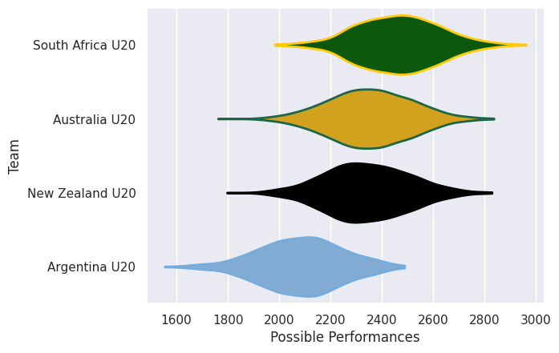

## Team Rankings

## Standings
### Current Standings

| Club             |   Played |   Wins |   Point Differential |   Losing Bonus Points | Try Bonus Points   |   Competition Points |
|:-----------------|---------:|-------:|---------------------:|----------------------:|:-------------------|---------------------:|
| South Africa U20 |        3 |      2 |                   66 |                     0 |                    |                   10 |
| New Zealand U20  |        3 |      1 |                   -3 |                     0 |                    |                    6 |
| Argentina U20    |        3 |      1 |                  -21 |                     1 |                    |                    5 |
| Australia U20    |        3 |      1 |                  -42 |                     1 |                    |                    5 |

## Completed Match Review

| Model | Percent Correct Predictions | Spread Error |
| ------ | ------ | ------ |
| Club Level | 66.7% | 12.6 |
| Player Level: Lineup | nan% | nan |
| Player Level: Minutes | nan% | nan |

