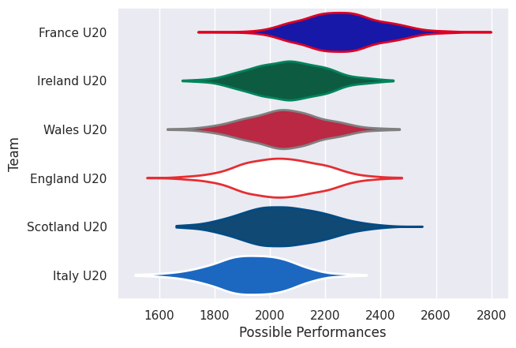

## Team Rankings

## Standings
### Current Standings

| Club         |   Played |   Wins |   Point Differential |   Losing Bonus Points | Try Bonus Points   |   Competition Points |
|:-------------|---------:|-------:|---------------------:|----------------------:|:-------------------|---------------------:|
| France U20   |        5 |      5 |                   76 |                     0 |                    |                   20 |
| Ireland U20  |        5 |      4 |                   32 |                     0 |                    |                   16 |
| England U20  |        5 |      3 |                   26 |                     1 |                    |                   13 |
| Wales U20    |        5 |      1 |                  -25 |                     2 |                    |                    6 |
| Italy U20    |        5 |      1 |                  -57 |                     1 |                    |                    5 |
| Scotland U20 |        5 |      1 |                  -52 |                     0 |                    |                    4 |

## Completed Match Review

| Model | Percent Correct Predictions | Spread Error |
| ------ | ------ | ------ |
| Club Level | 73.3% | 14.3 |
| Player Level: Lineup | nan% | nan |
| Player Level: Minutes | nan% | nan |

