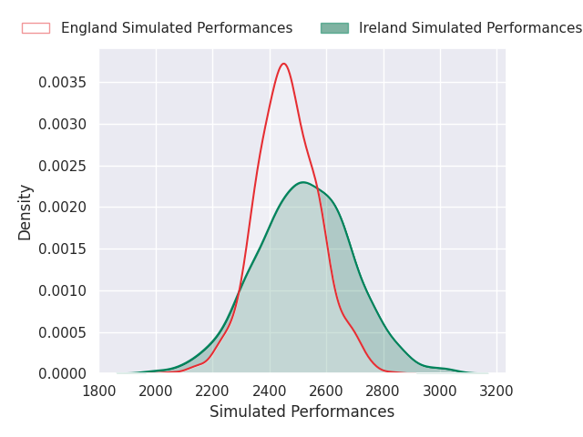
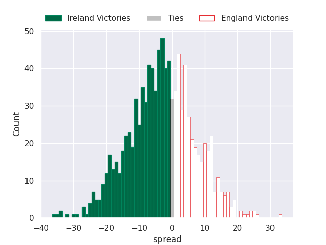

## Team Rankings

## Standings
### Projected Remaining Table

| Club     |   To Play |   Projected Wins |   Projected Differential |   Projected Losing Bonus Points | Projected Try Bonus Points   |   Projected Competition Points |
|:---------|----------:|-----------------:|-------------------------:|--------------------------------:|:-----------------------------|-------------------------------:|
| France   |         5 |            3.507 |                   37.502 |                           0.722 |                              |                         15.006 |
| England  |         5 |            3.389 |                   33.164 |                           0.862 |                              |                         14.696 |
| Ireland  |         5 |            3.088 |                   18.479 |                           0.993 |                              |                         13.643 |
| Scotland |         5 |            2.7   |                   11.328 |                           0.852 |                              |                         11.86  |
| Wales    |         5 |            1.245 |                  -38.791 |                           1.091 |                              |                          6.327 |
| Italy    |         5 |            0.706 |                  -61.682 |                           0.933 |                              |                          3.921 |

### Projected Total Table

| Club     |   Played |   Wins |   Point Differential |   Losing Bonus Points | Try Bonus Points   |   Competition Points |
|:---------|---------:|-------:|---------------------:|----------------------:|:-------------------|---------------------:|
| France   |        5 |  3.507 |               37.502 |                 0.722 |                    |               15.006 |
| England  |        5 |  3.389 |               33.164 |                 0.862 |                    |               14.696 |
| Ireland  |        5 |  3.088 |               18.479 |                 0.993 |                    |               13.643 |
| Scotland |        5 |  2.7   |               11.328 |                 0.852 |                    |               11.86  |
| Wales    |        5 |  1.245 |              -38.791 |                 1.091 |                    |                6.327 |
| Italy    |        5 |  0.706 |              -61.682 |                 0.933 |                    |                3.921 |

## Future Predictions
### Week 1
#### Ireland V England on 2027/02/05

Average Margin: Ireland by 3.0

#### France V Wales on 2027/02/05

Average Margin: France by 17.9

#### Scotland V Italy on 2027/02/05

Average Margin: Scotland by 17.2

### Week 2
#### Scotland V Wales on 2027/02/12

Average Margin: Scotland by 11.1

#### England V France on 2027/02/12

Average Margin: England by 2.7

#### Italy V Ireland on 2027/02/12

Average Margin: Ireland by 10.9

### Week 3
#### France V Scotland on 2027/02/19

Average Margin: France by 11.0

#### England V Italy on 2027/02/19

Average Margin: England by 19.7

#### Wales V Ireland on 2027/02/19

Average Margin: Ireland by 5.4

### Week 4
#### Scotland V Ireland on 2027/03/05

Average Margin: Scotland by 2.2

#### Wales V England on 2027/03/05

Average Margin: England by 5.7

#### Italy V France on 2027/03/05

Average Margin: France by 12.6

### Week 5
#### England V Scotland on 2027/03/12

Average Margin: England by 8.1

#### Italy V Wales on 2027/03/12

Average Margin: Wales by 1.4

#### Ireland V France on 2027/03/12

Average Margin: Ireland by 1.3

