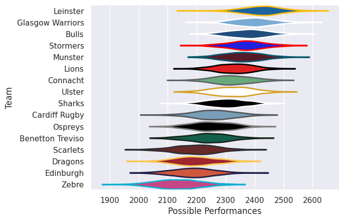

## Team Rankings

## Standings
### Current Standings

| Club             |   Played |   Wins |   Point Differential |   Losing Bonus Points |   Try Bonus Points |   Competition Points |
|:-----------------|---------:|-------:|---------------------:|----------------------:|-------------------:|---------------------:|
| Glasgow Warriors |       18 |     13 |                  141 |                     2 |                 13 |                   67 |
| Leinster         |       18 |     12 |                  145 |                     2 |                 13 |                   63 |
| Bulls            |       18 |     12 |                  160 |                     1 |                 10 |                   59 |
| Stormers         |       18 |     12 |                  160 |                     1 |                  8 |                   59 |
| Ulster           |       19 |      9 |                   74 |                     4 |                 10 |                   54 |
| Connacht         |       18 |     10 |                   47 |                     4 |                 10 |                   54 |
| Munster          |       18 |     11 |                   20 |                     3 |                  7 |                   54 |
| Lions            |       18 |     10 |                   59 |                     3 |                  8 |                   53 |
| Cardiff Rugby    |       18 |     11 |                  -19 |                     4 |                  3 |                   51 |
| Sharks           |       18 |      8 |                   39 |                     3 |                  9 |                   46 |
| Edinburgh        |       19 |      7 |                  -77 |                     4 |                  6 |                   40 |
| Ospreys          |       18 |      7 |                  -78 |                     3 |                  4 |                   39 |
| Benetton Treviso |       18 |      6 |                 -166 |                     1 |                  4 |                   33 |
| Scarlets         |       18 |      4 |                  -99 |                     5 |                  3 |                   28 |
| Dragons          |       18 |      3 |                 -131 |                     4 |                  3 |                   27 |
| Zebre            |       18 |      2 |                 -275 |                     4 |                  3 |                   15 |

### Projected Remaining Table

| Club     |   To Play |   Projected Wins |   Projected Differential |   Projected Losing Bonus Points | Projected Try Bonus Points   |   Projected Competition Points |
|:---------|----------:|-----------------:|-------------------------:|--------------------------------:|:-----------------------------|-------------------------------:|
| Lions    |         1 |            0.846 |                    7.807 |                           0.105 |                              |                          3.537 |
| Connacht |         1 |            0.812 |                    7.568 |                           0.135 |                              |                          3.425 |
| Stormers |         1 |            0.594 |                    2.189 |                           0.257 |                              |                          2.723 |
| Bulls    |         1 |            0.361 |                   -2.189 |                           0.342 |                              |                          1.876 |
| Scarlets |         1 |            0.167 |                   -7.568 |                           0.33  |                              |                          1.04  |
| Sharks   |         1 |            0.13  |                   -7.807 |                           0.32  |                              |                          0.888 |

### Projected Total Table

| Club             |   Played |   Wins |   Point Differential |   Losing Bonus Points |   Try Bonus Points |   Competition Points |
|:-----------------|---------:|-------:|---------------------:|----------------------:|-------------------:|---------------------:|
| Glasgow Warriors |       18 | 13     |              141     |                 2     |                 13 |               67     |
| Leinster         |       18 | 12     |              145     |                 2     |                 13 |               63     |
| Stormers         |       19 | 12.594 |              162.189 |                 1.257 |                  8 |               61.723 |
| Bulls            |       19 | 12.361 |              157.811 |                 1.342 |                 10 |               60.876 |
| Connacht         |       19 | 10.812 |               54.568 |                 4.135 |                 10 |               57.425 |
| Lions            |       19 | 10.846 |               66.807 |                 3.105 |                  8 |               56.537 |
| Ulster           |       19 |  9     |               74     |                 4     |                 10 |               54     |
| Munster          |       18 | 11     |               20     |                 3     |                  7 |               54     |
| Cardiff Rugby    |       18 | 11     |              -19     |                 4     |                  3 |               51     |
| Sharks           |       19 |  8.13  |               31.193 |                 3.32  |                  9 |               46.888 |
| Edinburgh        |       19 |  7     |              -77     |                 4     |                  6 |               40     |
| Ospreys          |       18 |  7     |              -78     |                 3     |                  4 |               39     |
| Benetton Treviso |       18 |  6     |             -166     |                 1     |                  4 |               33     |
| Scarlets         |       19 |  4.167 |             -106.568 |                 5.33  |                  3 |               29.04  |
| Dragons          |       18 |  3     |             -131     |                 4     |                  3 |               27     |
| Zebre            |       18 |  2     |             -275     |                 4     |                  3 |               15     |

### Projected Playoff Results

|                  | Reach Quarterfinal   | Win Quarterfinal   | Reach Semifinal   | Win Semifinal   | Reach Final   | Win Final   |
|:-----------------|:---------------------|:-------------------|:------------------|:----------------|:--------------|:------------|
| Leinster         | 100.0 %              | 100.0 %            | 100.0 %           | 100.0 %         | 100.0 %       | 100.0 %     |
| Bulls            | 100.0 %              | 100.0 %            | 100.0 %           | 100.0 %         | 100.0 %       | 0.0 %       |
| Glasgow Warriors | 100.0 %              | 100.0 %            | 100.0 %           | 0.0 %           | 0.0 %         | 0.0 %       |
| Stormers         | 100.0 %              | 100.0 %            | 100.0 %           | 0.0 %           | 0.0 %         | 0.0 %       |
| Connacht         | 100.0 %              | 0.0 %              | 0.0 %             | 0.0 %           | 0.0 %         | 0.0 %       |
| Munster          | 100.0 %              | 0.0 %              | 0.0 %             | 0.0 %           | 0.0 %         | 0.0 %       |
| Cardiff Rugby    | 100.0 %              | 0.0 %              | 0.0 %             | 0.0 %           | 0.0 %         | 0.0 %       |
| Lions            | 100.0 %              | 0.0 %              | 0.0 %             | 0.0 %           | 0.0 %         | 0.0 %       |

## Completed Match Review

| Model | Percent Correct Predictions | Spread Error |
| ------ | ------ | ------ |
| Club Level | 65.2% | 12.3 |
| Player Level: Lineup | nan% | nan |
| Player Level: Minutes | nan% | nan |

## Future Predictions
### Week 20
#### Connacht V Scarlets on 2025/10/04

Average Margin: Connacht by 7.6

### Week 21
#### Bulls V Stormers on 2025/12/25

Average Margin: Stormers by 2.2

#### Lions V Sharks on 2025/12/25

Average Margin: Lions by 7.8

