## Team Rankings

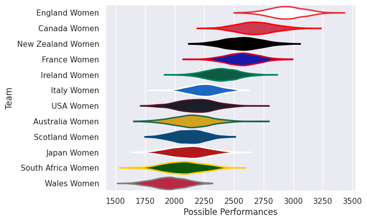
## Standings
### Current Standings

| Club               |   Played |   Wins |   Point Differential |   Losing Bonus Points | Try Bonus Points   |   Competition Points |
|:-------------------|---------:|-------:|---------------------:|----------------------:|:-------------------|---------------------:|
| New Zealand Women  |        2 |      2 |                   66 |                     0 |                    |                    8 |
| Canada Women       |        2 |      1 |                   38 |                     0 |                    |                    6 |
| England Women      |        2 |      1 |                   33 |                     0 |                    |                    6 |
| Italy Women        |        1 |      1 |                   34 |                     0 |                    |                    4 |
| Wales Women        |        1 |      1 |                   31 |                     0 |                    |                    4 |
| USA Women          |        1 |      1 |                    4 |                     0 |                    |                    4 |
| France Women       |        2 |      1 |                  -11 |                     0 |                    |                    4 |
| Ireland Women      |        1 |      0 |                   -4 |                     1 |                    |                    1 |
| Australia Women    |        2 |      0 |                  -36 |                     1 |                    |                    1 |
| South Africa Women |        1 |      0 |                  -31 |                     0 |                    |                    0 |
| Japan Women        |        1 |      0 |                  -34 |                     0 |                    |                    0 |
| Scotland Women     |        2 |      0 |                  -90 |                     0 |                    |                    0 |

### Projected Remaining Table

| Club               |   To Play |   Projected Wins |   Projected Differential |   Projected Losing Bonus Points | Projected Try Bonus Points   |   Projected Competition Points |
|:-------------------|----------:|-----------------:|-------------------------:|--------------------------------:|:-----------------------------|-------------------------------:|
| Italy Women        |         1 |            0.952 |                   20.672 |                           0.033 |                              |                          3.851 |
| Ireland Women      |         1 |            0.907 |                   17.784 |                           0.057 |                              |                          3.701 |
| England Women      |         1 |            0.834 |                   14.293 |                           0.081 |                              |                          3.445 |
| Canada Women       |         1 |            0.792 |                   10.917 |                           0.117 |                              |                          3.329 |
| USA Women          |         1 |            0.647 |                    5.18  |                           0.159 |                              |                          2.797 |
| Australia Women    |         1 |            0.545 |                    1.811 |                           0.183 |                              |                          2.433 |
| Scotland Women     |         1 |            0.42  |                   -1.811 |                           0.211 |                              |                          1.961 |
| Wales Women        |         1 |            0.328 |                   -5.18  |                           0.218 |                              |                          1.58  |
| France Women       |         1 |            0.186 |                  -10.917 |                           0.205 |                              |                          0.993 |
| New Zealand Women  |         1 |            0.152 |                  -14.293 |                           0.153 |                              |                          0.789 |
| Japan Women        |         1 |            0.085 |                  -17.784 |                           0.122 |                              |                          0.478 |
| South Africa Women |         1 |            0.043 |                  -20.672 |                           0.106 |                              |                          0.288 |

### Projected Total Table

| Club               |   Played |   Wins |   Point Differential |   Losing Bonus Points | Try Bonus Points   |   Competition Points |
|:-------------------|---------:|-------:|---------------------:|----------------------:|:-------------------|---------------------:|
| England Women      |        3 |  1.834 |               47.293 |                 0.081 |                    |                9.445 |
| Canada Women       |        3 |  1.792 |               48.917 |                 0.117 |                    |                9.329 |
| New Zealand Women  |        3 |  2.152 |               51.707 |                 0.153 |                    |                8.789 |
| Italy Women        |        2 |  1.952 |               54.672 |                 0.033 |                    |                7.851 |
| USA Women          |        2 |  1.647 |                9.18  |                 0.159 |                    |                6.797 |
| Wales Women        |        2 |  1.328 |               25.82  |                 0.218 |                    |                5.58  |
| France Women       |        3 |  1.186 |              -21.917 |                 0.205 |                    |                4.993 |
| Ireland Women      |        2 |  0.907 |               13.784 |                 1.057 |                    |                4.701 |
| Australia Women    |        3 |  0.545 |              -34.189 |                 1.183 |                    |                3.433 |
| Scotland Women     |        3 |  0.42  |              -91.811 |                 0.211 |                    |                1.961 |
| Japan Women        |        2 |  0.085 |              -51.784 |                 0.122 |                    |                0.478 |
| South Africa Women |        2 |  0.043 |              -51.672 |                 0.106 |                    |                0.288 |

## Completed Match Review

| Model | Percent Correct Predictions | Spread Error |
| ------ | ------ | ------ |
| Club Level | 66.7% | 16.0 |
| Player Level: Lineup | nan% | nan |
| Player Level: Minutes | nan% | nan |

## Future Predictions
### Week 3
#### Scotland Women V Australia Women on 2026/09/26

Average Margin: Australia Women by 1.8

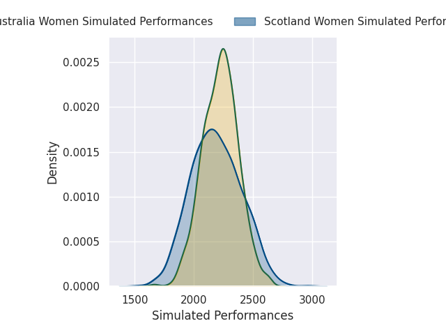

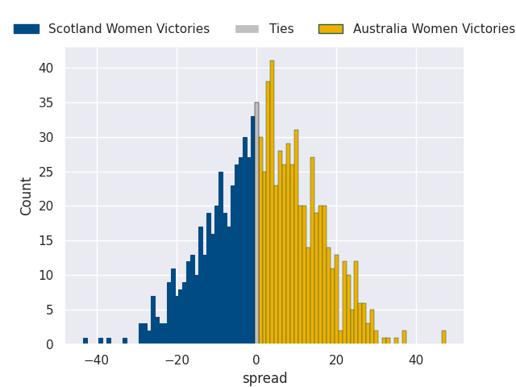

#### Wales Women V USA Women on 2026/09/26

Average Margin: USA Women by 5.2

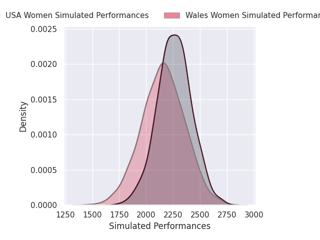
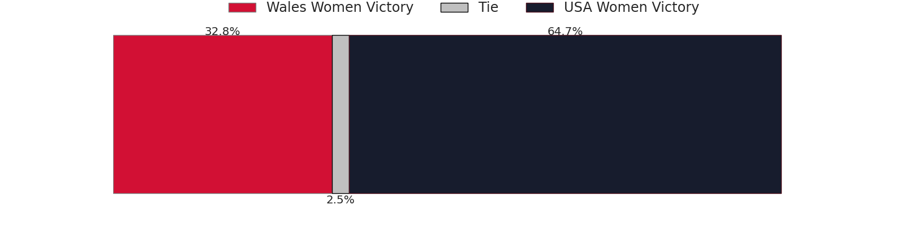
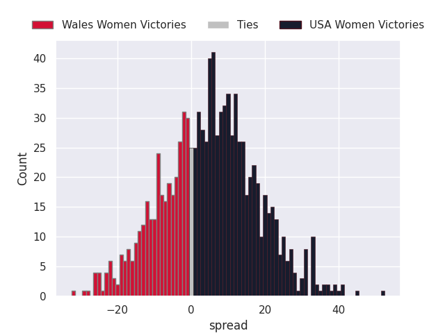

#### England Women V New Zealand Women on 2026/09/26

Average Margin: England Women by 14.3

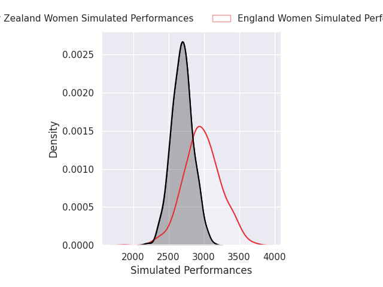
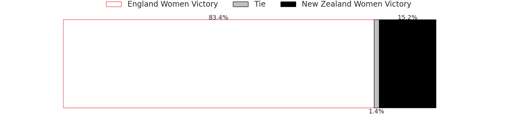
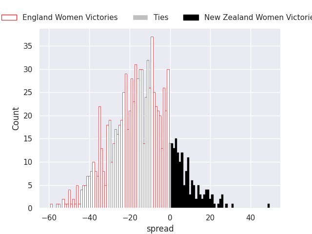

#### Italy Women V South Africa Women on 2026/09/26

Average Margin: Italy Women by 20.7

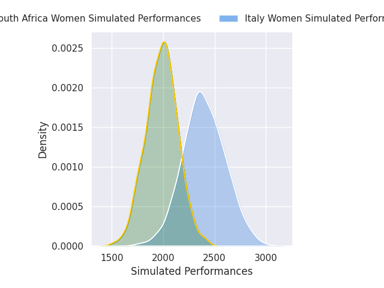
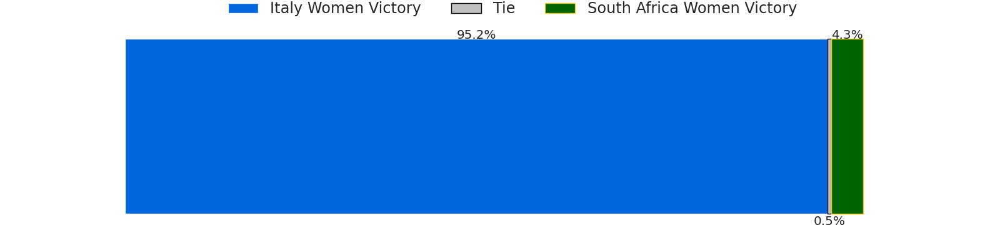
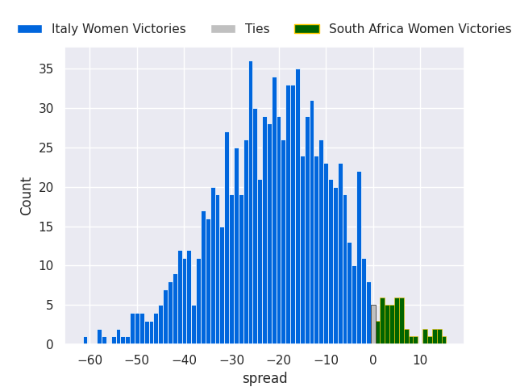

#### France Women V Canada Women on 2026/09/26

Average Margin: Canada Women by 10.9

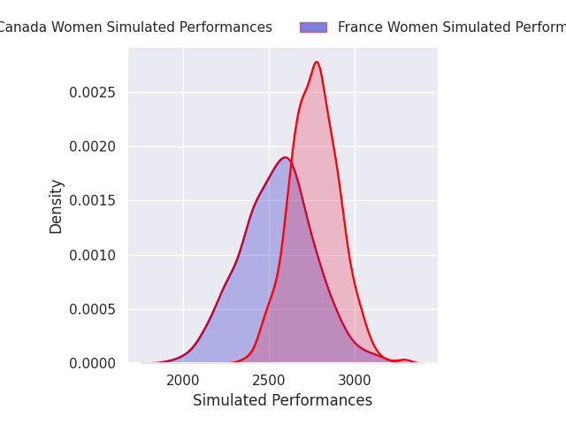
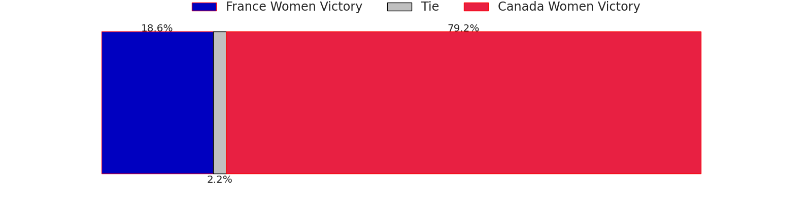
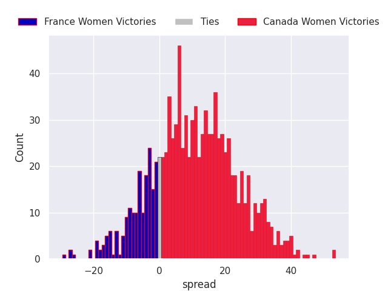

#### Ireland Women V Japan Women on 2026/09/27

Average Margin: Ireland Women by 17.8

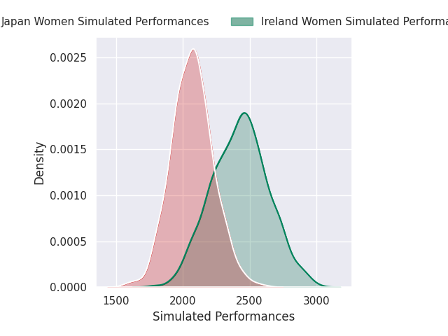
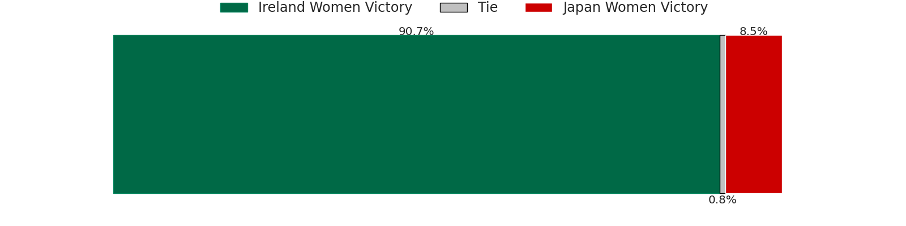
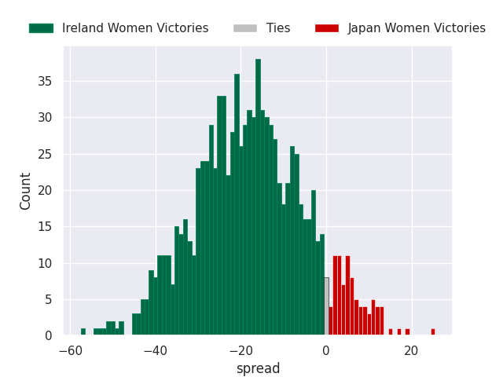

