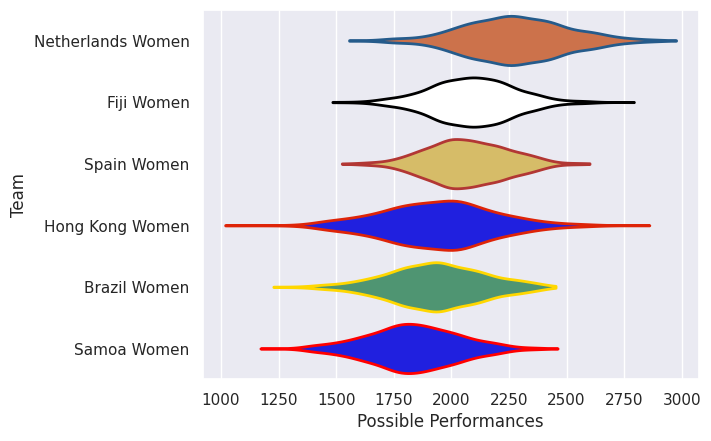
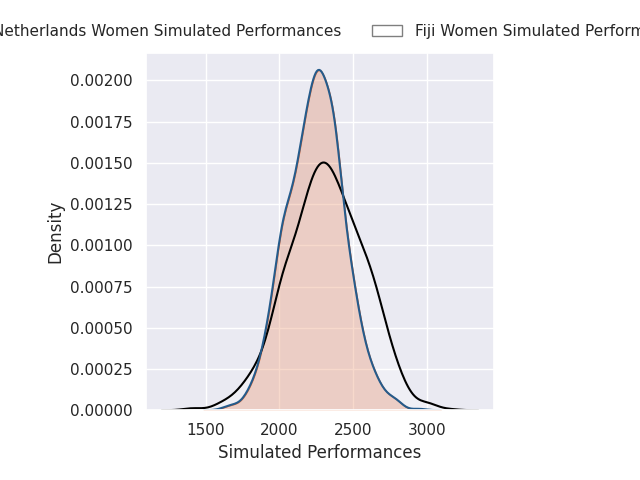
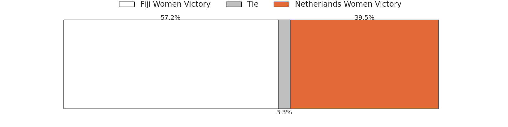
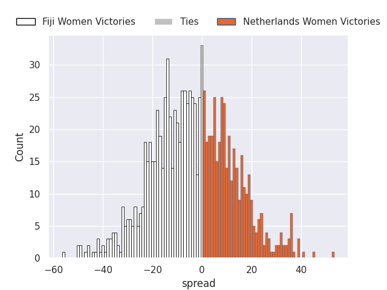
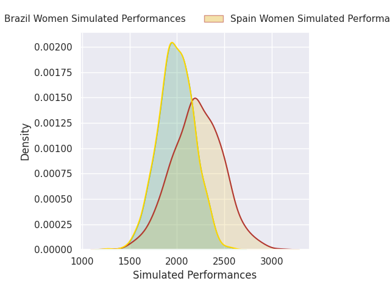
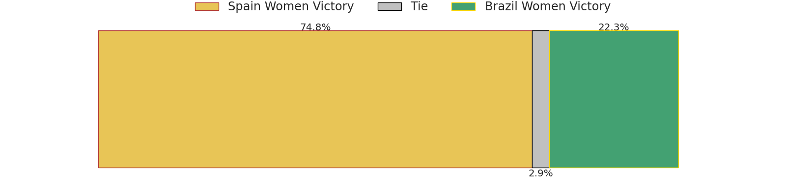
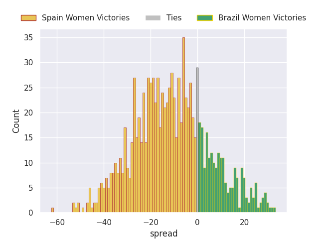
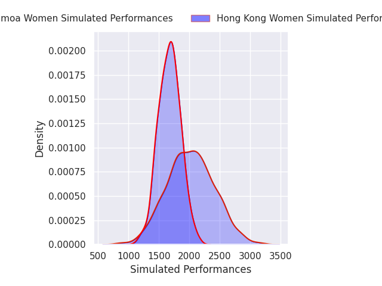
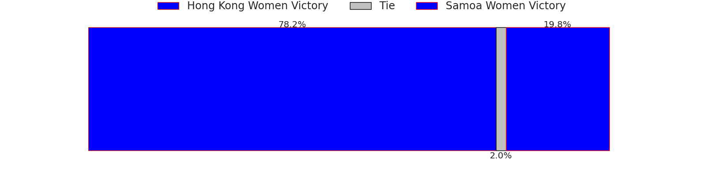
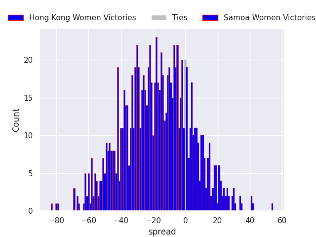

## Team Rankings

## Standings
### Current Standings

| Club              |   Played |   Wins |   Point Differential |   Losing Bonus Points | Try Bonus Points   |   Competition Points |
|:------------------|---------:|-------:|---------------------:|----------------------:|:-------------------|---------------------:|
| Netherlands Women |        2 |      2 |                   72 |                     0 |                    |                    8 |
| Fiji Women        |        2 |      2 |                   34 |                     0 |                    |                    8 |
| Spain Women       |        2 |      1 |                   34 |                     1 |                    |                    5 |
| Hong Kong Women   |        2 |      1 |                  -23 |                     0 |                    |                    4 |
| Brazil Women      |        2 |      0 |                   -7 |                     2 |                    |                    2 |
| Samoa Women       |        2 |      0 |                 -110 |                     0 |                    |                    0 |

### Projected Remaining Table

| Club              |   To Play |   Projected Wins |   Projected Differential |   Projected Losing Bonus Points | Projected Try Bonus Points   |   Projected Competition Points |
|:------------------|----------:|-----------------:|-------------------------:|--------------------------------:|:-----------------------------|-------------------------------:|
| Hong Kong Women   |         1 |            0.782 |                   17.454 |                           0.086 |                              |                          3.254 |
| Spain Women       |         1 |            0.748 |                   11.07  |                           0.093 |                              |                          3.143 |
| Fiji Women        |         1 |            0.572 |                    3.565 |                           0.14  |                              |                          2.494 |
| Netherlands Women |         1 |            0.395 |                   -3.565 |                           0.163 |                              |                          1.809 |
| Brazil Women      |         1 |            0.223 |                  -11.07  |                           0.157 |                              |                          1.107 |
| Samoa Women       |         1 |            0.198 |                  -17.454 |                           0.12  |                              |                          0.952 |

### Projected Total Table

| Club              |   Played |   Wins |   Point Differential |   Losing Bonus Points | Try Bonus Points   |   Competition Points |
|:------------------|---------:|-------:|---------------------:|----------------------:|:-------------------|---------------------:|
| Fiji Women        |        3 |  2.572 |               37.565 |                 0.14  |                    |               10.494 |
| Netherlands Women |        3 |  2.395 |               68.435 |                 0.163 |                    |                9.809 |
| Spain Women       |        3 |  1.748 |               45.07  |                 1.093 |                    |                8.143 |
| Hong Kong Women   |        3 |  1.782 |               -5.546 |                 0.086 |                    |                7.254 |
| Brazil Women      |        3 |  0.223 |              -18.07  |                 2.157 |                    |                3.107 |
| Samoa Women       |        3 |  0.198 |             -127.454 |                 0.12  |                    |                0.952 |

## Completed Match Review

| Model | Percent Correct Predictions | Spread Error |
| ------ | ------ | ------ |
| Club Level | 77.8% | 18.3 |
| Player Level: Lineup | nan% | nan |
| Player Level: Minutes | nan% | nan |

## Future Predictions
### Week 3
#### Fiji Women V Netherlands Women on 2026/09/26

Average Margin: Fiji Women by 3.6

#### Spain Women V Brazil Women on 2026/09/26

Average Margin: Spain Women by 11.1

#### Hong Kong Women V Samoa Women on 2026/09/26

Average Margin: Hong Kong Women by 17.5

