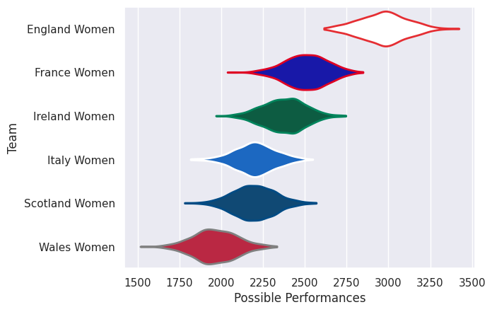

## Team Rankings

## Standings
### Current Standings

| Club           |   Played |   Wins |   Point Differential |   Losing Bonus Points | Try Bonus Points   |   Competition Points |
|:---------------|---------:|-------:|---------------------:|----------------------:|:-------------------|---------------------:|
| England Women  |        5 |      5 |                  179 |                     0 |                    |                   20 |
| France Women   |        5 |      4 |                  109 |                     0 |                    |                   16 |
| Ireland Women  |        5 |      3 |                   67 |                     0 |                    |                   12 |
| Italy Women    |        5 |      2 |                  -52 |                     0 |                    |                    8 |
| Scotland Women |        5 |      1 |                 -189 |                     0 |                    |                    4 |
| Wales Women    |        5 |      0 |                 -114 |                     1 |                    |                    1 |

## Completed Match Review

| Model | Percent Correct Predictions | Spread Error |
| ------ | ------ | ------ |
| Club Level | 100.0% | 17.2 |
| Player Level: Lineup | nan% | nan |
| Player Level: Minutes | nan% | nan |

