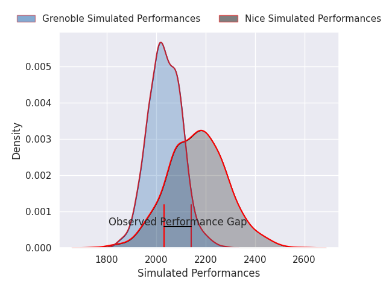
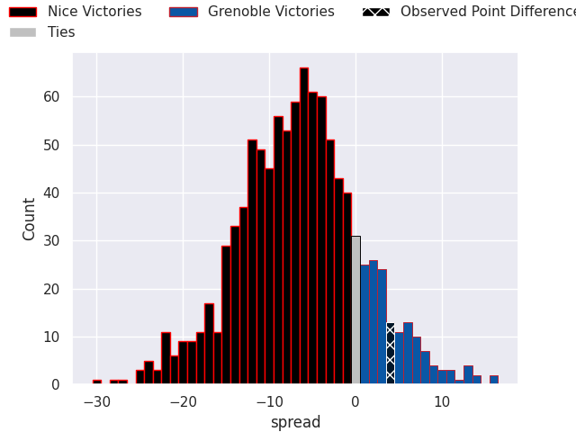
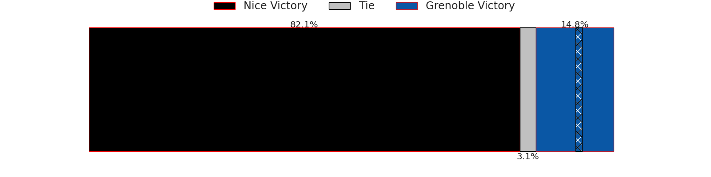

## Club Level Predictions

Now that the game has been played, lets see how the club predictions did. I predicted Nice to win by 6.59, and Grenoble won by 4.0. That's an absolute error of 10.6 for the margin of victory, while my average absolute error has been 14.8 over the past six months. This prediction was more accurate than 54.2% of my recent predictions.

For the Over/Under model, I predicted a total of 50.5 and we have an actual total of 70.0. That's an absolute error of 19.5 compared to a six month average of 14.4. This prediction was more accurate than 27.1% of my recent predictions.
### Projected Performances - Club Model

### Projected Spreads - Club Model

### Projected Results - Club Model

