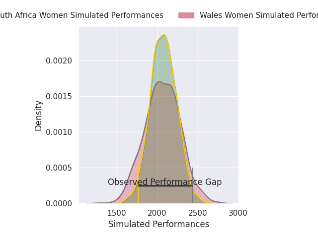
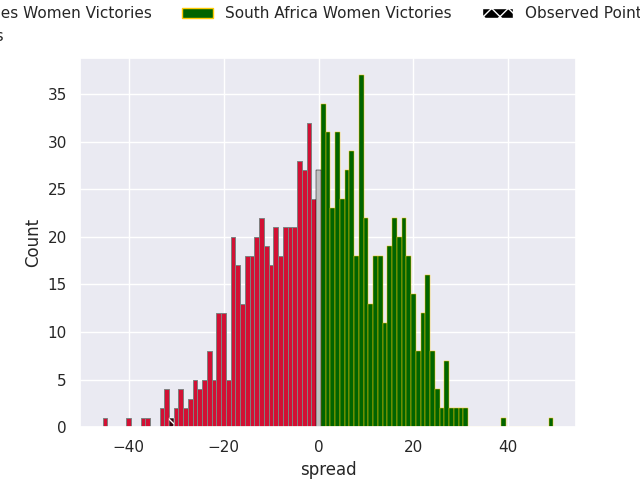

## Club Level Predictions

Now that the game has been played, lets see how the club predictions did. I predicted South Africa Women to win by 0.67, and Wales Women won by 31.0. That's an absolute error of 31.7 for the margin of victory, while my average absolute error has been 14.8 over the past six months. This prediction was more accurate than 10.2% of my recent predictions.

For the Over/Under model, I predicted a total of 48.5 and we have an actual total of 69.0. That's an absolute error of 20.5 compared to a six month average of 14.4. This prediction was more accurate than 24.9% of my recent predictions.
### Projected Performances - Club Model

### Projected Spreads - Club Model

### Projected Results - Club Model

