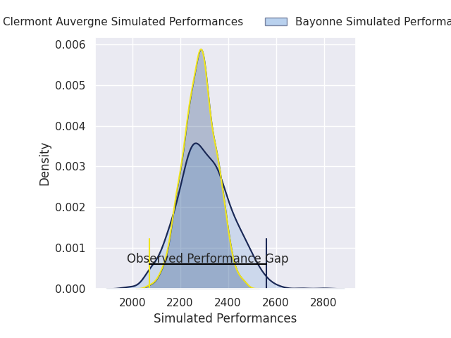
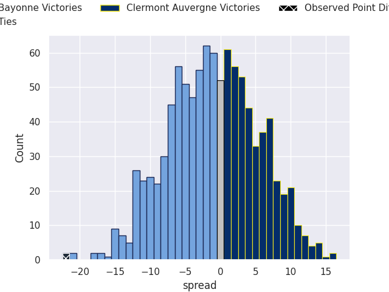
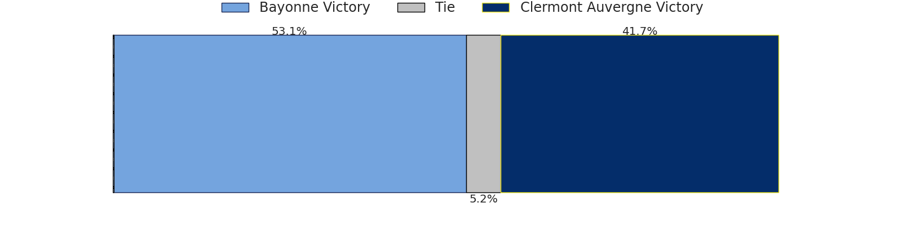
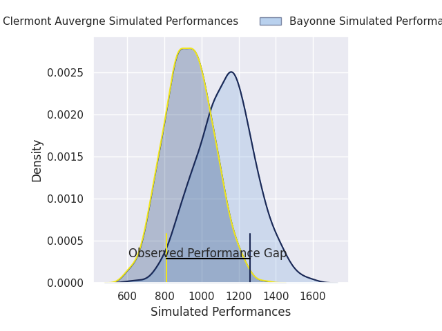
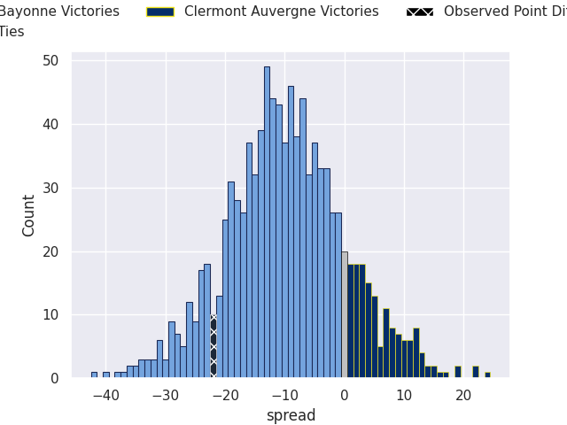
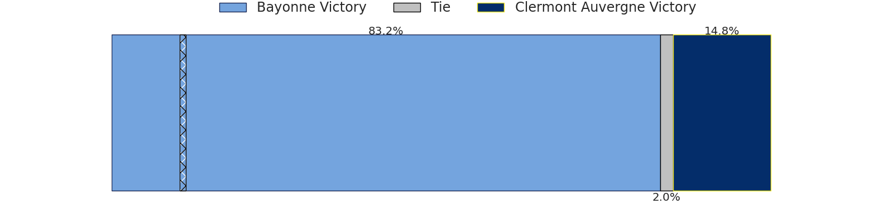

## Club Level Predictions

Now that the game has been played, lets see how the club predictions did. I predicted Bayonne to win by 1.05, and Bayonne won by 22.0. That's an absolute error of 21.0 for the margin of victory, while my average absolute error has been 14.7 over the past six months. This prediction was more accurate than 24.5% of my recent predictions.

For the Over/Under model, I predicted a total of 54.5 and we have an actual total of 70.0. That's an absolute error of 15.5 compared to a six month average of 14.6. This prediction was more accurate than 38.0% of my recent predictions.
### Projected Performances - Club Model

### Projected Spreads - Club Model

### Projected Results - Club Model

## Player Level Predictions

With the player model, I predicted Bayonne to win by 9.75,  and Bayonne won by 22.0. That's an absolute error of 12.2 for the margin of victory, while the average error as been 15.0 for the past six months. So this prediction was more accurate than 38.2% of my recent predictions.
### Projected Performances - Player Model

### Projected Spreads - Player Model

### Projected Results - Player Model

