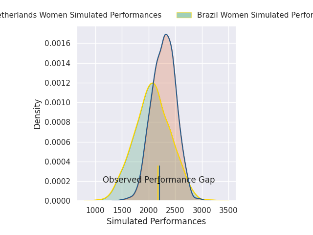
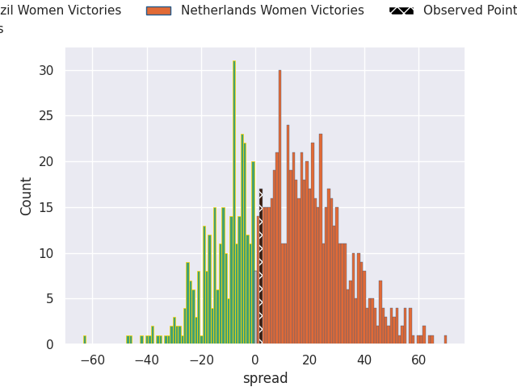
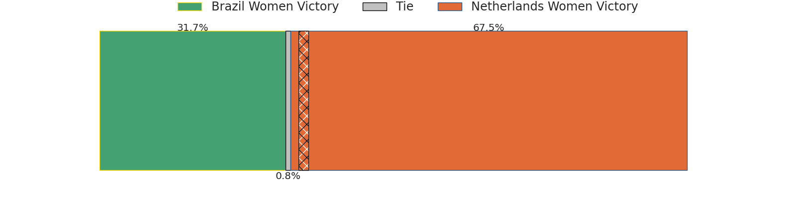

## Club Level Predictions

Now that the game has been played, lets see how the club predictions did. I predicted Netherlands Women to win by 10.43, and Netherlands Women won by 2.0. That's an absolute error of 8.4 for the margin of victory, while my average absolute error has been 14.7 over the past six months. This prediction was more accurate than 62.3% of my recent predictions.

For the Over/Under model, I predicted a total of 48.5 and we have an actual total of 32.0. That's an absolute error of 16.5 compared to a six month average of 14.6. This prediction was more accurate than 35.0% of my recent predictions.
### Projected Performances - Club Model

### Projected Spreads - Club Model

### Projected Results - Club Model

