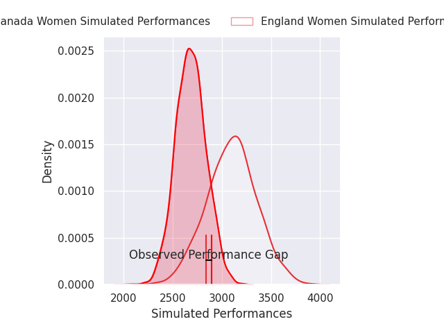
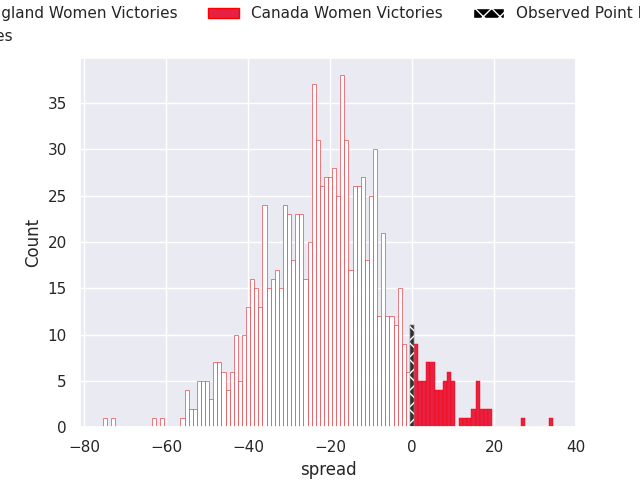
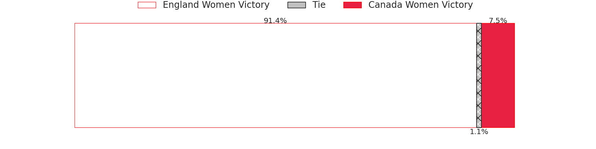

## Club Level Predictions

Now that the game has been played, lets see how the club predictions did. I predicted England Women to win by 20.7, and Canada Women won by 0.0. That's an absolute error of 20.7 for the margin of victory, while my average absolute error has been 14.8 over the past six months. This prediction was more accurate than 24.6% of my recent predictions.

For the Over/Under model, I predicted a total of 48.5 and we have an actual total of 52.0. That's an absolute error of 3.5 compared to a six month average of 14.4. This prediction was more accurate than 84.9% of my recent predictions.
### Projected Performances - Club Model

### Projected Spreads - Club Model

### Projected Results - Club Model

