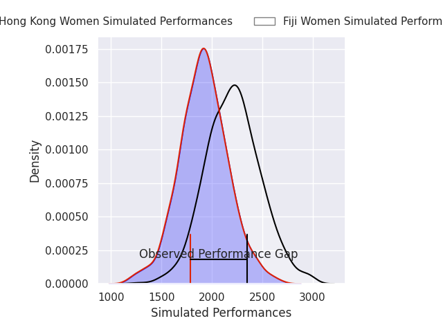
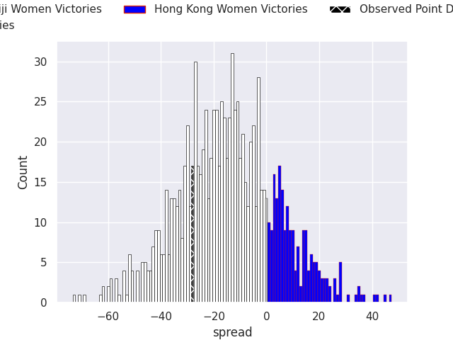
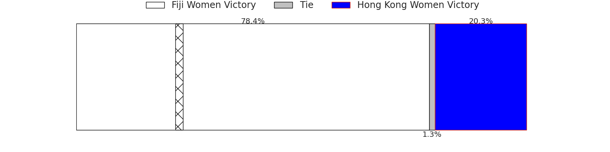

## Club Level Predictions

Now that the game has been played, lets see how the club predictions did. I predicted Fiji Women to win by 14.61, and Fiji Women won by 28.0. That's an absolute error of 13.4 for the margin of victory, while my average absolute error has been 14.8 over the past six months. This prediction was more accurate than 44.9% of my recent predictions.

For the Over/Under model, I predicted a total of 46.5 and we have an actual total of 80.0. That's an absolute error of 33.5 compared to a six month average of 14.4. This prediction was more accurate than 7.1% of my recent predictions.
### Projected Performances - Club Model

### Projected Spreads - Club Model

### Projected Results - Club Model

