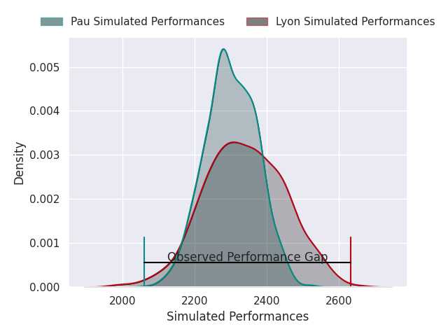
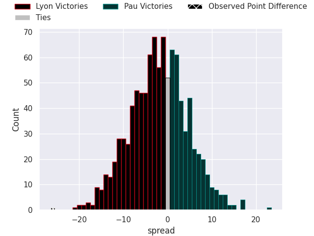
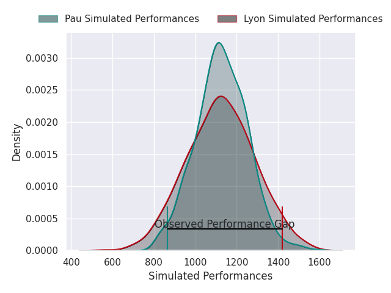
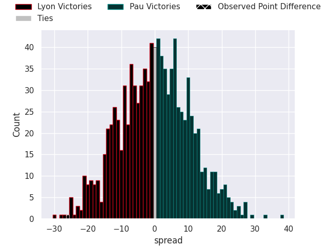

## Club Level Predictions

Now that the game has been played, lets see how the club predictions did. I predicted Lyon to win by 1.94, and Lyon won by 26.0. That's an absolute error of 24.1 for the margin of victory, while my average absolute error has been 14.8 over the past six months. This prediction was more accurate than 19.3% of my recent predictions.

For the Over/Under model, I predicted a total of 52.5 and we have an actual total of 76.0. That's an absolute error of 23.5 compared to a six month average of 14.4. This prediction was more accurate than 19.5% of my recent predictions.
### Projected Performances - Club Model

### Projected Spreads - Club Model

### Projected Results - Club Model

## Player Level Predictions

With the player model, I predicted Pau to win by 0.11,  and Lyon won by 26.0. That's an absolute error of 26.1 for the margin of victory, while the average error as been 15.1 for the past six months. So this prediction was more accurate than 14.6% of my recent predictions.
### Projected Performances - Player Model

### Projected Spreads - Player Model

### Projected Results - Player Model

