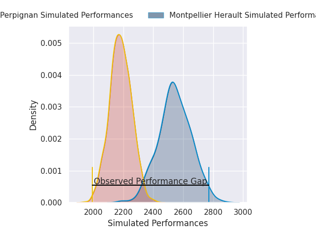
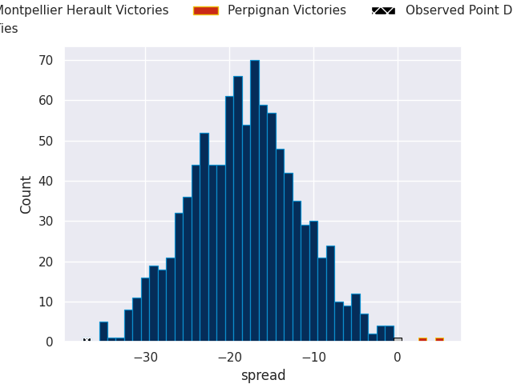
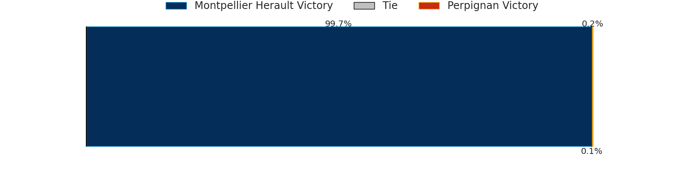

## Club Level Predictions

Now that the game has been played, lets see how the club predictions did. I predicted Montpellier Herault to win by 18.15, and Montpellier Herault won by 37.0. That's an absolute error of 18.8 for the margin of victory, while my average absolute error has been 14.7 over the past six months. This prediction was more accurate than 30.2% of my recent predictions.

For the Over/Under model, I predicted a total of 49.5 and we have an actual total of 63.0. That's an absolute error of 13.5 compared to a six month average of 14.6. This prediction was more accurate than 44.6% of my recent predictions.
### Projected Performances - Club Model

### Projected Spreads - Club Model

### Projected Results - Club Model

