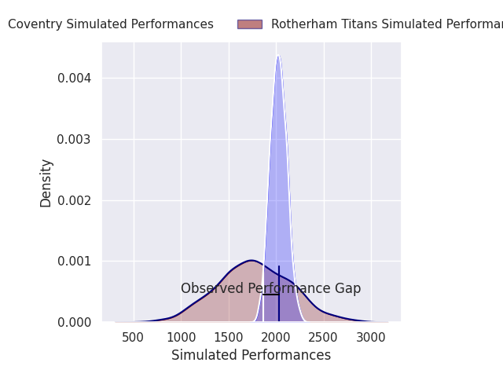
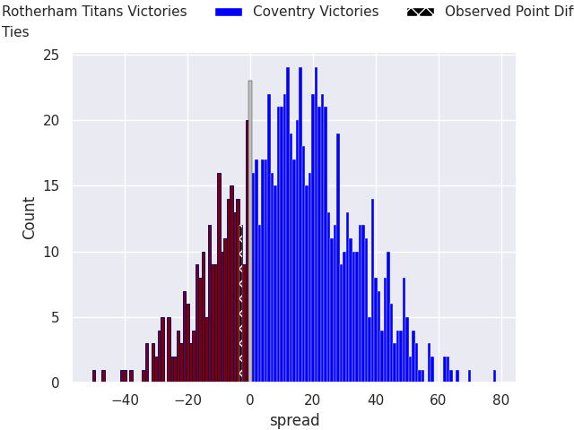
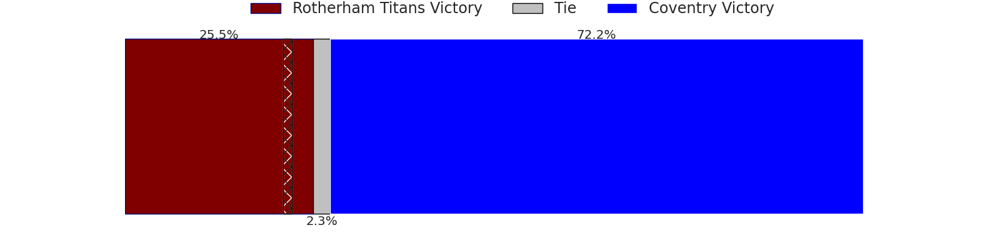

## Club Level Predictions

Now that the game has been played, lets see how the club predictions did. I predicted Coventry to win by 12.7, and Rotherham Titans won by 3.0. That's an absolute error of 15.7 for the margin of victory, while my average absolute error has been 14.8 over the past six months. This prediction was more accurate than 38.0% of my recent predictions.

For the Over/Under model, I predicted a total of 51.5 and we have an actual total of 73.0. That's an absolute error of 21.5 compared to a six month average of 14.4. This prediction was more accurate than 23.0% of my recent predictions.
### Projected Performances - Club Model

### Projected Spreads - Club Model

### Projected Results - Club Model

