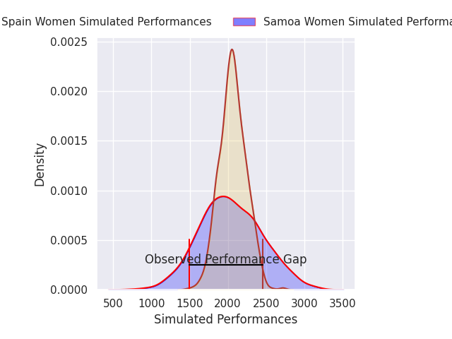
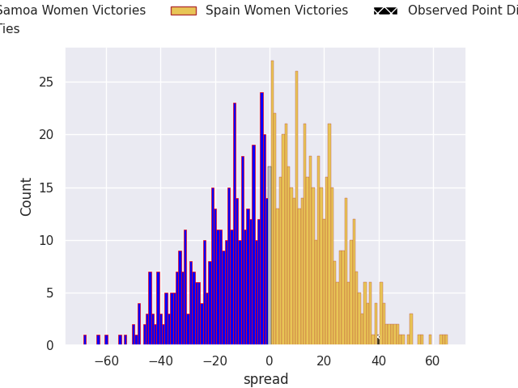
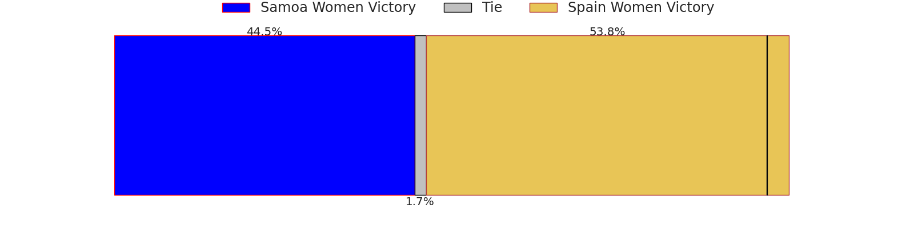

## Club Level Predictions

Now that the game has been played, lets see how the club predictions did. I predicted Spain Women to win by 1.24, and Spain Women won by 40.0. That's an absolute error of 38.8 for the margin of victory, while my average absolute error has been 14.8 over the past six months. This prediction was more accurate than 5.4% of my recent predictions.

For the Over/Under model, I predicted a total of 49.5 and we have an actual total of 82.0. That's an absolute error of 32.5 compared to a six month average of 14.4. This prediction was more accurate than 8.4% of my recent predictions.
### Projected Performances - Club Model

### Projected Spreads - Club Model

### Projected Results - Club Model

