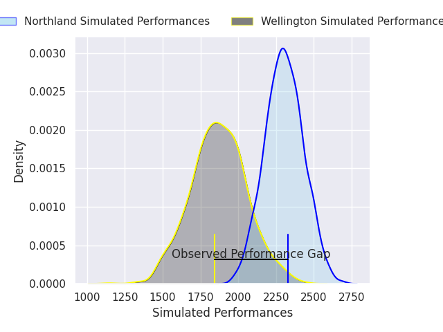
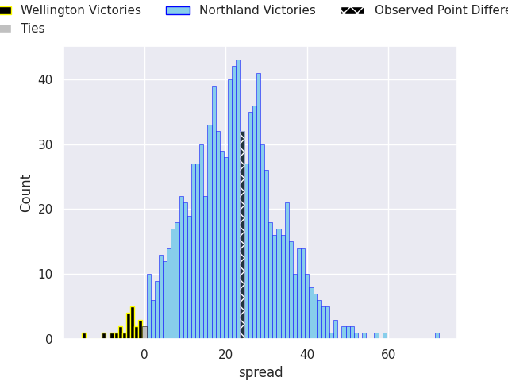
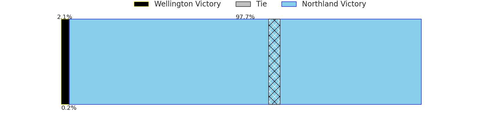

## Club Level Predictions

Now that the game has been played, lets see how the club predictions did. I predicted Northland to win by 21.61, and Northland won by 24.0. That's an absolute error of 2.4 for the margin of victory, while my average absolute error has been 14.7 over the past six months. This prediction was more accurate than 88.5% of my recent predictions.

For the Over/Under model, I predicted a total of 52.5 and we have an actual total of 80.0. That's an absolute error of 27.5 compared to a six month average of 14.6. This prediction was more accurate than 13.8% of my recent predictions.
### Projected Performances - Club Model

### Projected Spreads - Club Model

### Projected Results - Club Model

