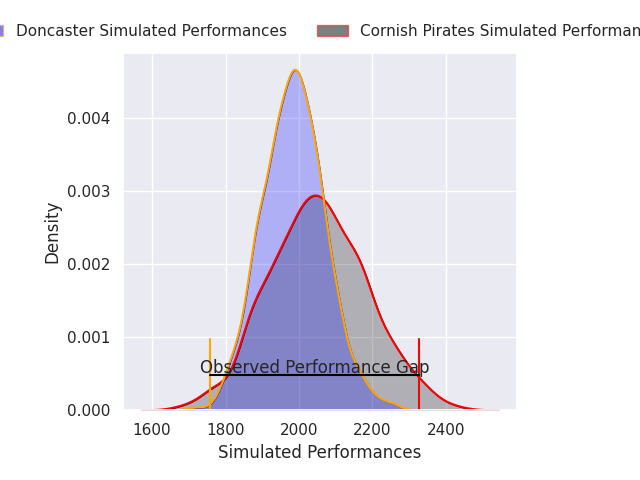
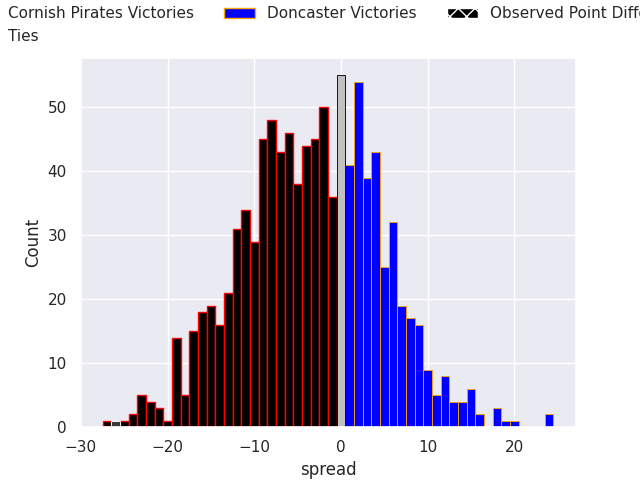

## Club Level Predictions

Now that the game has been played, lets see how the club predictions did. I predicted Cornish Pirates to win by 3.33, and Cornish Pirates won by 26.0. That's an absolute error of 22.7 for the margin of victory, while my average absolute error has been 14.7 over the past six months. This prediction was more accurate than 20.8% of my recent predictions.

For the Over/Under model, I predicted a total of 48.5 and we have an actual total of 64.0. That's an absolute error of 15.5 compared to a six month average of 14.6. This prediction was more accurate than 38.0% of my recent predictions.
### Projected Performances - Club Model

### Projected Spreads - Club Model

### Projected Results - Club Model

