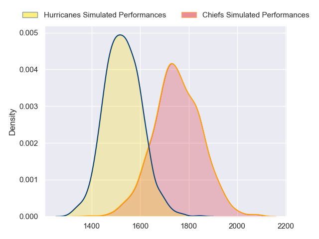
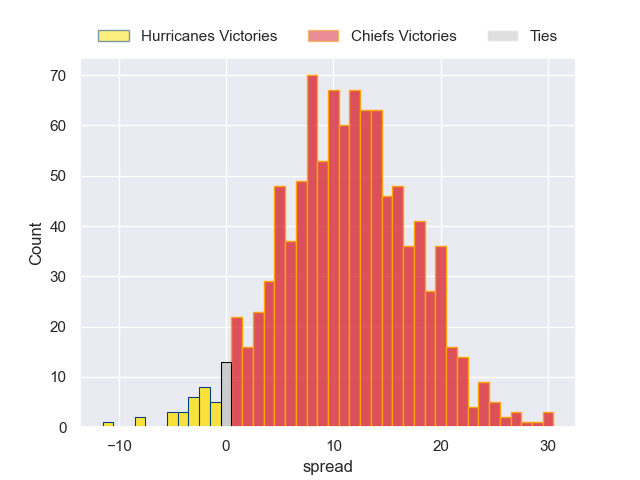
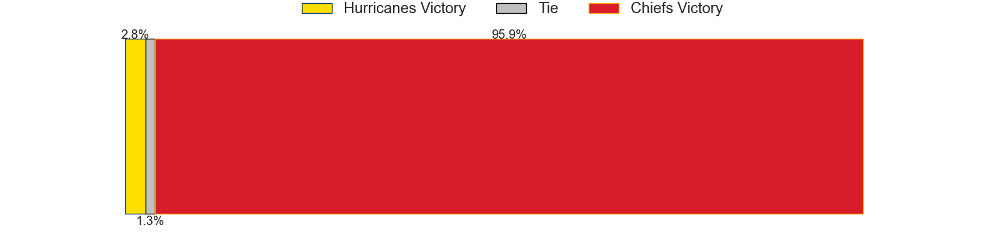

---  
layout: page  
title: Hurricanes at Chiefs  
date: 2023-05-20 03:05:00 18:00:00 -0500  
categories: match projection  
---
# Hurricanes at Chiefs

# Club Level Predictions

The first set of predictions treats a club as the smallest object, as the club develops its members, organizes a gameplan, and deploys its players as needed for each match. This club model has a prediction of 0.779, which translates to predicting Chiefs to win by 11.2.

Each club has a rating and a rating deviation (simiar to a Glicko system), and expected performances can be generated. This allows for simulated matches and spreads like the ones below.
## Projected Performances

## Projected Spreads

## Projected Results

# Player Level Predictions

Treating teams instead as an entity made up of the currently active players, I have ratings for each player in an altogether different system. These can be combined to form team ratings once teamsheets are announced, weighting starters a bit higher than the reserves. After the match is played, players can be weighted by their minutes on the field, allowing for an accurate measure of the team's composition. With these compiled team ratings, we can make predictions, measure inaccuracy, and update the individual player ratings.
## Prediction without Player Minutes: Chiefs by 22.8

Chiefs by 18.8 on a neutral field

| Away Player          |   Away elo |   Away Percentile |   Number |   Home Percentile |   Home elo | Home Player         |
|:---------------------|-----------:|------------------:|---------:|------------------:|-----------:|:--------------------|
| Xavier Numia         |     102.84 |                91 |        1 |                80 |      91.21 | Aidan Ross          |
| Jacob Devery         |      87.37 |                73 |        2 |                97 |     114.99 | Samisoni Taukei'aho |
| Owen Franks          |     103.31 |                92 |        3 |                72 |      87.13 | George Dyer         |
| James Blackwell      |      84.81 |                66 |        4 |                96 |     120.54 | Brodie Retallick    |
| Isaia Walker-Leawere |     100.96 |                88 |        5 |                38 |      71.57 | Tupou Vaa'i         |
| Devan Flanders       |      82.78 |                62 |        6 |                85 |      97.56 | Pita Gus Sowakula   |
| Du'Plessis Kirifi    |      87.71 |                72 |        7 |                98 |     130.31 | Sam Cane            |
| Brayden Iose         |      58.12 |                17 |        8 |                99 |     131.4  | Luke Jacobson       |
| Cam Roigard          |      91.95 |                76 |        9 |               100 |     141.04 | Brad Weber          |
| Aidan Morgan         |      81.73 |                56 |       10 |                72 |      89.96 | Damian McKenzie     |
| Kini Naholo          |     109.29 |                94 |       11 |                82 |      95.62 | Etene Nanai-Seturo  |
| Peter Umaga-Jensen   |      85.07 |                63 |       12 |                97 |     119.05 | Anton Lienert-Brown |
| Billy Proctor        |     107.96 |                91 |       13 |                90 |     105.74 | Alex Nankivell      |
| Julian Savea         |     117.2  |                96 |       14 |                72 |      87.66 | Emoni Narawa        |
| Joshua Moorby        |      81.78 |                55 |       15 |                73 |      92.37 | Shaun Stevenson     |
| Hame Faiva           |      76.42 |                51 |       16 |                75 |      87.85 | Tyrone Thompson     |
| Tevita Mafileo       |      92.81 |                82 |       17 |                84 |      93.7  | Ollie Norris        |
| Justin Sangster      |     109.89 |                93 |       19 |                90 |     103.19 | Naitoa Ah Kuoi      |
| Caleb Delany         |      94.22 |                82 |       20 |                45 |      76.13 | Simon Parker        |
| Jamie Booth          |      50.82 |                 6 |       21 |                85 |      99.84 | Cortez Ratima       |
| Riley Hohepa         |      75.21 |                45 |       22 |                79 |      96.93 | Josh Ioane          |
| Salesi Rayasi        |      81.03 |                60 |       23 |                81 |      97.35 | Rameka Poihipi      |

