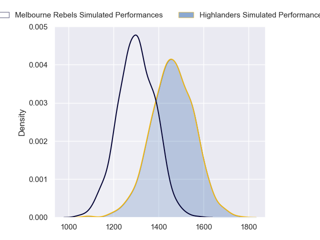
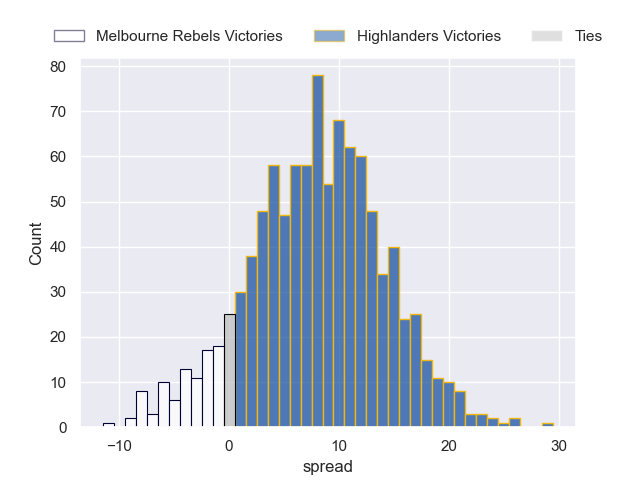
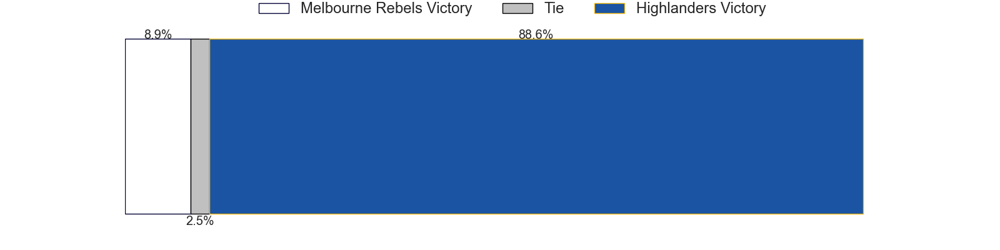

---  
layout: page  
title: Melbourne Rebels at Highlanders  
date: 2023-05-20 00:35:00 18:00:00 -0500  
categories: match projection  
---
# Melbourne Rebels at Highlanders

# Club Level Predictions

The first set of predictions treats a club as the smallest object, as the club develops its members, organizes a gameplan, and deploys its players as needed for each match. This club model has a prediction of 0.714, which translates to predicting Highlanders to win by 8.0.

Each club has a rating and a rating deviation (simiar to a Glicko system), and expected performances can be generated. This allows for simulated matches and spreads like the ones below.
## Projected Performances

## Projected Spreads

## Projected Results

# Player Level Predictions

Treating teams instead as an entity made up of the currently active players, I have ratings for each player in an altogether different system. These can be combined to form team ratings once teamsheets are announced, weighting starters a bit higher than the reserves. After the match is played, players can be weighted by their minutes on the field, allowing for an accurate measure of the team's composition. With these compiled team ratings, we can make predictions, measure inaccuracy, and update the individual player ratings.
## Prediction without Player Minutes: Highlanders by 5.2

Highlanders by 1.2 on a neutral field

| Away Player      |   Away elo |   Away Percentile |   Number |   Home Percentile |   Home elo | Home Player          |
|:-----------------|-----------:|------------------:|---------:|------------------:|-----------:|:---------------------|
| Matt Gibbon      |      94.16 |                84 |        1 |                73 |      87.46 | Ethan de Groot       |
| Alex Mafi        |      86.59 |                74 |        2 |                81 |      92.77 | Andrew Makalio       |
| Sam Talakai      |      90.83 |                79 |        3 |                73 |      87.82 | Jermaine Ainsley     |
| Josh Canham      |      77.08 |                51 |        4 |                85 |      98.89 | Shannon Frizell      |
| Vaiolini Ekuasi  |      80.69 |                58 |        6 |                50 |      75.62 | Sean Withy           |
| Brad Wilkin      |      83.9  |                64 |        7 |                93 |     109.3  | Billy Harmon         |
| Richard Hardwick |      82.44 |                60 |        8 |                10 |      53.75 | Hugh Renton          |
| Ryan Louwrens    |     101.88 |                87 |        9 |                74 |      91.09 | Aaron Smith          |
| Reece Hodge      |     112.16 |                93 |       10 |                92 |     109.09 | Freddie Burns        |
| Monty Ioane      |     117.87 |                97 |       11 |                73 |      88.34 | Jona Nareki          |
| Stacey Ili       |      80.77 |                56 |       12 |                62 |      86.13 | Sam Gilbert          |
| Lachie Anderson  |      72.4  |                41 |       14 |                66 |      84.84 | Jonah Lowe           |
| Andrew Kellaway  |      97.26 |                80 |       15 |                84 |     100.95 | Connor Garden-Bachop |
| Jordan Uelese    |      77.19 |                53 |       16 |                65 |      82.69 | Leni Apisai          |
| Pone Fa'amausili |      85.84 |                69 |       18 |                71 |      86.67 | Saula Mau            |
| Trevor Hosea     |      79.35 |                55 |       19 |                51 |      81.08 | Marino Mikaele-Tu'u  |
| Tamati Ioane     |      82.35 |                54 |       20 |                73 |      88.17 | James Lentjes        |
| James Tuttle     |      94.28 |                78 |       21 |                56 |      79.99 | Folau Fakatava       |
| Nick Jooste      |      80.93 |                53 |       22 |                84 |      99.89 | Mitch Hunt           |
| Joe Pincus       |      81.09 |                54 |       23 |                45 |      75.5  | Thomas Umaga-Jensen  |

